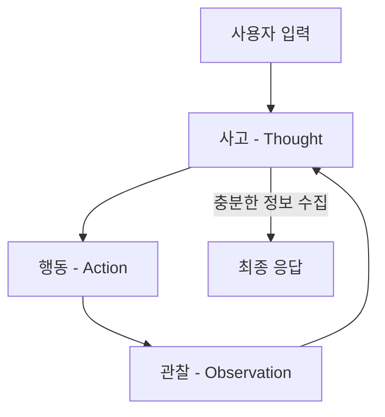
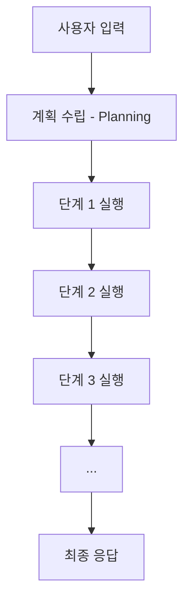
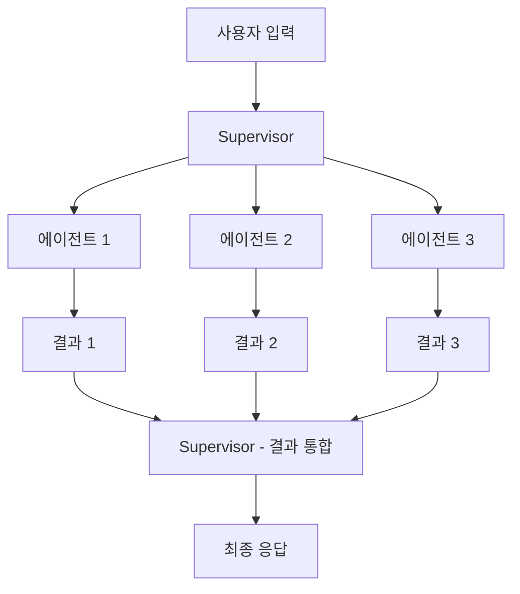
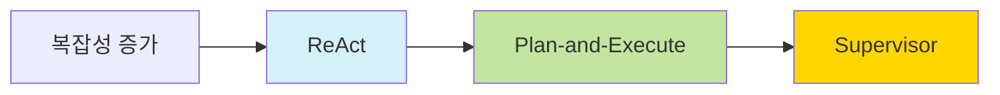

> [!summary]
> 이 글에서는 LLM 기반 시스템의 두 가지 주요 접근법인 워크플로우와 에이전트의 근본적인 차이점을 설명하고, 에이전트 아키텍처인 ReAct, Plan-and-Execute, Supervisor의 작동 원리와 장단점을 비교 분석한다. 각 아키텍처의 적합한 사용 사례와 함께 사용자 경험 향상을 위한 의사결정 과정 시각화의 중요성, 그리고 MCP와 A2A 같은 표준화 프로토콜의 미래 발전 방향을 알아본다.

> [!info]
> 이 글은 [[데블챌 데이터 블로그 챌린지]] 참여 글입니다.

## 1. 서론

최근 LLM(Large Language Model) 기술의 발전과 함께 에이전트(Agent) 시스템이 주목받고 있다. LLM 에이전트는 자연어 기반 AI 시스템으로, 사용자의 목표를 달성하기 위해 추론하고, 계획을 세우며, 도구를 사용하는 능력을 갖추고 있다. 에이전트의 성능과 기능은 기반이 되는 아키텍처에 크게 영향을 받으며, 각 아키텍처는 고유한 강점과 약점을 가지고 있다.

### AI 에이전트의 개념


위 다이어그램은 LLM 활용 방식의 근본적인 차이를 보여준다:

**워크플로우(Workflows)와 에이전트(Agent)의 핵심 차이점:**

1. **워크플로우**: LLM이 사전 정의된 코드 흐름 내에서만 작동
   - LLM은 고정된 프로세스 내에 내장되어 있거나 제한된 경로를 따라 흐름 제어
   - 프롬프트 체이닝, 병렬화, 오케스트레이션 등 미리 설계된 구조 내에서 실행

2. **에이전트**: LLM이 환경 피드백을 기반으로 자신의 행동을 결정
   - 도구 선택과 사용을 스스로 결정하고 결과에 따라 다음 행동 조정
   - 자율적 의사결정과 환경과의 상호작용이 핵심

이 글에서 다루는 ReAct, Plan-and-Execute, Supervisor 아키텍처는 모두 에이전트 범주에 속하며, 각기 다른 방식으로 의사결정과 행동을 수행한다.


AI 에이전트(Agent)는 환경을 인식하고, 결정을 내리며, 행동을 취하는 자율적인 시스템이다. 컴퓨터 과학에서 에이전트는 다음과 같은 핵심 특성을 가진다:

1. **자율성(Autonomy)**: 인간의 직접적인 개입 없이 작업을 수행한다.
2. **인식(Perception)**: 환경으로부터 정보를 수집하고 처리한다.
3. **결정(Decision-making)**: 수집한 정보를 바탕으로 다음 행동을 결정한다.
4. **행동(Action)**: 결정에 따라 환경에 영향을 미치는 행동을 취한다.
5. **목표 지향성(Goal-orientation)**: 특정 목표 달성을 위해 행동한다.

LLM 에이전트는 이러한 기본적인 에이전트 개념에 대규모 언어 모델의 강력한 언어 이해 및 생성 능력을 결합한 것이다. LLM은 에이전트의 '두뇌' 역할을 하며, 다양한 아키텍처는 이 두뇌가 어떻게 사고하고 행동할지를 결정하는 '사고 구조'를 제공한다.

### 현대 LLM 기반 에이전트 아키텍처

최근 몇 년간 LLM의 발전과 함께 다양한 에이전트 아키텍처가 등장했다:

- **ReAct(2022)**: Google Research에서 발표한 아키텍처로, 추론(Reasoning)과 행동(Acting)을 결합했다. 사고-행동-관찰의 반복적인 사이클을 통해 복잡한 문제를 해결한다.

- **Plan-and-Execute(2023)**: LangChain과 같은 프레임워크에서 개발된 방식으로, 계획 수립과 실행을 명확히 분리한다. 먼저 전체 계획을 수립한 후, 각 단계를 순차적으로 실행하는 접근법이다.

- **Supervisor/멀티에이전트(2023-2024)**: 복잡한 작업을 여러 전문 에이전트에게 분배하는 아키텍처가 발전했다. 중앙 관리자(Supervisor)가 작업을 조정하고 결과를 통합한다.

이러한 현대적 아키텍처들은 각각 고유한 장단점을 가지고 있으며, 작업의 성격과 복잡성에 따라 적합한 아키텍처가 달라질 수 있다.

### Agentic AI의 개념

Agentic AI(에이전틱 AI)는 단순히 질문에 답변하는 것을 넘어, 사용자의 목표를 달성하기 위해 능동적으로 행동하는 AI 시스템을 말한다. 이러한 시스템은 다음과 같은 핵심 특성을 가진다:

1. **자율성(Autonomy)**: 인간의 직접적인 개입 없이 독립적으로 작업을 수행할 수 있다.
2. **목표 지향성(Goal-oriented)**: 주어진 목표를 달성하기 위해 행동한다.
3. **환경 인식(Environment awareness)**: 주변 환경과 상호작용하고 정보를 수집한다.
4. **도구 사용(Tool usage)**: 외부 도구와 API를 활용하여 능력을 확장한다.
5. **의사결정(Decision making)**: 여러 옵션 중에서 최적의 행동을 선택한다.

이러한 Agentic AI를 구현하기 위해서는 효과적인 아키텍처가 필요하며, 여기에서 ReAct, Plan-and-Execute, Supervisor와 같은 다양한 접근 방식이 등장했다.

> [!quote] 에이전트의 정의
> "에이전트는 LLM을 사용하여 애플리케이션의 제어 흐름을 결정하는 시스템이다."[^1]

이 글에서는 여러 에이전트 아키텍처 중에서도 특히 널리 사용되는 ReAct, Plan-and-Execute, Supervisor를 중심으로 살펴보고 비교 분석한다. 필요에 따라 다른 아키텍처도 함께 살펴볼 수 있다. 각 아키텍처의 핵심 개념, 작동 방식, 장단점을 이해함으로써 특정 사용 사례에 가장 적합한 아키텍처를 선택하는 데 도움이 될 것이다.

## 2. 에이전트의 기본 구성 요소

LLM 에이전트 아키텍처를 이해하기 전에, 모든 아키텍처에 공통적으로 적용되는 핵심 구성 요소를 살펴보자.


### 도구 호출(Tool Calling)

도구 호출은 에이전트가 외부 시스템과 상호작용할 수 있게 해주는 핵심 기능이다. 에이전트는 API 호출, 데이터베이스 쿼리, 웹 검색 등 다양한 도구를 활용하여 정보를 수집하고 작업을 수행한다.

> [!note] 도구 호출의 중요성
> 도구는 외부 시스템과 상호작용이 필요할 때 유용하다. 외부 시스템(예: API)은 자연어보다는 특정 입력 스키마나 페이로드를 요구하는 경우가 많다. API를 도구로 바인딩할 때, 모델에게 필요한 입력 스키마를 인식시킨다.[^1]

### 메모리(Memory)

메모리는 에이전트가 이전 상호작용과 관찰 결과를 저장하고 활용할 수 있게 해주는 구성 요소이다. 단기 메모리와 장기 메모리로 구분된다:

1. **단기 메모리**: 시퀀스의 이전 단계에서 획득한 정보에 접근할 수 있게 한다.
2. **장기 메모리**: 이전 상호작용의 정보(예: 대화의 이전 메시지)를 기억할 수 있게 한다.[^1]

### 계획 수립(Planning)

계획 수립은 에이전트가 복잡한 작업을 해결하기 위해 일련의 단계를 설계하는 과정이다. 효과적인 계획 수립은 에이전트가 목표를 달성하는 데 필요한 단계를 체계적으로 수행할 수 있게 해준다.

### 추론 과정(Reasoning)

추론은 에이전트가 정보를 처리하고 결정을 내리는 과정이다. 여기에는 다음 단계 결정, 도구 선택, 입력 해석, 출력 생성 등이 포함된다. 추론의 품질은 에이전트의 전반적인 성능에 직접적인 영향을 미친다.

## 3. ReAct 아키텍처

ReAct(Reasoning + Acting)는 가장 널리 사용되는 에이전트 아키텍처 중 하나로, 추론과 행동을 결합한 접근 방식이다.

### 개념과 작동 방식

ReAct는 LLM이 사고(Thought), 행동(Action), 관찰(Observation)의 순환 과정을 통해 문제를 해결하는 방식이다. 이 사이클은 에이전트가 충분한 정보를 수집하고 사용자 요청을 해결할 수 있을 때까지 반복된다.[^2]



ReAct의 작동 과정은 다음과 같다:

1. **사고(Thought)**: LLM이 현재 상황을 평가하고 다음에 취할 행동을 고려한다.
2. **행동(Action)**: 에이전트가 특정 도구를 호출하거나 작업을 수행한다.
3. **관찰(Observation)**: 행동의 결과를 관찰하고 그 정보를 수집한다.
4. **반복**: 이 과정은 에이전트가 충분한 정보를 수집하고 더 이상 도구를 호출할 필요가 없다고 판단할 때까지 반복된다.

> [!example] ReAct 예시
> 사용자: "파리와 로마 중에 어느 도시가 더 인구가 많나요?"
> 
> **사고**: 파리와 로마의 인구를 알아봐야겠다. 검색 도구를 사용해보자.
> **행동**: [검색] "파리 인구"
> **관찰**: 파리의 인구는 약 2,161,000명(2020년 기준)
> 
> **사고**: 이제 로마의 인구를 알아봐야겠다.
> **행동**: [검색] "로마 인구"
> **관찰**: 로마의 인구는 약 2,873,000명(2020년 기준)
> 
> **사고**: 로마의 인구가 파리보다 더 많다.
> **최종 응답**: "로마의 인구가 약 2,873,000명으로, 파리(약 2,161,000명)보다 더 많습니다."

### 장점

- **투명성**: 추론 과정이 명시적으로 드러나 에이전트의 결정 과정을 이해하기 쉽다.
- **유연성**: 다양한 도구를 사용하며 문제 해결 방식을 상황에 맞게 조정할 수 있다.
- **일반성**: 다양한 종류의 작업에 적용할 수 있다.
- **동적 대응**: 새로운 정보에 따라 계획을 조정할 수 있다.

### 한계점

- **효율성**: 복잡한 작업에서는 여러 번의 반복이 필요하여 비효율적일 수 있다.
- **일관성**: 단계별 추론이 항상 최적의 결과를 보장하지는 않는다.
- **장기 계획**: 복잡한 다단계 계획 수립에 한계가 있을 수 있다.

### LangChain의 ReAct 구현: create_react_agent

LangChain에선 `pre_model_hook`, `post_model_hook`, `response_format`등의 추가 로직을 적용하여 강력한 ReAct 에이전트를 구현할 수 있다. `create_react_agent`는 LangChain의 prebuilt 모듈에서 제공하는 함수로, 다음과 같은 핵심 구성요소를 포함한다:

- [`tools`](https://langchain-ai.github.io/langgraph/agents/tools/): 에이전트가 작업을 수행하는 데 사용할 수 있는 도구(함수, API 또는 기타 호출 가능한 객체) 목록
- [`pre_model_hook`](https://langchain-ai.github.io/langgraph/how-tos/create-react-agent-manage-message-history/): 모델이 호출되기 전에 실행되는 함수로, 메시지 압축이나 기타 전처리 작업에 사용
- `post_model_hook`: 모델이 호출된 후 실행되는 함수로, 가드레일, 인간-인-더-루프 흐름 또는 기타 후처리 작업 구현에 활용
- [`response_format`](https://langchain-ai.github.io/langgraph/agents/agents/#6-configure-structured-output): 최종 출력의 유형을 제한하는 데 사용되는 데이터 구조(예: `pydantic` `BaseModel`)

다음은 위 내용을 적용한 ReAct 에이전트의 작동 흐름을 보여주는 그래프이다:


아래는 `create_react_agent`를 사용한 기본 예제 코드이다:

```python
from langgraph.prebuilt import create_react_agent
from langchain_openai import ChatOpenAI
from pydantic import BaseModel

model = ChatOpenAI("o4-mini")

def tool() -> None:
    """Testing tool."""
    ...

def pre_model_hook() -> None:
    """Pre-model hook."""
    ...

def post_model_hook() -> None:
    """Post-model hook."""
    ...

class ResponseFormat(BaseModel):
    """Response format for the agent."""
    result: str

agent = create_react_agent(
    model,
    tools=[tool],
    pre_model_hook=pre_model_hook,
    post_model_hook=post_model_hook,
    response_format=ResponseFormat,
)

agent.get_graph().draw_mermaid_png()
```

이 구현은 ReAct 패턴의 강력한 확장으로, 다양한 전처리/후처리 로직과 구조화된 응답 형식을 통해 에이전트의 성능과 신뢰성을 크게 향상시킬 수 있다.

## 4. Plan-and-Execute 아키텍처

Plan-and-Execute는 계획 수립과 실행을 명확히 분리한 아키텍처이다. 이 접근 방식은 복잡한 작업을 체계적으로 해결하는 데 효과적이다.

### 개념과 작동 방식

Plan-and-Execute는 두 단계로 구성된다:[^3]

1. **계획 단계(Plan)**: LLM이 사용자 요청을 분석하고 목표를 달성하기 위한 상세한 단계별 계획을 수립한다.
2. **실행 단계(Execute)**: 에이전트가 계획된 각 단계를 순차적으로 실행한다.



Plan-and-Execute 아키텍처에서는 일반적으로 계획 단계와 실행 단계에 서로 다른 프롬프트나 심지어 다른 모델을 사용할 수 있다. 계획자(Planner)는 전체적인 전략을 세우는 데 집중하고, 실행자(Executor)는 각 단계를 효과적으로 수행하는 데 집중합니다.[^4]

> [!example] Plan-and-Execute 예시
> 사용자: "내일 친구들과의 피크닉을 계획해주세요. 음식, 장소, 활동을 포함해주세요."
> 
> **계획 단계**:
> 1. 적합한 피크닉 장소 추천
> 2. 날씨 확인
> 3. 준비할 음식 목록 작성
> 4. 가져갈 물품 목록 작성
> 5. 피크닉 활동 제안
> 
> **실행 단계**:
> 1. 장소 추천: "한강공원, 남산공원, 올림픽공원이 피크닉에 적합합니다..."
> 2. 날씨 확인: "내일 서울 날씨는 맑음, 기온 25도로 예상됩니다..."
> 3. 음식 목록: "샌드위치, 과일, 치킨, 음료수 등을 준비하면 좋겠습니다..."
> ...

### 장점

- **체계적 접근**: 복잡한 작업을 명확한 단계로 분해한다.
- **명확한 구조**: 계획과 실행이 분리되어 있어 각 단계에 집중할 수 있다.
- **가시성**: 전체 계획이 미리 수립되어 사용자가 과정을 이해하기 쉽다.
- **효율성**: 중복 작업이 줄어들고 작업 흐름이 최적화된다.

### 한계점

- **적응력**: 실행 중 예상치 못한 상황에 대한 적응력이 떨어질 수 있다.
- **오버헤드**: 간단한 작업에 대해서는 과도한 계획이 비효율적일 수 있다.
- **초기 계획 의존성**: 초기 계획의 품질이 전체 성능에 크게 영향을 미친다.

## 5. Supervisor 아키텍처

Supervisor 아키텍처는 하나의 메타 에이전트(Supervisor)가 다른 에이전트들의 작업을 조정하고 관리하는 계층적 접근 방식이다.

### 개념과 작동 방식

Supervisor 아키텍처에서는 상위 수준의 관리자 에이전트가 복잡한 작업을 여러 하위 에이전트에게 분배하고, 그들의 작업 결과를 수집하여 통합한다.[^5] 이 과정은 다음과 같은 단계로 진행된다:

1. **작업 분석**: Supervisor가 사용자 요청을 분석하고 필요한 하위 작업을 식별한다.
2. **작업 할당**: 각 하위 작업을 적절한 에이전트에게 할당한다.
3. **진행 모니터링**: 각 에이전트의 작업 진행 상황을 모니터링한다.
4. **결과 통합**: 각 에이전트의 결과를 수집하고 종합적인 응답을 생성한다.
5. **피드백 및 조정**: 필요한 경우 추가 지시를 제공하거나 작업을 재할당한다.




위 다이어그램은 다양한 멀티 에이전트 시스템의 구조를 보여준다. 이러한 구조는 Supervisor 아키텍처와 같은 복잡한 에이전트 시스템을 구현하는 데 활용될 수 있다. 다이어그램에서 볼 수 있듯이, 멀티 에이전트 시스템은 여러 에이전트가 협업하여 복잡한 작업을 수행하는 방식으로, 각 에이전트는 특정 역할이나 전문 지식을 가지고 있다. 이러한 시스템에서는 에이전트 간의 효과적인 통신과 조정이 핵심 요소이며, 이를 통해 단일 에이전트로는 해결하기 어려운 복잡한 문제를 해결할 수 있다.

Supervisor 아키텍처는 멀티 에이전트 시스템의 한 형태로, 각 에이전트가 특정 영역이나 기능에 특화되어 있을 수 있다.[^6]

> [!example] Supervisor 예시
> 사용자: "새로운 웹사이트를 만들고 싶어요. 디자인, 콘텐츠, 기술적 요구사항을 포함해서 제안해주세요."
> 
> **Supervisor**: 이 요청을 디자인, 콘텐츠, 기술 세 부분으로 나누어 처리하겠습니다.
> 
> **디자인 에이전트에게 작업 할당**: "웹사이트 디자인 컨셉을 제안해주세요."
> **콘텐츠 에이전트에게 작업 할당**: "웹사이트에 필요한 콘텐츠 구조와 예시를 제안해주세요."
> **기술 에이전트에게 작업 할당**: "웹사이트 구현에 필요한 기술 스택과 요구사항을 제안해주세요."
> 
> [각 에이전트가 작업 수행]
> 
> **Supervisor**: 각 에이전트의 결과를 검토하고 통합하여 최종 제안서를 작성합니다.

### 장점

- **복잡성 관리**: 복잡한 작업을 더 작고 관리하기 쉬운 하위 작업으로 분해한다.
- **전문화**: 각 에이전트가 특정 영역에 특화되어 더 정확한 결과를 제공할 수 있다.
- **병렬 처리**: 여러 작업을 동시에 처리할 수 있어 효율성이 향상된다.
- **확장성**: 필요에 따라 새로운 에이전트를 추가하거나 제거할 수 있다.

### 한계점

- **복잡성**: 아키텍처 자체가 복잡하여 구현과 유지보수가 어려울 수 있다.
- **오버헤드**: 에이전트 간 조정과 통신에 추가적인 비용이 발생한다.
- **일관성**: 여러 에이전트의 결과를 일관되게 통합하는 것이 어려울 수 있다.

## 6. 장점과 한계점 비교 분석

각 아키텍처의 장점과 한계점을 직접 비교하여 어떤 상황에서 어떤 아키텍처가 더 적합한지 살펴보자.

### 장점 비교

| 측면 | ReAct | Plan-and-Execute | Supervisor |
|------|-------|------------------|------------|
| **유연성** | 높음 - 새로운 정보에 동적으로 대응 | 중간 - 계획 내에서 유연성 제한 | 중간-높음 - 하위 에이전트 재할당 가능 |
| **투명성** | 높음 - 모든 사고 과정이 명시적 | 높음 - 전체 계획이 사전에 가시화 | 중간 - 내부 처리가 복잡하여 일부 불투명 |
| **확장성** | 중간 - 단일 에이전트 한계 있음 | 중간 - 계획 복잡도에 제한 | 높음 - 새로운 에이전트 추가 용이 |
| **구현 용이성** | 쉬움 - 간단한 반복 구조 | 중간 - 계획과 실행 분리 필요 | 어려움 - 복잡한 조정 메커니즘 필요 |
| **멀티태스킹** | 제한적 - 주로 순차적 처리 | 제한적 - 계획된 순서로 실행 | 우수함 - 병렬 작업 처리 가능 |

### 한계점 비교

| 측면 | ReAct | Plan-and-Execute | Supervisor |
|------|-------|------------------|------------|
| **계획 능력** | 제한적 - 단기적 계획만 가능 | 강력함 - 전체 계획 수립 | 강력함 - 작업 분해 및 할당 |
| **적응성** | 높음 - 새로운 정보에 즉시 대응 | 낮음 - 계획 변경이 어려움 | 중간 - 하위 에이전트 재할당 필요 |
| **복잡한 작업** | 어려움 - 다단계 작업에 비효율적 | 좋음 - 명확한 단계별 접근 | 매우 좋음 - 작업 분해로 복잡성 관리 |
| **오버헤드** | 낮음 - 간단한 구조 | 중간 - 계획 수립에 추가 비용 | 높음 - 조정 및 통신 비용 발생 |
| **일관성** | 중간 - 단계별 결정이 최적이 아닐 수 있음 | 높음 - 일관된 계획 실행 | 낮음-중간 - 에이전트 간 결과 통합 어려움 |

### 사용자 경험과 의사결정 과정 시각화의 중요성

모든 에이전트 아키텍처에서 간과해서는 안 될 중요한 측면은 모델의 의사결정 과정을 사용자에게 얼마나 효과적으로 시각화하고 전달하는가이다. LLM이 내부적으로 결정을 내리는 과정을 사용자가 이해할 수 있도록 투명하게 표현하는 것은 신뢰와 사용자 경험에 직접적인 영향을 미친다.

> [!important] 의사결정 과정 시각화의 중요성
> 복잡한 에이전트 시스템에서는 모델이 어떻게 결론에 도달했는지를 사용자가 이해할 수 있어야 한다. 이는 신뢰 구축과 효과적인 피드백을 위해 필수적이다.

각 아키텍처별 시각화 전략과 중요성:

- **ReAct**: 사고(Thought) 과정을 명시적으로 보여주는 것이 사용자 신뢰를 높인다. 각 단계에서 모델이 무엇을 생각하고, 어떤 행동을 취했으며, 어떤 결과를 관찰했는지 투명하게 보여주면 사용자는 에이전트의 결정 과정을 더 잘 이해할 수 있다.

- **Plan-and-Execute**: 이 아키텍처는 특히 시각화가 중요하다. 전체 계획을 먼저 보여주고, 각 단계의 진행 상황을 실시간으로 업데이트하면 사용자는 장시간 걸리는 작업에서도 인내심을 유지할 수 있다. 진행 표시줄, 단계별 상태 표시, 완료된 작업과 남은 작업의 시각적 구분이 매우 효과적이다.

- **Supervisor**: 복잡한 다중 에이전트 시스템에서는 작업 할당과 조정 과정을 시각화하는 것이 중요하다. 어떤 하위 에이전트가 어떤 작업을 담당하고 있는지, 전체 작업의 진행 상황은 어떠한지를 보여주는 대시보드 형태의 시각화가 유용하다.

특히 Plan-and-Execute와 같이 시간이 오래 걸리는 아키텍처에서는 중간 과정을 얼마나 잘 시각화하고 전달하느냐가 사용자 경험에 결정적인 영향을 미친다. 사용자가 중간 결과를 볼 수 없다면, 에이전트가 제대로 작동하고 있는지 의심하게 되고 불안감을 느낄 수 있다. 따라서 다음과 같은 전략이 중요하다:

1. **진행 상황 표시**: 전체 작업 중 얼마나 완료되었는지 시각적으로 표시
2. **중간 결과 공유**: 각 단계가 완료될 때마다 중간 결과를 즉시 제공
3. **예상 완료 시간**: 남은 시간에 대한 추정치 제공
4. **단계별 설명**: 현재 진행 중인 단계와 다음에 수행할 단계에 대한 설명 제공

이러한 시각화 요소들은 단순한 UI/UX 개선을 넘어, 에이전트 시스템의 핵심 기능으로 간주되어야 한다. 사용자가 AI 에이전트의 의사결정 과정을 이해할 수 있을 때, 그 결과를 더 신뢰하고 효과적으로 활용할 수 있기 때문이다.

## 7. 아키텍처 비교 분석

세 가지 아키텍처의 주요 특성을 비교해 보겠다.

| 특성 | ReAct | Plan-and-Execute | Supervisor |
|------|-------|------------------|------------|
| **기본 접근 방식** | 사고-행동-관찰 반복 | 계획 수립 후 순차적 실행 | 작업 분배 및 조정 |
| **의사결정 과정** | 단계별 추론 | 초기 계획 기반 | 계층적 조정 |
| **적응성** | 높음 | 중간 | 중간~높음 |
| **투명성** | 높음 | 높음 | 중간 |
| **복잡한 작업 처리** | 중간 | 좋음 | 매우 좋음 |
| **구현 복잡성** | 낮음 | 중간 | 높음 |
| **확장성** | 중간 | 중간 | 높음 |
| **도구 활용** | 동적 | 계획 기반 | 에이전트별 특화 |
| **오류 복구** | 좋음 | 제한적 | 중간~좋음 |

### 의사결정 프로세스 비교

- **ReAct**: 각 단계에서 새로운 정보를 기반으로 추론하고 결정한다. 이는 적응성이 높지만 장기적인 계획이 부족할 수 있다.
- **Plan-and-Execute**: 초기에 상세한 계획을 수립하고 이를 따른다. 체계적이지만 예상치 못한 상황에 적응하기 어려울 수 있다.
- **Supervisor**: 메타 에이전트가 전체 작업 흐름을 조정한다. 복잡한 작업을 효과적으로 관리할 수 있지만, 조정 오버헤드가 발생한다.

### 복잡한 작업 처리 능력

복잡한 작업을 처리하는 능력에 따라 세 아키텍처를 비교해 보면:



- **간단한 작업**: ReAct가 효율적이고 충분하다.
- **중간 복잡도 작업**: Plan-and-Execute가 체계적인 접근을 제공한다.
- **매우 복잡한 작업**: Supervisor가 작업 분해와 전문화된 처리를 통해 우수한 성능을 발휘한다.

> [!tip] 작업 복잡성에 따른 아키텍처 선택
> - **단일 도메인, 간단한 작업**: ReAct
> - **다단계, 선형적 작업**: Plan-and-Execute
> - **다영역, 복합적인 작업**: Supervisor

이러한 비교를 통해 알 수 있듯이, 각 아키텍처는 특정 상황에서 강점을 발휘한다. 실제 응용에서는 작업의 특성과 요구사항을 고려하여 적절한 아키텍처를 선택하거나, 여러 아키텍처의 장점을 결합한 하이브리드 접근법을 고려할 수 있다.

## 8. 실제 응용 사례

각 아키텍처가 적합한 실제 응용 사례를 살펴보자.

### ReAct 응용 사례

- **정보 검색 및 QA**: 사용자 질문에 답하기 위한 정보 검색 및 통합
- **간단한 문제 해결**: 기본적인 계산, 간단한 의사결정이 필요한 작업
- **대화형 에이전트**: 사용자와 자연스러운 대화를 나누는 에이전트

> [!example] ReAct 적용 사례
> - 고객 지원 챗봇
> - 일반적인 정보 검색 도우미
> - 간단한 작업 자동화 도구

### Plan-and-Execute 응용 사례

- **다단계 문제 해결**: 여러 단계가 필요한 복잡한 작업
- **프로젝트 계획**: 단계별 계획이 필요한 프로젝트 관리
- **절차적 작업**: 특정 순서로 수행해야 하는 작업

> [!example] Plan-and-Execute 적용 사례
> - 여행 계획 도우미
> - 복잡한 요리 레시피 안내
> - 소프트웨어 설치 및 구성 가이드

### Supervisor 응용 사례

- **복합적 문제 해결**: 여러 도메인의 지식이 필요한 복잡한 문제
- **협업 작업**: 여러 에이전트의 협업이 필요한 작업
- **대규모 프로젝트 관리**: 여러 하위 작업으로 구성된 대규모 프로젝트

> [!example] Supervisor 적용 사례
> - 종합적인 비즈니스 전략 수립
> - 다중 도메인 연구 프로젝트
> - 웹사이트 설계 및 개발(디자인, 콘텐츠, 개발 등 여러 측면 포함)

## 9. 미래 발전 방향

LLM 에이전트 아키텍처는 계속해서 발전하고 있으며, 몇 가지 주요 트렌드가 주목받고 있다.

### 하이브리드 아키텍처

단일 아키텍처의 한계를 극복하기 위해 여러 아키텍처의 장점을 결합한 하이브리드 접근 방식이 등장하고 있다. 예를 들어, ReAct의 적응성과 Plan-and-Execute의 체계적 계획을 결합하거나, Supervisor 구조 내에서 다양한 에이전트 아키텍처를 활용하는 방식이 있다.[^7]

### 자가 개선 메커니즘

에이전트가 자신의 성능을 평가하고 개선하는 메커니즘이 중요해지고 있다. 이는 반성(Reflection) 단계를 통해 이루어질 수 있으며, 에이전트가 자신의 행동을 평가하고 더 나은 접근 방식을 학습하게 한다.[^8]

> [!note] 반성(Reflection)의 중요성
> 반성 메커니즘은 에이전트의 신뢰성을 크게 향상시킬 수 있다. 이는 작업 완료 및 정확성 평가, 반복적 개선을 위한 피드백 제공, 자기 수정 및 학습 기능을 포함한다.[^1]

### 인간-AI 협업

모든 아키텍처에서 인간과의 협업을 강화하는 방향으로 발전하고 있다. 인간의 피드백과 개입을 효과적으로 통합하는 Human-in-the-loop 패턴은 에이전트의 성능과 신뢰성을 크게 향상시킬 수 있다.[^9]

## 10. 결론

LLM 에이전트 아키텍처는 각각 고유한 강점과 약점을 가지고 있으며, 특정 사용 사례에 더 적합할 수 있다. 에이전트를 설계할 때는 다음 사항을 고려해야 한다:

1. **작업의 복잡성**: 작업이 단순한지, 다단계인지, 다영역인지에 따라 적절한 아키텍처를 선택한다.
2. **적응성 요구사항**: 동적 환경에서는 ReAct의 적응성이 유리할 수 있다.
3. **확장성 고려**: 복잡한 시스템에서는 Supervisor의 확장성이 중요할 수 있다.
4. **구현 복잡성**: 프로젝트의 리소스와 시간 제약에 따라 구현 복잡성을 고려한다.

> [!tip] 아키텍처 선택 가이드
> - 단순하고 일반적인 작업: **ReAct**
> - 다단계, 선형적 작업: **Plan-and-Execute**
> - 다영역, 복합적인 작업: **Supervisor**

미래에는 이러한 아키텍처가 더욱 발전하고 융합되어, 더 강력하고 적응력 있는 에이전트 시스템이 등장할 것으로 예상된다. 특히 자가 개선 메커니즘, 인간-AI 협업, 그리고 하이브리드 아키텍처가 주요 발전 방향이 될 것이다.

### 표준화된 프로토콜의 등장

에이전트 아키텍처의 발전과 함께, 에이전트와 외부 세계의 상호작용을 표준화하기 위한 노력도 진행되고 있다. 그 중 대표적인 예가 Anthropic에서 개발한 [[MCP(Model Context Protocol)]]이다. MCP는 AI 모델과 외부 도구, 데이터 소스를 연결하는 표준 프로토콜로, USB-C와 같이 다양한 시스템 간의 통합을 단순화한다. 이러한 표준화 노력은 에이전트 개발을 더욱 효율적으로 만들고, 다양한 도구와의 연결을 용이하게 하여 에이전트 기능을 확장하는 데 중요한 역할을 한다.

또한, Google에서 발표한 A2A(Agent-to-Agent Protocol)도 주목할 만한 표준화 노력이다. A2A는 에이전트들 사이의 통신을 위한 프로토콜로, 여러 AI 에이전트가 서로 협력하여 복잡한 작업을 수행할 수 있게 해준다. MCP가 AI 모델과 외부 도구 간의 연결에 초점을 맞춘다면, A2A는 에이전트들 간의 효과적인 협업과 소통에 중점을 둔다. 이 두 프로토콜은 서로 보완적인 관계로, 함께 사용될 경우 더욱 강력하고 유연한 에이전트 생태계를 구축할 수 있다.

## 11. 실용적 관점과 미래 전망

지금까지 살펴본 아키텍처들을 실제 애플리케이션에 적용할 때의 실용적 관점과 미래 발전 방향에 대해 생각해보자.

### 실용적 아키텍처 선택 가이드

각 아키텍처의 실제 활용에 있어 좀 더 구체적인 고려 사항은 다음과 같다:

- **ReAct Agent**: 속도가 중요한 챗봇이나 일반적인 질의응답 시스템에 적합하다. LLM 모델이 점점 똑똑해지면서 ReAct만으로도 다양한 작업을 효과적으로 처리할 수 있게 되었다. 간단하고 빠른 응답이 필요한 대부분의 상황에서 ReAct는 복잡한 아키텍처보다 효율적인 선택이 될 수 있다.

- **Plan-and-Execute**: 심층적인 연구 리포트 작성, 복잡한 분석 보고서, 다단계 프로젝트 계획과 같이 체계적인 접근이 필요한 작업에 적합하다. 시간이 다소 걸리더라도 높은 품질과 일관성이 중요한 경우에 유용하다.

- **Supervisor**: 여러 전문 분야가 결합된 복합적 작업에 적합하다. 여러 에이전트의 협업이 필요한 시나리오에서 가장 큰 가치를 발휘하지만, 간단한 작업에는 오버헤드가 클 수 있다.

> [!tip] 하이브리드 접근법
> 실제 애플리케이션에서는 단일 아키텍처만 고집할 필요가 없다. 사용자에게 '빠른 모드'(ReAct)와 '심층 분석 모드'(Plan-and-Execute)를 선택할 수 있게 하여 상황에 맞는 최적의 경험을 제공할 수 있다.

### 도구 관리의 중요성

도구(Tool)의 수가 증가함에 따라 에이전트가 적절한 도구를 선택하는 것이 중요한 과제가 된다:

- **도구 수가 적을 때**: 대부분의 아키텍처가 효과적으로 작동하며, 특히 ReAct는 도구 선택과 사용에 있어 직관적인 판단을 잘 수행한다.

- **도구 수가 많을 때**: 에이전트가 어떤 도구를 사용해야 할지 결정하는 데 혼란을 겪을 수 있다. 이 문제를 해결하기 위한 접근법으로는:
  1. **의미론적 검색(Semantic Search)**: 사용자 요청에 기반하여 관련 도구를 검색
  2. **머신러닝 기반 도구 선택**: 과거 패턴을 학습하여 적절한 도구 추천
  3. **도구 그루핑**: 유사한 기능을 가진 도구들을 그룹화하여 관리
  4. **멀티에이전트 접근**: 각 에이전트가 특정 도구 세트를 담당

### Multi-Agent 시스템 발전 방향

Supervisor 아키텍처와 SWARM과 같은 다른 멀티에이전트 접근법 간의 비교 및 통합이 향후 중요한 연구 주제가 될 것이다:

- **Supervisor vs SWARM**: Supervisor는 중앙 집중식 조정을 사용하는 반면, SWARM은 더 분산된 의사결정과 자율성을 강조한다. 두 접근법은 작업의 성격과 필요한 조정 수준에 따라 각각의 장점이 있다.

- **하이브리드 멀티에이전트 시스템**: 일부 작업은 중앙 집중식 조정이 필요하고, 다른 작업은 분산 협업이 더 효과적일 수 있다. 두 방식을 상황에 맞게 전환하거나 결합하는 하이브리드 시스템이 등장할 것으로 예상된다.

### 미래 통합 시스템의 비전

표준화된 프로토콜과 다양한 아키텍처의 발전을 고려할 때, 미래의 에이전트 시스템은 다음과 같은 형태로 진화할 수 있다:

1. **도구 통합 레이어**: [[MCP(Model Context Protocol)]]를 활용하여 다양한 외부 도구와 데이터 소스를 손쉽게 연결

2. **도구 관리 에이전트**: 도구들을 효과적으로 관리하고 적절한 도구를 선택하는 전문 에이전트

3. **컨텍스트 기반 아키텍처 전환**: 작업의 복잡성과 특성에 따라 ReAct, Plan-and-Execute 등을 동적으로 전환

4. **에이전트 간 협업**: A2A 프로토콜을 통해 서로 다른 개발자나 조직이 만든 에이전트들이 함께 협업

이러한 통합 시스템은 단일 아키텍처의 한계를 극복하고, 각 접근법의 장점을 최대한 활용하여 더 지능적이고 유연한 AI 시스템을 구축할 수 있다.

## 참고 문헌

[^1]: [Agent architectures - LangGraph](https://langchain-ai.github.io/langgraph/concepts/agentic_concepts/)
[^2]: [ReAct: Synergizing Reasoning and Acting in Language Models](https://react-lm.github.io/)
[^3]: [Plan-and-Execute - LangGraph](https://langchain-ai.github.io/langgraph/tutorials/plan-and-execute/plan-and-execute/)
[^4]: [Plan and Execute AI Agents Architecture](https://medium.com/@shubham.ksingh.cer14/plan-and-execute-ai-agents-architecture-f6c60b5b9598)
[^5]: [Supervisor - LangGraph](https://langchain-ai.github.io/langgraph/reference/supervisor/)
[^6]: [Multi-agent - LangGraph](https://langchain-ai.github.io/langgraph/agents/multi-agent/#swarm)
[^7]: [What is a cognitive architecture?](https://blog.langchain.dev/what-is-a-cognitive-architecture/)
[^8]: [Agentic AI vs AI Agents: Definitions and Differences](https://www.moveworks.com/us/en/resources/blog/agentic-ai-vs-ai-agents-definitions-and-differences)
[^9]: [Planning Agents: Plan and Execute](https://rudaks.tistory.com/entry/langgraphPlanning-Agents-Plan-and-Execute)