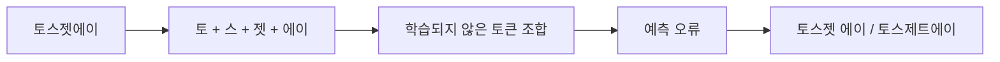
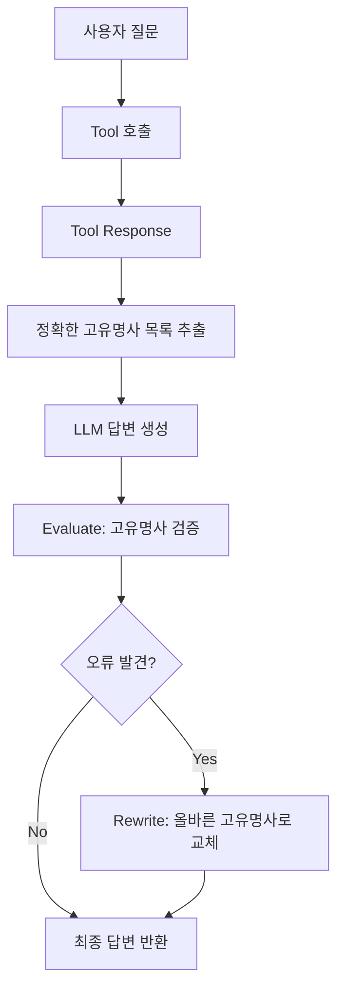

> [!summary]
> 헬스케어 도메인 챗봇을 개발하면서 LLM이 특정 고유명사(약품명, 병원명 등)를 5% 미만이지만 일관되게 틀리는 문제를 발견했다. 초기에는 긴 프롬프트로 인한 Context Engineering 문제로 추정했으나, 실험 결과 토큰화(Tokenization) 과정에서 고유명사가 여러 토큰으로 분리되고 Transformer 모델의 다음 토큰 예측 특성상 학습되지 않은 고유명사를 정확히 생성하기 어렵다는 것을 발견했다. Few-shot, Fine-tuning 등 여러 방법을 시도한 결과, Evaluate + Rewrite 방식으로 문제를 효과적으로 해결할 수 있었다.

## 1. 문제 발견

헬스케어 도메인의 고객 지원 챗봇을 개발하던 중, 특정 고유명사들을 일관되게 틀리는 현상을 발견했다. 전체적으로는 5% 미만의 낮은 오류율이었지만, 특정 약품명과 병원명에서 반복적으로 오표기가 발생했다.

### 문제의 특징

- 오류율: 전체의 5% 미만
- 특징: **특정 고유명사에 집중**된 오류
- 도메인: 약품명, 병원명, 거래처명 등
- 심각도: 헬스케어 도메인 특성상 고유명사 정확도는 매우 중요

> [!example] 실제 사례
> 사용자: "토스젯에이에 대해 알려주세요"
>
> 기대 응답: "토스젯에이는..."
> 실제 응답: "토스젯 에이는..." 또는 "토스제트에이는..."

## 2. 초기 가설: Context Engineering 문제?

처음에는 프롬프트 길이 때문에 발생하는 문제라고 추측했다.

**초기 가설:**
- 프롬프트에 약품명 리스트, 병원명 리스트 등 많은 컨텍스트를 주입
- 프롬프트가 길어지면서 LLM이 특정 정보에 집중하지 못함
- Context Engineering으로 해결 가능할 것

### 가설 검증 실험

간단한 프롬프트로 격리 테스트를 진행했다:

```
System: 당신은 헬스케어 전문가입니다.
User: 토스젯에이에 대해 설명해주세요.
```

**결과:** 짧은 프롬프트에서도 동일한 오류 발생

→ 프롬프트 길이가 근본 원인이 아님을 발견

## 3. 근본 원인 분석: 토큰화와 Transformer의 한계

### OpenAI Tokenizer 실험

[OpenAI Tokenizer](https://platform.openai.com/tokenizer)에서 고유명사들을 입력하며 실험한 결과, 흥미로운 패턴을 발견했다.

**"토스젯에이" 토큰화 결과:**


> [!note] 토큰화 관찰 결과
> 고유명사가 여러 개의 작은 토큰으로 분리되는 현상을 확인했다. 일반적인 단어들은 하나의 토큰으로 표현되는 반면, 특이한 철자 조합을 가진 고유명사들은 2-3개 이상의 토큰으로 쪼개진다.

### 왜 고유명사를 틀릴까?

**Transformer 기반 LLM의 작동 원리:**

1. **다음 토큰 예측에 최적화**: Transformer 모델은 이전 토큰들을 기반으로 다음 토큰을 예측하도록 학습됨
2. **학습 데이터의 부재**: 특정 도메인의 고유명사는 학습 데이터에 충분히 포함되지 않음
3. **토큰 분리의 악영향**: 고유명사가 여러 토큰으로 쪼개지면, 각 토큰 간의 연결이 학습되지 않아 정확한 재구성이 어려움



**예시:**
- "토스젯에이"가 여러 토큰으로 분리
- 각 토큰 사이의 연결이 학습되지 않음
- LLM은 유사하지만 다른 토큰 조합을 예측
- 결과: "토스젯 에이", "토스제트에이" 같은 오타 발생

> [!important] 핵심 인사이트
> LLM은 일반적인 언어 패턴에는 강하지만, 학습 데이터에 없는 특이한 토큰 조합(도메인 특화 고유명사)을 정확히 재현하는 데는 취약하다.

## 4. 전문가 인터뷰: 실무 관점

문제의 근본 원인을 파악한 후, 해결 방법을 모색하기 위해 Catalin Vieru(전 AWS Principal Cloud Architect, 전 Microsoft Azure Cloud Architect, 현 Google Principal Architect for Generative AI)와 인터뷰를 진행했다.

### 전문가 프로필

**Catalin Vieru**
- 현재: Google LLC, Principal Architect, Generative AI (2024.05 - Present)
- 경력: AWS Principal Cloud Architect (2017-2021), Microsoft Azure Cloud Architect (2016-2017)
- 전문 분야: Data & AI, Machine Learning, Cloud Architecture

### 주요 조언

**1단계: 에이전트 역할 명확히 분리**
- 에이전트는 **순수 데이터 검색**에만 집중
- 추가 토큰 생성을 최소화하여 오류 발생 지점 축소
- 데이터를 반환하되, 해석은 상위 레이어로 위임

> [!quote] Catalin Vieru
> "Agent should focus on data retrieval and minimize additional token generation. Let the supervisor handle final response generation to clearly identify error points."

**2단계: 생성 후 검증 메커니즘 (Evaluation)**
- 정의된 용어 목록(Lexicon)과 실제 응답 비교
- 불일치 발견 시 재시도 루프 실행 (2-3회)
- Microsoft Azure의 평가 서비스 활용 가능
- 99% 이상의 정확도 달성 가능

**3단계: 다층 기술 적용**

1. **정규표현식**: 빠른 오류 탐지 및 교정 (추가 LLM 호출 불필요)
2. **Fine-tuning**: 1,000개 샘플로 도메인 특화 모델 생성
3. **DPO (Direct Preference Optimization)**: 특정 용어 선호도 학습
4. **커스텀 임베딩 모델**: 의료 도메인 특화 임베딩 모델 활용

### 추가 전략

**Context Engineering**
- 복잡한 쿼리를 단계별로 분해
- 각 단계의 중간 결과를 명시적으로 표시
- 투명성 확보로 디버깅 용이

**재검증 프롬프트**
- Supervisor 응답을 LLM에 다시 입력
- "제품 목록에 맞춰 용어 교정" 지시
- 이중 검증으로 정확도 향상

### 유사 사례 및 산업

**금융 산업**
- 전문 용어: bonds, shorts, derivatives
- 맥락에 따라 의미가 달라지는 용어 처리 필요

**바이오의약 산업**
- 약품명, 화학물질명의 정확한 표기
- 규제 준수를 위한 높은 정확도 요구

**법률 산업**
- 판례명, 법률 용어의 정확한 인용
- 오표기 시 법적 문제 발생 가능

> [!important] 핵심 철학
> "복잡한 시스템을 분할하고 LLM의 자유도를 제한함으로써 예측 가능한 동작을 확보한다"

## 5. 이상적인 해결 방법 (하지만 불가능)

가장 근본적인 해결책은 **토크나이저에 고유명사를 학습**시키는 것이다.

**이상적인 접근:**
1. 커스텀 토큰 추가: 우리 도메인의 고유명사들을 단일 토큰으로 등록
2. 토크나이저 재학습: 해당 고유명사들이 쪼개지지 않도록 학습
3. 모델 미세 조정: 새로운 토크나이저로 모델 재학습

**현실적인 제약:**
- OpenAI API 사용: 토크나이저를 수정할 수 없음
- 완전한 모델 재학습은 비용과 시간 측면에서 비현실적
- 빠르게 변경되는 고유명사(신제품, 새 병원)에 대응 불가

## 6. 시도한 해결 방법들

### 6.1. 프롬프트에 약품명 리스트 주입

가장 먼저 시도한 방법은 프롬프트에 약품명 리스트를 직접 넣는 것이었다.

```
System: 당신은 헬스케어 전문가입니다.

다음 약품명을 정확히 사용하세요:
- 토스젯에이
- 베아티정
- 엘리퀴스
...

User: 토스젯에이에 대해 설명해주세요.
```

결과는 실망스러웠다. 프롬프트에 약품명을 명시했는데도 오류는 여전히 발생했다. 프롬프트가 길어질수록 LLM이 특정 정보에 집중하지 못한다고 생각해서, 짧은 프롬프트로도 테스트해봤다. 하지만 문제는 그게 아니었다. 토큰화 레벨의 문제를 프롬프트만으로는 해결할 수 없다는 것을 깨달았다.

### 6.2. Fine-tuning

다음으로 고려한 방법은 고유명사가 포함된 QA 데이터셋을 만들어 모델을 Fine-tuning하는 것이었다. 모델이 직접 고유명사를 학습하면 해결될 것 같았다.

하지만 치명적인 문제가 있었다. 헬스케어 도메인은 변화가 빠르다. 신제품이 계속 출시되고, 새로운 병원이 추가된다. 매번 Fine-tuning을 다시 해야 한다면? 비용과 시간이 너무 많이 든다. 게다가 충분한 학습 데이터를 만드는 것도 쉽지 않다.

빠르게 변화하는 도메인에는 적합하지 않은 방법이라는 결론을 내렸다.

### 6.3. Evaluate + Rewrite (마감에 쫓겨 선택한 방법)

시간이 촉박했다. 여러 방법을 고민하다가 결국 선택한 방법은 생각보다 단순했다. LLM이 답변을 생성하기 전에 사용할 고유명사 목록을 미리 추출하고, 답변 생성 후 검증해서 틀린 부분을 고치는 것이다.



핵심은 타이밍이다. Tool Response는 데이터베이스에서 직접 가져온 정보라 고유명사가 정확하다. 이 단계에서 답변에 사용될 고유명사 목록을 미리 뽑아둔다. LLM을 거치기 전이라 아직 오류가 없다.

그 다음 LLM이 답변을 생성한다. 이때 고유명사 오류가 발생할 수 있다. 하지만 우리는 이미 정답을 알고 있다. 생성된 답변과 정답 목록을 비교해서 틀린 고유명사를 찾고, 문자열 치환으로 교체한다. 추가 LLM 호출이 필요 없으니 빠르다.

결과는 놀라웠다. 고유명사 오류율이 5%에서 거의 0%로 떨어졌다. 응답 시간도 거의 증가하지 않았다. 검증 로직은 단순 문자열 매칭이라 매우 빠르기 때문이다.

이 방법을 선택한 이유는 명확하다. 구현이 간단하고, 새로운 고유명사가 추가되어도 Master Entity List만 업데이트하면 된다. Fine-tuning도 필요 없고, 비용도 거의 안 든다.

### 6.4. 한영 병기 (미시도)

한 가지 더 생각했던 아이디어가 있다. 한글과 영어는 토큰화 방식이 다르다. 그렇다면 두 언어를 함께 제공하면 서로 보완되지 않을까?

```
System: 다음 약품명을 정확히 사용하세요:
- Toszet A (토스젯에이)
- Product B (프로덕트비)
```

영어 토큰화에서 실패해도 한글 정보가 있고, 한글 토큰화에서 실패해도 영어 정보가 있으니 상호 보완이 될 것 같았다.

하지만 시도하지 않았다. Evaluate + Rewrite 방식이 이미 충분히 효과적이었기 때문이다. 굳이 추가 실험을 할 필요성을 느끼지 못했다. 다만 Evaluate + Rewrite를 적용하기 어려운 환경이라면, 한영 병기를 시도해볼 가치는 있을 것 같다.

## 7. 결론 및 인사이트

### 핵심 발견

1. **토큰화가 고유명사 정확도에 미치는 영향**: 특이한 철자 조합을 가진 고유명사는 여러 토큰으로 분리되고, 학습되지 않은 토큰 조합은 LLM이 정확히 재현하기 어렵다.

2. **긴 프롬프트는 원인이 아니었다**: 초기 가설은 틀렸다. 짧은 프롬프트에서도 동일한 문제가 발생했다.

3. **Few-shot은 만능이 아니다**: 프롬프트에 예시를 추가하는 것만으로는 토큰화 레벨의 문제를 해결할 수 없다.

4. **사후 검증의 효과**: 생성 전에 올바른 정보를 확보하고, 생성 후 검증하는 방식이 가장 실용적이고 효과적이었다.

### 실무 적용 가이드

**비슷한 문제를 겪고 있다면:**

1. **문제 정의**: 어떤 고유명사에서 오류가 발생하는가?
2. **토큰화 분석**: OpenAI Tokenizer에서 해당 고유명사가 어떻게 분리되는지 확인
3. **격리 테스트**: 짧은 프롬프트로 테스트하여 Context 문제인지 확인
4. **Evaluate + Rewrite 적용**:
   - Tool Response에서 정확한 고유명사 목록 추출
   - 답변 생성 후 검증 및 교정
   - Master Entity List 관리

**도메인별 적용:**
- **의료/헬스케어**: 약품명, 병원명, 의료 기기명
- **법률**: 법률 용어, 판례명, 법인명
- **금융**: 금융 상품명, 기관명
- **이커머스**: 브랜드명, 제품명

### 남은 질문들

1. **더 나은 토큰화**: 도메인 특화 토크나이저를 학습시킬 수 있다면?
2. **한영 병기의 효과**: 실제로 얼마나 효과가 있을까?
3. **다국어 환경**: 한국어-영어 외 다른 언어 조합에서는?
4. **모델별 차이**: GPT-4, Claude, Gemini 등 모델별로 토큰화 방식과 고유명사 정확도는 어떻게 다를까?

> [!quote] 마무리
> LLM은 강력하지만 완벽하지 않다. 특히 도메인 특화 고유명사처럼 학습 데이터에 충분히 포함되지 않은 정보를 다룰 때는 추가적인 엔지니어링이 필요하다. 문제의 근본 원인을 이해하고, 실용적인 해결책을 찾는 과정이 중요하다.

### 전문가 조언과의 연결점

인터뷰에서 얻은 Catalin Vieru의 조언과 우리가 최종 채택한 방법을 비교하면:

**일치하는 부분:**
- **Evaluate + Rewrite ≈ 생성 후 검증 메커니즘**: 정의된 용어 목록과 실제 응답 비교
- **정규표현식 활용**: 빠른 오류 탐지 및 교정
- **Lexicon 관리**: Master Entity List를 활용한 용어 관리

**차이점:**
- 우리: 문자열 매칭으로 단순하게 구현
- 전문가 제안: Azure Evaluation Service 같은 고급 도구 활용 가능

우리의 접근이 실무 전문가의 조언과 일치한다는 것은, 이 방법이 실무적으로도 검증된 솔루션임을 의미한다.

## 참고자료

- [OpenAI Tokenizer](https://platform.openai.com/tokenizer)
- [Attention Is All You Need (Transformer 논문)](https://arxiv.org/abs/1706.03762)
- [전문가 인터뷰 전문](https://daglo.ai/share/A8Nd9Z3RSwKNrl58)
