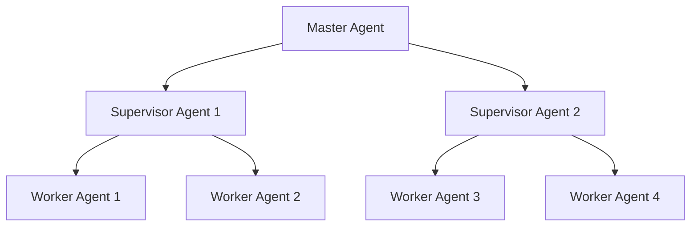
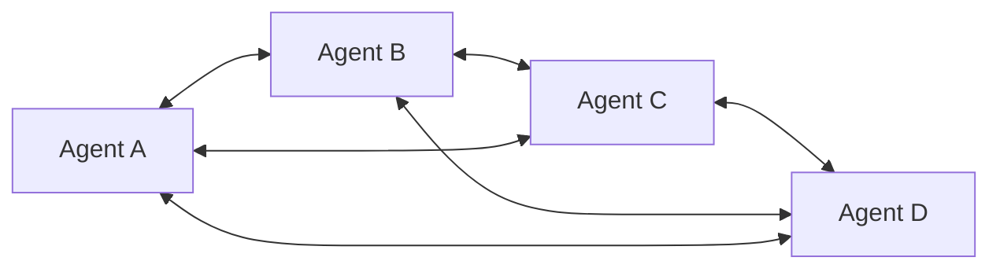
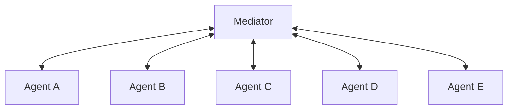
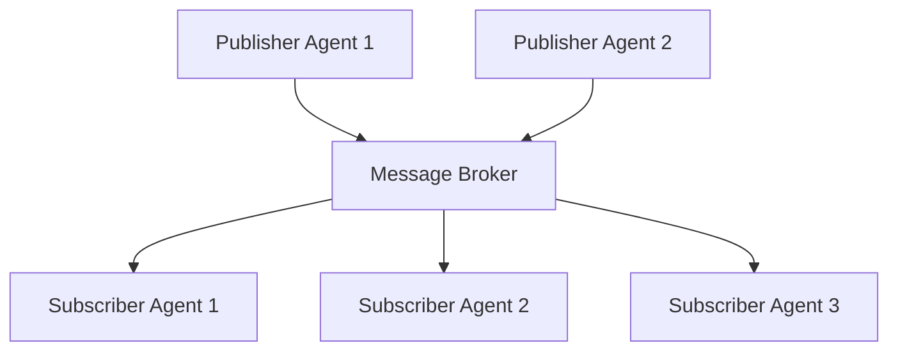
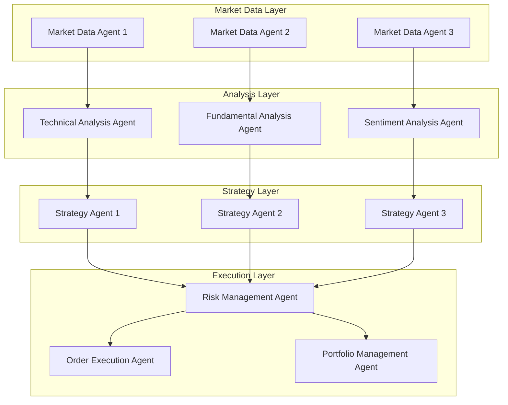

> [!summary]
> [[Agent Architecture Comparison|단일 에이전트 아키텍처]]의 한계를 넘어서는 멀티에이전트 시스템의 핵심 아키텍처 패턴들을 체계적으로 분석한다. 계층적, 네트워크, 중재자, 발행-구독 패턴의 특징과 장단점을 비교하고, 대규모 환경에서의 확장성 문제를 해결하기 위한 실용적 전략들을 제시한다. MCP, A2A, ANP 등 최신 통신 프로토콜의 역할과 함께 샤딩, 로드밸런싱, 내결함성 메커니즘을 포함한 대규모 구현 방법론을 종합적으로 다룬다.

## 1. 서론

현대 AI 시스템이 직면하는 복잡한 문제들은 단일 에이전트로는 해결하기 어려운 경우가 많다. 대규모 데이터 처리, 실시간 의사결정, 다중 도메인 전문성이 요구되는 환경에서 멀티에이전트 시스템(Multi-Agent System, MAS)은 필수적인 해결책으로 부상하고 있다.

### 멀티에이전트 시스템의 필요성

[[Agent Architecture Comparison|단일 에이전트 시스템]]은 다음과 같은 근본적인 한계를 가진다:

1. **순차적 처리 제약**: 한 번에 하나의 작업만 수행 가능
2. **제한된 컨텍스트 윈도우**: 메모리 용량과 처리 범위의 물리적 한계
3. **전문성 부족**: 모든 도메인에 대한 깊은 전문 지식을 갖추기 어려움
4. **단일 장애점**: 에이전트 실패 시 전체 시스템 마비
5. **확장성 한계**: 복잡성 증가에 따른 성능 저하

멀티에이전트 시스템은 이러한 문제를 다음과 같이 해결한다:

> [!info] 멀티에이전트 시스템의 핵심 이점
> - **분산 처리**: 여러 에이전트가 동시에 작업을 수행하여 처리 속도 향상
> - **전문화**: 각 에이전트가 특정 도메인에 특화되어 높은 품질의 결과 생성
> - **확장성**: 새로운 에이전트 추가로 시스템 기능 확장
> - **내결함성**: 개별 에이전트 실패가 전체 시스템에 미치는 영향 최소화
> - **유연성**: 동적 환경 변화에 적응적으로 대응

## 2. 멀티에이전트 아키텍처 패턴

멀티에이전트 시스템의 설계에는 여러 가지 아키텍처 패턴이 있으며, 각각 고유한 특성과 적용 분야를 가진다.


> [!info] 멀티에이전트 시스템을 고려해야 하는 시점
> 단일 에이전트 시스템에서 다음과 같은 문제가 발생할 때 멀티에이전트 시스템으로 전환을 고려해야 한다:
> - **도구 선택 혼란**: 에이전트가 사용할 수 있는 도구가 너무 많아 최적의 선택을 하지 못함
> - **컨텍스트 복잡성**: 단일 에이전트가 추적하기에는 컨텍스트가 너무 복잡함
> - **전문화 필요성**: 시스템에 여러 전문 분야(계획, 연구, 수학 전문가 등)가 필요함

### LangGraph에서의 멀티에이전트 구현

LangGraph는 다양한 멀티에이전트 패턴을 구현할 수 있는 강력한 프레임워크를 제공한다. 주요 구현 방식은 다음과 같다:

#### 핸드오프(Handoffs) 메커니즘
에이전트 간 제어권 전달을 위한 핵심 패턴으로, `Command` 객체를 통해 구현된다:

```python
from langgraph.graph import Command

def agent_node(state) -> Command[Literal["agent", "another_agent"]]:
    # 라우팅 조건 결정 (LLM 도구 호출, 구조화된 출력 등)
    goto = get_next_agent(...)  # 'agent' 또는 'another_agent'
    return Command(
        # 다음에 호출할 에이전트 지정
        goto=goto,
        # 해당 에이전트에 전달할 정보 (상태 업데이트)
        update={"messages": [new_message]}
    )
```

#### 서브그래프(Subgraphs) 활용


복잡한 멀티에이전트 시스템에서는 서브그래프를 통해 캡슐화된 구조를 만들 수 있다. 서브그래프는 다른 그래프의 노드로 사용되는 그래프로, 다음과 같은 이점을 제공한다:

- **재사용성**: 여러 그래프에서 동일한 노드 세트 재활용
- **팀 협업**: 서로 다른 팀이 독립적으로 그래프의 다른 부분 개발
- **모듈화**: 복잡한 시스템을 관리 가능한 구성 요소로 분해


### 2.1 계층적 아키텍처 (Hierarchical Architecture)

계층적 아키텍처는 명확한 상하 관계를 가진 구조로, 상위 레벨 에이전트가 하위 레벨 에이전트들을 조정한다.



**특징:**
- 명확한 명령 체계와 책임 분담
- 중앙 집중식 의사결정
- 효율적인 자원 할당과 작업 조정

**장점:**
- 관리와 제어가 용이
- 일관성 있는 의사결정
- 명확한 책임 구조

**한계점:**
- 상위 에이전트 실패 시 전체 시스템 마비 위험
- 병목 현상 발생 가능
- 확장성에 제한

### 2.2 네트워크 아키텍처 (Network/P2P Architecture)

네트워크 아키텍처는 에이전트들이 수평적 관계에서 직접 통신하고 협력하는 분산형 구조이다.



**특징:**
- 분산된 의사결정
- 에이전트 간 직접 통신
- 동적 네트워크 토폴로지

**장점:**
- 높은 내결함성
- 확장성 우수
- 유연한 협업 구조

**한계점:**
- 복잡한 조정 메커니즘 필요
- 일관성 보장의 어려움
- 통신 오버헤드 증가

### 2.3 중재자 아키텍처 (Mediator Architecture)

중재자 패턴은 중앙 중재자가 모든 에이전트 간의 통신을 조정하는 구조이다. LangGraph에서는 Supervisor 패턴으로 구현된다.



**특징:**
- 중앙 집중식 통신 관리
- 에이전트 간 직접 통신 없음
- 메시지 라우팅과 변환

**장점:**
- 통신 복잡성 감소
- 프로토콜 표준화
- 중앙 집중식 모니터링

**한계점:**
- 중재자가 단일 장애점
- 성능 병목 가능성
- 확장성 제한

#### Supervisor Tool-Calling 패턴
LangGraph에서 제공하는 특별한 중재자 패턴으로, 개별 에이전트를 도구로 표현하는 방식이다:

```python
from langchain_openai import ChatOpenAI
from langgraph.graph import StateGraph, MessagesState

# 각 에이전트를 도구로 정의
def researcher_agent(query: str) -> str:
    """연구 작업을 수행하는 에이전트"""
    # 연구 로직 구현
    return research_result

def analyst_agent(data: str) -> str:
    """데이터 분석을 수행하는 에이전트"""
    # 분석 로직 구현
    return analysis_result

# Supervisor 에이전트가 도구 호출 LLM을 사용하여
# 어떤 에이전트 도구를 호출할지, 어떤 인자를 전달할지 결정
tools = [researcher_agent, analyst_agent]
supervisor = ChatOpenAI(model="gpt-4").bind_tools(tools)
```

이 패턴의 장점은 LLM이 자연스럽게 도구 선택과 인자 전달을 담당하므로 복잡한 라우팅 로직이 필요 없다는 것이다.

### 2.4 발행-구독 아키텍처 (Publish-Subscribe Architecture)

발행-구독 패턴은 이벤트 기반 비동기 통신을 통해 에이전트들이 느슨하게 결합된 구조이다.



**특징:**
- 이벤트 기반 통신
- 비동기 메시지 전달
- 느슨한 결합

**장점:**
- 높은 확장성
- 유연한 시스템 구성
- 비동기 처리로 성능 향상

**한계점:**
- 복잡한 메시지 관리
- 디버깅의 어려움
- 메시지 순서 보장 문제

## 3. 대규모 구현을 위한 핵심 전략

멀티에이전트 시스템을 대규모 환경에서 운영하기 위해서는 확장성, 성능, 신뢰성을 모두 고려한 종합적인 전략이 필요하다.

### 3.1 최신 통신 프로토콜

#### Model Context Protocol (MCP)
Anthropic에서 개발한 [[MCP(Model Context Protocol)]]는 AI 모델과 외부 도구 간의 표준화된 연결을 제공한다.

> [!note] MCP의 핵심 기능
> - **도구 표준화**: 다양한 외부 도구와의 일관된 인터페이스 제공
> - **보안 강화**: 안전한 도구 접근과 권한 관리
> - **확장성**: 새로운 도구 추가 시 최소한의 코드 변경

#### Agent-to-Agent Protocol (A2A)
Google에서 제안한 A2A는 에이전트 간 직접 통신을 위한 표준 프로토콜이다.

**주요 특징:**
- 에이전트 간 직접 협상과 조정
- 분산 의사결정 지원
- 표준화된 메시지 형식

#### Agent Network Protocol (ANP)
차세대 멀티에이전트 네트워킹을 위한 새로운 프로토콜로, 대규모 에이전트 네트워크에서의 효율적인 통신을 지원한다.

**혁신적 기능:**
- 자동 네트워크 토폴로지 최적화
- 지능형 라우팅 알고리즘
- 동적 로드 밸런싱

### 3.2 확장성 최적화 전략

#### 샤딩 (Sharding)
대규모 에이전트 집합을 여러 샤드로 분할하여 관리하는 방식이다. 각 샤드는 일정 수의 에이전트를 담당하며, 일관성 해싱을 통해 메시지를 적절한 샤드로 라우팅한다.

#### 로드 밸런싱
에이전트 간 작업 분산을 최적화하는 메커니즘이다. 가중 라운드 로빈, 성능 기반 선택, 최소 연결 수 등의 알고리즘을 활용하여 각 에이전트의 부하를 고려한 작업 할당을 수행한다.

### 3.3 내결함성 메커니즘

#### 서킷 브레이커 패턴
장애 에이전트로의 요청을 차단하여 연쇄 장애를 방지하는 메커니즘이다. CLOSED(정상), OPEN(장애), HALF_OPEN(복구 시도) 세 가지 상태를 통해 장애 전파를 차단하고 시스템 안정성을 보장한다.

#### 분산 합의 알고리즘
에이전트 간 일관성 있는 의사결정을 보장하는 메커니즘이다. Raft, PBFT(Practical Byzantine Fault Tolerance) 등의 알고리즘을 통해 네트워크 파티션이나 일부 에이전트 장애 상황에서도 시스템의 일관성을 유지한다.

## 4. 에이전트 간 통신과 상태 관리

멀티에이전트 시스템을 구축할 때 가장 중요한 고려사항은 에이전트들이 어떻게 통신하고 상태를 관리하는가이다.

### 4.1 통신 방식: 핸드오프 vs 도구 호출

에이전트 간 통신은 크게 두 가지 방식으로 이루어진다:

**핸드오프 방식:**
- 에이전트가 그래프 상태를 핸드오프 페이로드의 일부로 전달
- 주로 메시지 리스트를 그래프 상태의 일부로 공유
- 제어권과 데이터를 함께 전달

**도구 호출 방식:**
- Supervisor가 도구 호출을 통해 하위 에이전트 제어
- 도구 호출 인자가 페이로드 역할
- 더 구조화된 인터페이스 제공

### 4.2 메시지 전달 전략

에이전트 간 메시지 전달에는 두 가지 주요 접근법이 있다:

#### 전체 사고 과정 공유
모든 에이전트가 서로의 완전한 사고 과정("스크래치패드")을 공유하는 방식이다.

**장점:**
- 다른 에이전트들이 더 나은 결정을 내릴 수 있음
- 시스템 전체의 추론 능력 향상

**단점:**
- 에이전트 수와 복잡성이 증가하면 스크래치패드가 급격히 증가
- 추가적인 메모리 관리 전략 필요

#### 최종 결과만 공유
각 에이전트는 자신만의 비공개 스크래치패드를 가지고 최종 결과만 다른 에이전트들과 공유하는 방식이다.

**장점:**
- 많은 에이전트나 복잡한 에이전트가 있는 시스템에 적합
- 메모리 효율성 향상

**단점:**
- 에이전트 간 컨텍스트 공유 제한
- 서로 다른 상태 스키마 정의 필요

### 4.3 복잡한 상태 스키마 설계

멀티에이전트 시스템에서 상태 설계는 시스템의 성능과 유지보수성에 직접적인 영향을 미친다. LangGraph에서는 다양한 상태 설계 패턴을 지원한다.

#### 입출력 스키마 분리
복잡한 멀티에이전트 시스템에서는 그래프의 입력과 출력 스키마를 분리하여 정의할 수 있다:

```python
from typing_extensions import TypedDict
from langchain_core.messages import AnyMessage

class InputState(TypedDict):
    user_query: str
    context: dict

class OutputState(TypedDict):
    final_response: str
    confidence_score: float
    processing_steps: list

class InternalState(TypedDict):
    user_query: str
    context: dict
    final_response: str
    confidence_score: float
    processing_steps: list
    # 내부 처리용 추가 필드들
    intermediate_results: list
    agent_communications: list[AnyMessage]

# 그래프 정의 시 입출력 스키마 지정
builder = StateGraph(InternalState, input=InputState, output=OutputState)
```

#### Reducer를 활용한 상태 업데이트 제어
멀티에이전트 환경에서는 여러 에이전트가 동시에 상태를 업데이트할 수 있으므로, Reducer 함수를 통해 업데이트 방식을 제어하는 것이 중요하다:

```python
import operator
from typing_extensions import Annotated

class MultiAgentState(TypedDict):
    # 메시지는 자동으로 누적
    messages: Annotated[list[AnyMessage], add_messages]
    # 결과는 리스트에 추가
    agent_results: Annotated[list[dict], operator.add]
    # 점수는 합산
    total_score: Annotated[float, operator.add]
    # 일반 필드는 덮어쓰기 (기본값)
    current_step: str
```

#### 에이전트별 비공개 상태
각 에이전트가 독립적인 상태를 가져야 할 때는 에이전트별 스키마를 정의할 수 있다:

```python
class AgentPrivateState(TypedDict):
    agent_id: str
    private_data: dict
    internal_memory: list

def agent_node(state: MultiAgentState, config: RunnableConfig) -> MultiAgentState:
    # 비공개 상태는 config를 통해 전달
    private_state = config.get("private_state", {})
    
    # 에이전트별 처리 로직
    result = process_with_private_data(state, private_state)
    
    return {"agent_results": [result]}
```

### 4.4 서브그래프를 통한 상태 스키마 분리

복잡한 멀티에이전트 시스템에서는 서로 다른 상태 스키마가 필요할 수 있다:

```python
from typing_extensions import TypedDict, Annotated
from langchain_core.messages import AnyMessage
from langgraph.graph import StateGraph, MessagesState, START
from langgraph.graph.message import add_messages

class SubgraphMessagesState(TypedDict):
    subgraph_messages: Annotated[list[AnyMessage], add_messages]

# 서브그래프 정의
def call_specialized_model(state: SubgraphMessagesState):
    response = specialized_model.invoke(state["subgraph_messages"])
    return {"subgraph_messages": response}

subgraph_builder = StateGraph(SubgraphMessagesState)
subgraph_builder.add_node(call_specialized_model)
subgraph = subgraph_builder.compile()

# 부모 그래프에서 서브그래프 호출
def call_subgraph(state: MessagesState):
    # 상태 변환: MessagesState -> SubgraphMessagesState
    response = subgraph.invoke({"subgraph_messages": state["messages"]})
    # 결과 변환: SubgraphMessagesState -> MessagesState
    return {"messages": response["subgraph_messages"]}

builder = StateGraph(MessagesState)
builder.add_node("subgraph_node", call_subgraph)
builder.add_edge(START, "subgraph_node")
graph = builder.compile()
```

### 4.5 병렬 처리와 Map-Reduce 패턴

멀티에이전트 시스템의 핵심 장점 중 하나는 여러 에이전트가 동시에 작업을 수행할 수 있다는 것이다. LangGraph는 이를 위한 다양한 패턴을 제공한다.

#### Send API를 통한 병렬 실행
여러 에이전트에게 동시에 작업을 분배하고 결과를 수집하는 Map-Reduce 패턴을 구현할 수 있다:

```python
from langgraph.graph import Send

def distribute_work(state: MultiAgentState):
    """작업을 여러 에이전트에게 분배"""
    tasks = split_task(state["user_query"])
    
    # Send API를 사용하여 여러 에이전트에게 병렬로 작업 전송
    return [
        Send("research_agent", {"task": task, "agent_id": f"researcher_{i}"})
        for i, task in enumerate(tasks)
    ] + [
        Send("analysis_agent", {"task": task, "agent_id": f"analyst_{i}"})
        for i, task in enumerate(tasks)
    ]

def research_agent(state: dict):
    """연구 작업 수행"""
    result = perform_research(state["task"])
    return {"agent_results": [{"type": "research", "result": result}]}

def analysis_agent(state: dict):
    """분석 작업 수행"""
    result = perform_analysis(state["task"])
    return {"agent_results": [{"type": "analysis", "result": result}]}

def collect_results(state: MultiAgentState):
    """모든 에이전트 결과 수집 및 통합"""
    research_results = [r for r in state["agent_results"] if r["type"] == "research"]
    analysis_results = [r for r in state["agent_results"] if r["type"] == "analysis"]
    
    final_result = synthesize_results(research_results, analysis_results)
    return {"final_response": final_result}

# 그래프 구성
builder = StateGraph(MultiAgentState)
builder.add_node("distribute_work", distribute_work)
builder.add_node("research_agent", research_agent)
builder.add_node("analysis_agent", analysis_agent)
builder.add_node("collect_results", collect_results)

builder.add_edge(START, "distribute_work")
builder.add_conditional_edges("distribute_work", lambda x: x)  # Send API 결과 라우팅
builder.add_edge("research_agent", "collect_results")
builder.add_edge("analysis_agent", "collect_results")
builder.add_edge("collect_results", END)
```

#### 조건부 병렬 실행
상황에 따라 선택적으로 에이전트들을 병렬 실행할 수 있다:

```python
def conditional_parallel_execution(state: MultiAgentState):
    """조건에 따라 병렬 실행할 에이전트 결정"""
    complexity = assess_complexity(state["user_query"])
    
    if complexity == "high":
        # 복잡한 작업: 모든 전문 에이전트 병렬 실행
        return [
            Send("expert_agent_1", state),
            Send("expert_agent_2", state),
            Send("expert_agent_3", state)
        ]
    elif complexity == "medium":
        # 중간 복잡도: 일부 에이전트만 실행
        return [
            Send("expert_agent_1", state),
            Send("expert_agent_2", state)
        ]
    else:
        # 단순한 작업: 단일 에이전트만 실행
        return Send("general_agent", state)
```

#### 지연 실행(Deferred Execution)
특정 조건이 충족될 때까지 에이전트 실행을 지연시킬 수 있다:

```python
def deferred_agent_execution(state: MultiAgentState):
    """조건 충족 시까지 실행 지연"""
    if prerequisites_met(state):
        return Send("specialized_agent", state)
    else:
        # 전제 조건이 충족되지 않은 경우 대기
        return Send("wait_node", state)

def wait_node(state: MultiAgentState):
    """전제 조건 확인 후 재시도"""
    # 전제 조건 재확인 로직
    if prerequisites_met(state):
        return Send("specialized_agent", state)
    else:
        # 계속 대기하거나 대안 경로 선택
        return {"status": "waiting"}
```

이러한 병렬 처리 패턴들은 멀티에이전트 시스템의 성능과 응답성을 크게 향상시킬 수 있다.

### 4.6 메시지 히스토리에서의 핸드오프 표현

핸드오프는 일반적으로 LLM이 전용 핸드오프 도구를 호출하는 방식으로 구현된다. 이는 도구 호출이 있는 AI 메시지로 표현되어 다음 에이전트에 전달된다.

대부분의 LLM 공급자는 해당하는 도구 메시지 없이 도구 호출이 있는 AI 메시지를 받는 것을 지원하지 않으므로, 다음 두 가지 옵션 중 하나를 선택해야 한다:

1. **도구 메시지 추가**: "에이전트 X로 성공적으로 전달됨"과 같은 추가 도구 메시지를 메시지 리스트에 추가
2. **AI 메시지 제거**: 도구 호출이 있는 AI 메시지를 제거

실제로는 대부분의 개발자가 옵션 1을 선택한다.

## 5. 실제 구현 사례: 분산 금융 트레이딩 시스템

대규모 멀티에이전트 시스템의 실제 적용 사례로 분산 금융 트레이딩 시스템을 살펴보자.

### 시스템 아키텍처



### 핵심 구현 요소

이 시스템은 4개 레이어로 구성된다:

1. **Market Data Layer**: 여러 거래소에서 실시간 시장 데이터 수집
2. **Analysis Layer**: 기술적/기본적/감정 분석을 병렬로 수행
3. **Strategy Layer**: 분석 결과를 바탕으로 거래 전략 결정
4. **Execution Layer**: 리스크 관리 후 주문 실행

각 레이어의 에이전트들은 발행-구독 패턴으로 통신하며, 로드 밸런서를 통해 작업이 분산된다.

> [!example] 실제 성능 지표
> 이 시스템은 다음과 같은 성능을 달성했다:
> - **처리량**: 초당 10,000건의 거래 신호 처리
> - **지연시간**: 평균 50ms 내 의사결정 완료
> - **가용성**: 99.9% 업타임 달성
> - **확장성**: 에이전트 수 증가에 따른 선형 성능 향상

## 6. 성능 최적화와 모니터링

### 6.1 성능 메트릭 수집

효과적인 멀티에이전트 시스템 운영을 위해서는 다음 메트릭들을 지속적으로 모니터링해야 한다:

- **응답 시간**: 각 에이전트의 평균/최대 응답 시간
- **처리량**: 분당 처리되는 요청 수 
- **오류율**: 실패한 요청의 비율
- **자원 사용률**: CPU, 메모리, 네트워크 사용량
- **에이전트 간 통신 지연**: 메시지 전달 시간

### 6.2 자동 스케일링

시스템 부하에 따라 에이전트 수를 동적으로 조정하는 메커니즘이다. 성능 메트릭을 기반으로 스케일 업/다운을 자동으로 수행하며, 최소/최대 에이전트 수 제한을 통해 안정성을 보장한다.

## 7. 보안과 프라이버시

대규모 멀티에이전트 시스템에서는 보안과 프라이버시가 특히 중요하다.

### 7.1 에이전트 인증과 권한 관리

멀티에이전트 시스템에서는 강력한 보안 메커니즘이 필수적이다:

- **인증**: 디지털 인증서를 통한 에이전트 신원 확인
- **권한 관리**: 역할 기반 접근 제어(RBAC)를 통한 세밀한 권한 설정
- **감사 추적**: 모든 에이전트 활동에 대한 로그 기록
- **세션 관리**: 토큰 기반 세션 관리와 만료 처리

### 7.2 안전한 통신

에이전트 간 통신의 보안을 위해 다음 메커니즘들이 활용된다:

- **암호화**: TLS/SSL을 통한 전송 구간 암호화와 메시지 레벨 암호화
- **디지털 서명**: 메시지 무결성과 송신자 인증을 위한 디지털 서명
- **키 관리**: 안전한 키 교환과 순환 정책
- **메시지 검증**: 재전송 공격 방지를 위한 논스(nonce)와 타임스탬프 활용

## 8. 미래 발전 방향과 도전 과제

### 8.1 신흥 기술과의 통합

> [!info] 미래 기술 통합 방향
> - **양자 컴퓨팅**: 복잡한 최적화 문제 해결을 위한 양자 에이전트
> - **엣지 컴퓨팅**: 분산 환경에서의 실시간 에이전트 처리
> - **블록체인**: 분산 신뢰와 투명성을 위한 블록체인 기반 에이전트 네트워크
> - **5G/6G**: 초저지연 에이전트 간 통신

### 8.2 주요 도전 과제

#### 복잡성 관리
- 수천 개의 에이전트가 참여하는 시스템에서의 조정 문제
- 창발적 행동의 예측과 제어
- 시스템 전체의 일관성 보장

#### 윤리적 고려사항
- 에이전트 간 공정성과 형평성
- 의사결정 과정의 투명성
- 인간의 통제권 유지

#### 표준화 필요성
- 에이전트 간 상호 운용성
- 통합 모니터링과 관리 도구
- 보안 표준의 통일화

미래의 멀티에이전트 시스템은 범용 에이전트 인터페이스(Universal Agent Interface)를 통해 서로 다른 개발자나 조직이 만든 에이전트들이 원활하게 협업할 수 있는 생태계로 발전할 것이다.

## 9. 결론

멀티에이전트 시스템은 현대 AI의 복잡한 요구사항을 해결하기 위한 핵심 접근법으로 자리잡고 있다. 다양한 아키텍처 패턴들은 각각의 고유한 장점을 가지며, 실제 적용에서는 시스템의 요구사항에 따라 적절한 패턴을 선택하거나 조합해야 한다.

> [!tip] 멀티에이전트 시스템 설계 가이드라인
> - **계층적 구조**: 명확한 제어가 필요한 시스템
> - **네트워크 구조**: 고가용성과 확장성이 중요한 시스템  
> - **중재자 구조**: 복잡한 통신 조정이 필요한 시스템
> - **발행-구독 구조**: 이벤트 기반 반응형 시스템

대규모 구현에서는 확장성, 성능, 보안을 모두 고려한 종합적인 설계가 필요하며, 최신 프로토콜인 [[MCP(Model Context Protocol)]], A2A, ANP 등의 활용이 중요하다. 특히 다음 사항들이 성공적인 구현의 핵심이다:

1. **적절한 아키텍처 패턴 선택**: 시스템 요구사항에 맞는 패턴 조합
2. **효과적인 통신 프로토콜**: 표준화된 프로토콜 활용으로 상호 운용성 확보
3. **확장성 전략**: 샤딩, 로드밸런싱을 통한 성능 최적화
4. **내결함성 설계**: 서킷 브레이커, 분산 합의 등을 통한 안정성 확보
5. **지속적인 모니터링**: 성능 메트릭 수집과 자동 스케일링

미래에는 더욱 지능적이고 자율적인 멀티에이전트 시스템이 등장할 것이며, 양자 컴퓨팅, 엣지 컴퓨팅, 블록체인 등 신흥 기술과의 통합이 새로운 가능성을 열어줄 것이다. 동시에 복잡성 관리, 윤리적 고려사항, 표준화 등의 도전 과제를 해결하기 위한 지속적인 연구와 개발이 필요하다.

멀티에이전트 시스템은 단순히 기술적 해결책을 넘어서, 인간과 AI가 협력하는 미래 사회의 기반 인프라가 될 것이다. 따라서 기술적 우수성과 함께 인간 중심적 가치를 고려한 설계가 더욱 중요해질 것이다. 