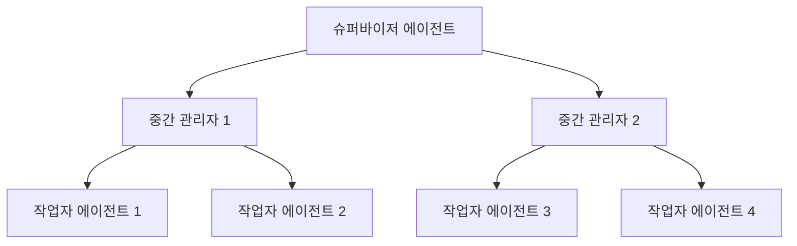
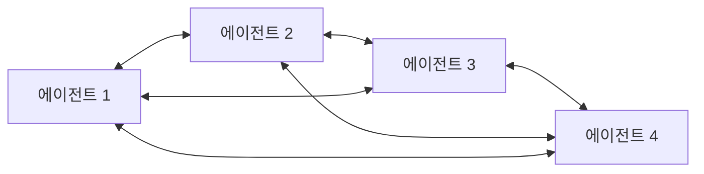
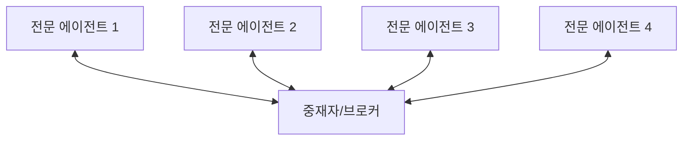
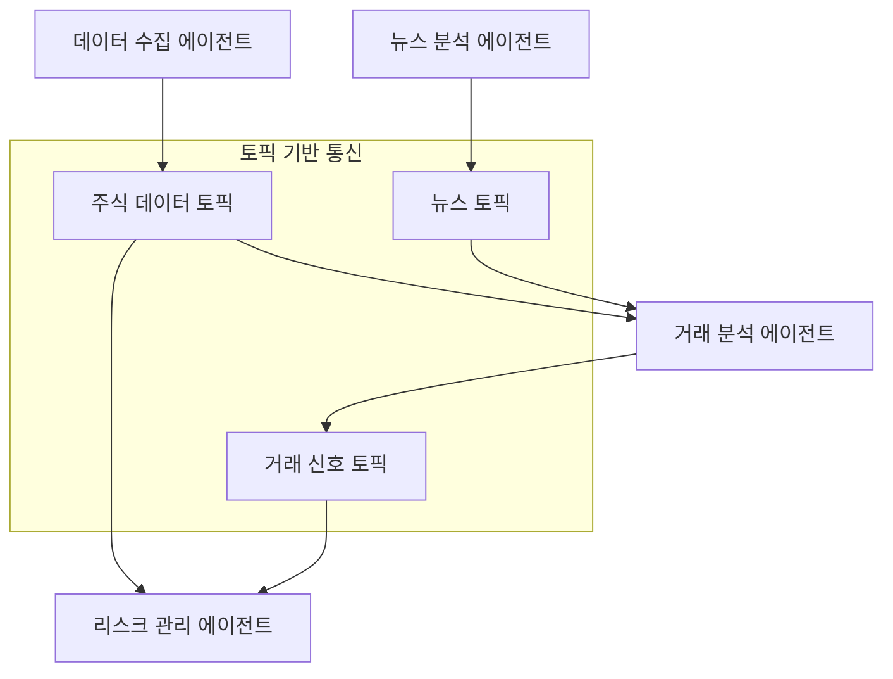

# 멀티에이전트 아키텍처와 대규모 구현 전략

[[Agent Architecture Comparison|단일 에이전트 아키텍처]]에서 더 나아가, 현대 AI 시스템은 점점 더 복잡한 문제를 해결하기 위해 여러 에이전트가 협력하는 멀티에이전트 시스템(Multi-Agent System, MAS)으로 발전하고 있다. 본 글에서는 다양한 멀티에이전트 아키텍처 패턴들을 살펴보고, 대규모 환경에서의 구현 전략과 최신 통신 프로토콜들을 분석한다.

## 멀티에이전트 시스템의 필요성

단일 에이전트는 다음과 같은 한계를 가진다:
- **순차적 처리**: 한 번에 하나의 작업만 수행 가능
- **제한된 컨텍스트**: 메모리 용량과 처리 범위의 물리적 한계
- **전문성 부족**: 모든 도메인에 대한 전문 지식을 갖추기 어려움
- **단일 장애점**: 에이전트 실패 시 전체 시스템 마비

멀티에이전트 시스템은 이러한 문제를 해결하며 다음과 같은 이점을 제공한다:

### 분산 처리와 병렬성
여러 에이전트가 동시에 작업을 수행하여 처리 속도 향상

### 전문화와 모듈화
각 에이전트가 특정 도메인에 특화되어 높은 품질의 결과 생성

### 확장성과 유연성
새로운 에이전트 추가로 시스템 기능 확장 용이

### 내결함성
일부 에이전트 실패 시에도 시스템 전체 안정성 유지

## 멀티에이전트 아키텍처 패턴

### 1. 계층적 아키텍처 (Hierarchical Architecture)



#### 특징
- **명확한 지휘 체계**: Top-down 방식의 작업 위임
- **구조화된 의사결정**: 각 레벨별 책임과 권한 분리
- **확장 가능성**: 계층 추가를 통한 시스템 확장

#### 사용 사례
- 복잡한 프로젝트 관리 시스템
- 금융 거래 처리 파이프라인
- 대규모 데이터 분석 워크플로우

#### 구현 예시 (LangGraph)
```python
from langgraph.graph import StateGraph, MessagesState
from langgraph.prebuilt import ToolNode

class HierarchicalAgent:
    def __init__(self):
        self.supervisor = SupervisorAgent()
        self.managers = [ManagerAgent(domain) for domain in domains]
        self.workers = {domain: [WorkerAgent() for _ in range(3)] 
                       for domain in domains}
    
    def create_graph(self):
        workflow = StateGraph(MessagesState)
        
        # 슈퍼바이저 노드 추가
        workflow.add_node("supervisor", self.supervisor.route_task)
        
        # 매니저 노드들 추가
        for i, manager in enumerate(self.managers):
            workflow.add_node(f"manager_{i}", manager.delegate_work)
        
        # 작업자 노드들 추가
        for domain, workers in self.workers.items():
            for j, worker in enumerate(workers):
                workflow.add_node(f"worker_{domain}_{j}", worker.execute)
        
        return workflow.compile()
```

### 2. 네트워크 아키텍처 (Network Architecture)



#### 특징
- **피어 투 피어 통신**: 모든 에이전트가 직접 소통 가능
- **분산 의사결정**: 중앙 집중식 제어 없음
- **동적 협력**: 상황에 따른 유연한 협력 관계 형성

#### 장단점
**장점:**
- 높은 유연성과 적응성
- 단일 장애점 없음
- 창발적 지능 발현 가능

**단점:**
- 통신 오버헤드 증가 (O(n²) 복잡도)
- 조정 및 합의 어려움
- 예측하기 어려운 시스템 동작

### 3. 중재자 아키텍처 (Mediator Architecture)



#### 특징
- **중앙 중재자**: 모든 통신이 중재자를 통해 이루어짐
- **프로토콜 표준화**: 일관된 통신 방식
- **서비스 발견**: 중재자가 적절한 에이전트 연결

#### 구현 예시 (MCP 기반)
```python
class MCPMediator:
    def __init__(self):
        self.agents = {}
        self.message_queue = Queue()
        
    def register_agent(self, agent_id, agent, capabilities):
        """에이전트 등록 및 역량 정보 저장"""
        self.agents[agent_id] = {
            'instance': agent,
            'capabilities': capabilities,
            'status': 'active'
        }
    
    def route_message(self, sender_id, message, target_capability=None):
        """메시지 라우팅 및 적절한 에이전트 선택"""
        if target_capability:
            # 역량 기반 에이전트 선택
            suitable_agents = [
                aid for aid, info in self.agents.items() 
                if target_capability in info['capabilities'] 
                and info['status'] == 'active'
            ]
            
            if suitable_agents:
                target_id = self.select_best_agent(suitable_agents, message)
                return self.deliver_message(target_id, message)
        
        return self.broadcast_message(message)
    
    def select_best_agent(self, candidates, message):
        """로드 밸런싱 및 에이전트 선택 로직"""
        # 라운드 로빈, 가중치 기반, 또는 ML 기반 선택
        return min(candidates, key=lambda x: self.get_agent_load(x))
```

### 4. 발행-구독 아키텍처 (Publish-Subscribe Architecture)



#### 특징
- **비동기 통신**: 발행자와 구독자 간 직접 결합 없음
- **확장성**: 새로운 구독자 추가 용이
- **필터링**: 관심 있는 정보만 수신 가능

#### 구현 예시
```python
import asyncio
from typing import Dict, List, Callable

class PubSubSystem:
    def __init__(self):
        self.topics: Dict[str, List[Callable]] = {}
        self.agents: Dict[str, 'Agent'] = {}
    
    async def subscribe(self, agent_id: str, topic: str, callback: Callable):
        """토픽 구독"""
        if topic not in self.topics:
            self.topics[topic] = []
        self.topics[topic].append((agent_id, callback))
    
    async def publish(self, topic: str, message: dict):
        """메시지 발행"""
        if topic in self.topics:
            tasks = []
            for agent_id, callback in self.topics[topic]:
                tasks.append(asyncio.create_task(callback(message)))
            await asyncio.gather(*tasks, return_exceptions=True)
    
    async def unsubscribe(self, agent_id: str, topic: str):
        """구독 해제"""
        if topic in self.topics:
            self.topics[topic] = [
                (aid, cb) for aid, cb in self.topics[topic] 
                if aid != agent_id
            ]

class NewsAnalysisAgent:
    def __init__(self, pubsub: PubSubSystem):
        self.pubsub = pubsub
        
    async def start(self):
        await self.pubsub.subscribe("news_agent", "raw_news", self.analyze_news)
    
    async def analyze_news(self, news_data):
        """뉴스 분석 후 결과 발행"""
        sentiment = await self.analyze_sentiment(news_data)
        await self.pubsub.publish("market_signals", {
            "type": "news_sentiment",
            "sentiment": sentiment,
            "confidence": 0.85
        })
```

## 대규모 멀티에이전트 시스템 구현 전략

### 1. 통신 프로토콜 선택

#### Model Context Protocol (MCP)
Anthropic에서 개발한 표준화된 컨텍스트 공유 프로토콜

**특징:**
- LLM과 외부 도구/데이터 소스 간 표준 인터페이스
- JSON-RPC 2.0 기반 경량 통신
- 클라이언트-호스트-서버 아키텍처

**구현 예시:**
```python
from mcp import Client, Server, Resource

class MCPAgentConnector:
    def __init__(self):
        self.clients = {}
        self.servers = {}
    
    async def create_server(self, agent_id: str, capabilities: List[str]):
        """에이전트를 MCP 서버로 등록"""
        server = Server(agent_id)
        
        for capability in capabilities:
            server.add_tool(
                name=f"{agent_id}_{capability}",
                description=f"{capability} service by {agent_id}",
                handler=self.get_capability_handler(agent_id, capability)
            )
        
        self.servers[agent_id] = server
        return server
    
    async def connect_to_agent(self, client_id: str, server_id: str):
        """다른 에이전트에 MCP 클라이언트로 연결"""
        if server_id in self.servers:
            client = Client(client_id)
            await client.connect(self.servers[server_id])
            self.clients[f"{client_id}->{server_id}"] = client
            return client
```

#### Agent2Agent (A2A) Protocol
Google에서 개발한 엔터프라이즈급 에이전트 간 통신 프로토콜

**특징:**
- JSON 기반 생명주기 모델
- OAuth 2.0 보안 인증
- 비동기 작업 지원
- 50+ 파트너사 지원

**구현 예시:**
```python
class A2AAgent:
    def __init__(self, agent_id: str, capabilities: List[str]):
        self.agent_id = agent_id
        self.capabilities = capabilities
        self.agent_card = self.create_agent_card()
    
    def create_agent_card(self):
        """A2A Agent Card 생성"""
        return {
            "agent_id": self.agent_id,
            "name": f"Specialized Agent {self.agent_id}",
            "description": "Multi-domain problem solver",
            "capabilities": self.capabilities,
            "endpoints": {
                "task_endpoint": f"/api/v1/agents/{self.agent_id}/tasks",
                "status_endpoint": f"/api/v1/agents/{self.agent_id}/status"
            },
            "authentication": {
                "type": "OAuth2",
                "scopes": ["read", "write", "execute"]
            }
        }
    
    async def delegate_task(self, target_agent_id: str, task: dict):
        """다른 에이전트에 작업 위임"""
        message = {
            "type": "task_request",
            "sender": self.agent_id,
            "target": target_agent_id,
            "task": task,
            "timestamp": datetime.utcnow().isoformat()
        }
        
        # HTTP POST to target agent's task endpoint
        response = await self.send_a2a_message(target_agent_id, message)
        return response
```

#### Agent Network Protocol (ANP)
탈중앙화된 에이전트 네트워크를 위한 오픈 프로토콜

**특징:**
- W3C DID (Decentralized Identifier) 기반 신원 확인
- JSON-LD 시맨틱 웹 기술 활용
- P2P 네트워크 지원
- 최소 정보 공개 원칙

### 2. 확장성 최적화 전략

#### 샤딩과 파티셔닝
```python
class AgentShardManager:
    def __init__(self, num_shards: int = 8):
        self.num_shards = num_shards
        self.shards = {i: AgentShard(i) for i in range(num_shards)}
        
    def get_shard(self, agent_id: str) -> int:
        """일관성 해싱을 통한 샤드 선택"""
        return hash(agent_id) % self.num_shards
    
    def route_message(self, sender_id: str, target_id: str, message: dict):
        """샤드 간 메시지 라우팅"""
        target_shard = self.get_shard(target_id)
        return self.shards[target_shard].deliver_message(target_id, message)

class AgentShard:
    def __init__(self, shard_id: int):
        self.shard_id = shard_id
        self.agents = {}
        self.message_queue = asyncio.Queue()
        
    async def process_messages(self):
        """메시지 처리 루프"""
        while True:
            message = await self.message_queue.get()
            await self.handle_message(message)
```

#### 로드 밸런싱과 자동 스케일링
```python
class AgentLoadBalancer:
    def __init__(self):
        self.agent_pools = {}
        self.metrics_collector = MetricsCollector()
        
    async def scale_agent_pool(self, agent_type: str):
        """부하에 따른 에이전트 풀 자동 확장"""
        current_load = await self.metrics_collector.get_load(agent_type)
        current_pool_size = len(self.agent_pools.get(agent_type, []))
        
        if current_load > 0.8 and current_pool_size < MAX_POOL_SIZE:
            # 새 에이전트 인스턴스 생성
            new_agent = await self.create_agent_instance(agent_type)
            self.agent_pools[agent_type].append(new_agent)
            
        elif current_load < 0.3 and current_pool_size > MIN_POOL_SIZE:
            # 과도한 인스턴스 제거
            agent_to_remove = self.agent_pools[agent_type].pop()
            await agent_to_remove.graceful_shutdown()
    
    def select_agent(self, agent_type: str, task_complexity: float):
        """작업 복잡도에 따른 최적 에이전트 선택"""
        available_agents = [
            agent for agent in self.agent_pools.get(agent_type, [])
            if agent.current_load < agent.max_capacity
        ]
        
        if not available_agents:
            return None
            
        # 가중치 기반 선택 (부하, 성능, 전문성 고려)
        return min(available_agents, key=lambda a: (
            a.current_load,
            -a.performance_score,
            abs(a.specialization_score - task_complexity)
        ))
```

### 3. 내결함성과 복구 메커니즘

#### 서킷 브레이커 패턴
```python
from enum import Enum
import time
from typing import Optional

class CircuitState(Enum):
    CLOSED = "closed"      # 정상 동작
    OPEN = "open"          # 장애 상태 (요청 차단)
    HALF_OPEN = "half_open" # 복구 시도

class AgentCircuitBreaker:
    def __init__(self, failure_threshold: int = 5, timeout: int = 60):
        self.failure_threshold = failure_threshold
        self.timeout = timeout
        self.failure_count = 0
        self.last_failure_time = 0
        self.state = CircuitState.CLOSED
        
    async def call_agent(self, agent_id: str, request: dict):
        """서킷 브레이커를 통한 안전한 에이전트 호출"""
        if self.state == CircuitState.OPEN:
            if time.time() - self.last_failure_time > self.timeout:
                self.state = CircuitState.HALF_OPEN
            else:
                raise CircuitBreakerOpenError(f"Agent {agent_id} is unavailable")
        
        try:
            response = await self.invoke_agent(agent_id, request)
            
            if self.state == CircuitState.HALF_OPEN:
                self.state = CircuitState.CLOSED
                self.failure_count = 0
                
            return response
            
        except Exception as e:
            self.failure_count += 1
            self.last_failure_time = time.time()
            
            if self.failure_count >= self.failure_threshold:
                self.state = CircuitState.OPEN
                
            raise e
```

#### 분산 합의 알고리즘
```python
class RaftConsensus:
    """멀티에이전트 환경에서의 합의 알고리즘"""
    
    def __init__(self, agent_id: str, peer_agents: List[str]):
        self.agent_id = agent_id
        self.peer_agents = peer_agents
        self.current_term = 0
        self.voted_for = None
        self.log = []
        self.state = "follower"  # follower, candidate, leader
        
    async def request_vote(self, term: int, candidate_id: str) -> bool:
        """투표 요청 처리"""
        if term > self.current_term:
            self.current_term = term
            self.voted_for = None
            self.state = "follower"
            
        if (self.voted_for is None or self.voted_for == candidate_id) and \
           self.is_log_up_to_date(candidate_id):
            self.voted_for = candidate_id
            return True
            
        return False
    
    async def elect_leader(self) -> Optional[str]:
        """리더 선출 과정"""
        self.state = "candidate"
        self.current_term += 1
        self.voted_for = self.agent_id
        
        votes = 1  # 자기 자신에게 투표
        tasks = []
        
        for peer in self.peer_agents:
            task = asyncio.create_task(
                self.send_vote_request(peer, self.current_term, self.agent_id)
            )
            tasks.append(task)
        
        responses = await asyncio.gather(*tasks, return_exceptions=True)
        votes += sum(1 for response in responses if response is True)
        
        if votes > len(self.peer_agents) // 2:
            self.state = "leader"
            return self.agent_id
        else:
            self.state = "follower"
            return None
```

## 실제 사용 사례: 금융 트레이딩 시스템

### 시스템 아키텍처
```python
class TradingMultiAgentSystem:
    """금융 트레이딩을 위한 멀티에이전트 시스템"""
    
    def __init__(self):
        self.data_agent = MarketDataAgent()
        self.analysis_agents = [
            TechnicalAnalysisAgent(),
            FundamentalAnalysisAgent(),
            SentimentAnalysisAgent()
        ]
        self.risk_agent = RiskManagementAgent()
        self.execution_agent = TradeExecutionAgent()
        self.pubsub = PubSubSystem()
        
    async def initialize(self):
        """시스템 초기화 및 에이전트 연결"""
        # 데이터 구독 설정
        await self.data_agent.subscribe_to_feeds([
            "market_data", "news_feed", "economic_indicators"
        ])
        
        # 분석 에이전트들의 신호 구독
        for agent in self.analysis_agents:
            await self.pubsub.subscribe(
                agent.agent_id, "trading_signals", 
                self.risk_agent.evaluate_signal
            )
        
        # 실행 에이전트 연결
        await self.pubsub.subscribe(
            "execution", "approved_trades",
            self.execution_agent.execute_trade
        )

class TechnicalAnalysisAgent:
    async def analyze(self, market_data: dict):
        """기술적 분석 수행"""
        indicators = {
            "rsi": self.calculate_rsi(market_data["prices"]),
            "macd": self.calculate_macd(market_data["prices"]),
            "bollinger": self.calculate_bollinger_bands(market_data["prices"])
        }
        
        signal = self.generate_signal(indicators)
        
        await self.pubsub.publish("trading_signals", {
            "agent": "technical_analysis",
            "signal": signal,
            "confidence": self.calculate_confidence(indicators),
            "timestamp": datetime.utcnow()
        })

class RiskManagementAgent:
    async def evaluate_signal(self, signal: dict):
        """리스크 평가 및 거래 승인"""
        risk_score = await self.calculate_risk(signal)
        
        if risk_score < self.risk_threshold:
            approved_trade = {
                "signal": signal,
                "position_size": self.calculate_position_size(risk_score),
                "stop_loss": self.calculate_stop_loss(signal),
                "take_profit": self.calculate_take_profit(signal)
            }
            
            await self.pubsub.publish("approved_trades", approved_trade)
```

### 성능 모니터링과 최적화
```python
class AgentPerformanceMonitor:
    def __init__(self):
        self.metrics = {}
        self.alert_thresholds = {
            "response_time": 5.0,  # seconds
            "error_rate": 0.05,    # 5%
            "throughput": 100      # requests/minute
        }
    
    async def collect_metrics(self, agent_id: str, operation: str, 
                            duration: float, success: bool):
        """에이전트 성능 메트릭 수집"""
        key = f"{agent_id}:{operation}"
        
        if key not in self.metrics:
            self.metrics[key] = {
                "response_times": [],
                "success_count": 0,
                "failure_count": 0,
                "last_updated": time.time()
            }
        
        self.metrics[key]["response_times"].append(duration)
        if success:
            self.metrics[key]["success_count"] += 1
        else:
            self.metrics[key]["failure_count"] += 1
        
        # 성능 저하 감지
        await self.check_performance_alerts(key)
    
    async def check_performance_alerts(self, key: str):
        """성능 임계값 모니터링 및 알림"""
        metric = self.metrics[key]
        
        avg_response_time = sum(metric["response_times"][-100:]) / \
                          min(len(metric["response_times"]), 100)
        
        error_rate = metric["failure_count"] / \
                    (metric["success_count"] + metric["failure_count"])
        
        if avg_response_time > self.alert_thresholds["response_time"]:
            await self.send_alert(f"High response time for {key}")
            
        if error_rate > self.alert_thresholds["error_rate"]:
            await self.send_alert(f"High error rate for {key}")
```

## 미래 방향성과 도전 과제

### 1. 진화하는 프로토콜
- **동적 프로토콜 협상**: 에이전트들이 실시간으로 최적 통신 방식 선택
- **메타 프로토콜**: 상황에 따른 프로토콜 생성 및 적응
- **자기 진화 시스템**: 성능 피드백을 통한 자동 아키텍처 개선

### 2. 보안과 프라이버시
- **영지식 증명**: 정보 공개 없는 신뢰성 확인
- **연합 학습**: 데이터 공유 없는 협력 학습
- **탈중앙화 신원 확인**: DID 기반 에이전트 인증

### 3. 집단 지능의 구현
- **창발적 행동**: 개별 에이전트 능력을 초월하는 시스템 수준 지능
- **분산 합의**: 대규모 에이전트 네트워크에서의 의사결정
- **자기 조직화**: 외부 제어 없는 에이전트 네트워크 최적화

### 4. 기술적 도전 과제

#### 확장성 한계
- **통신 오버헤드**: O(n²) 복잡도 문제 해결
- **상태 동기화**: 분산 환경에서의 일관성 유지
- **자원 경합**: 공유 자원에 대한 효율적 접근

#### 신뢰성과 안전성
- **비잔틴 장애**: 악의적 에이전트 대응
- **데이터 품질**: 잘못된 정보의 전파 방지
- **시스템 안정성**: 예측 불가능한 창발적 행동 제어

## 결론

멀티에이전트 아키텍처는 AI 시스템의 복잡성과 규모가 증가함에 따라 필수적인 기술로 부상하고 있다. 계층적, 네트워크, 중재자, 발행-구독 등 다양한 아키텍처 패턴은 각각의 장단점과 적용 영역을 가지고 있으며, 실제 구현 시에는 하이브리드 접근 방식이 효과적이다.

MCP, A2A, ANP 등의 표준화된 통신 프로토콜의 발전은 이종 에이전트 간의 상호 운용성을 크게 향상시키고 있으며, 대규모 시스템 구현을 위한 확장성 전략과 내결함성 메커니즘의 중요성이 더욱 커지고 있다.

미래의 멀티에이전트 시스템은 단순한 작업 분할을 넘어서 진정한 집단 지능을 구현하는 방향으로 발전할 것이며, 이를 위해서는 기술적 도전 과제뿐만 아니라 윤리적, 사회적 고려사항도 함께 해결해야 할 것이다.

[[Agent Architecture Comparison]]에서 논의한 단일 에이전트의 한계를 뛰어넘어, 멀티에이전트 시스템은 더욱 복잡하고 지능적인 AI 생태계의 기반이 될 것이다. 