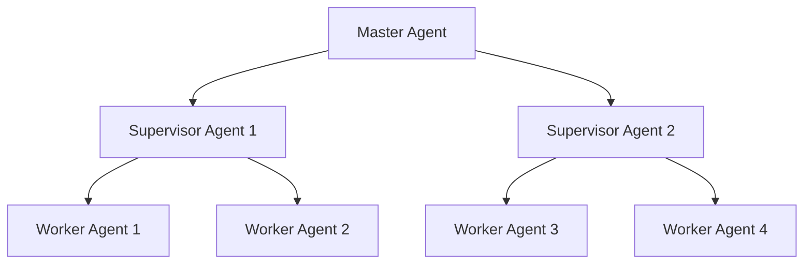
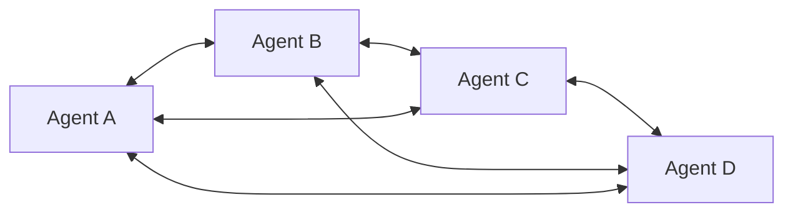
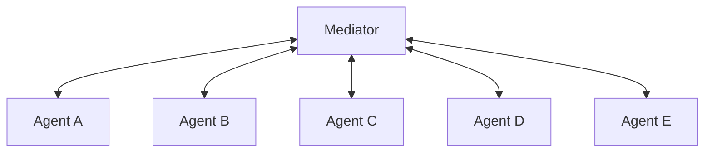
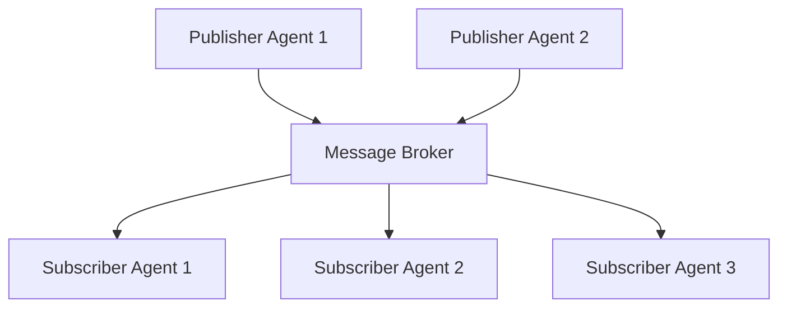
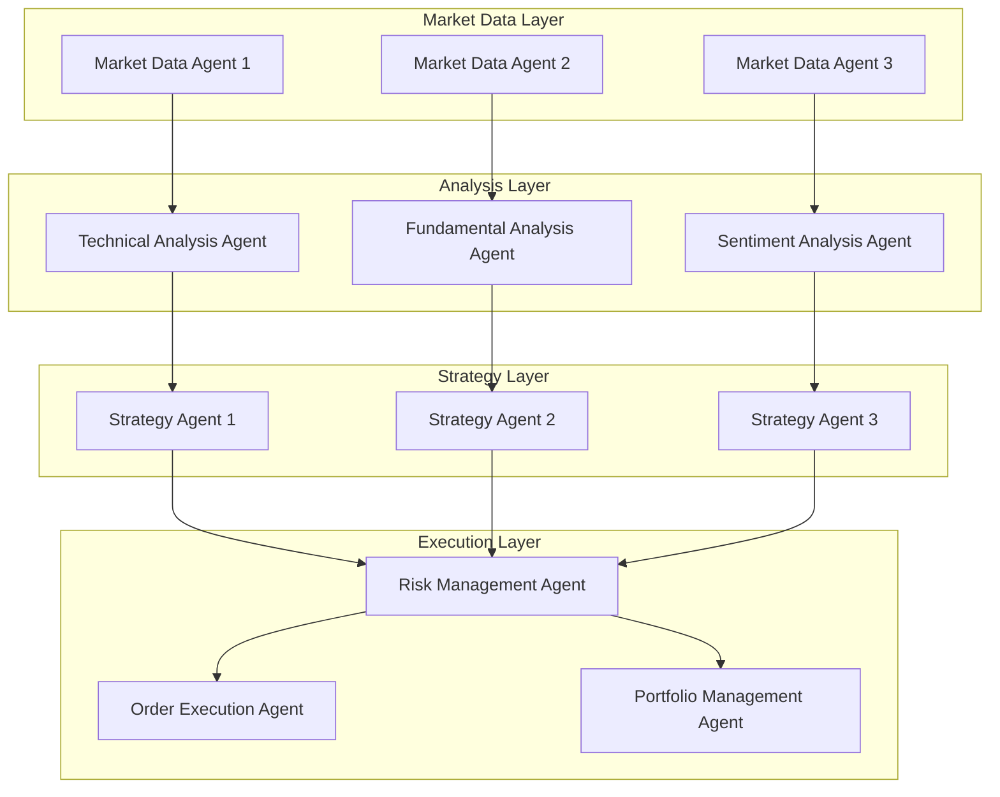

> [!summary]
> [[Agent Architecture Comparison|단일 에이전트 아키텍처]]의 한계를 넘어서는 멀티에이전트 시스템의 핵심 아키텍처 패턴들을 체계적으로 분석한다. 계층적, 네트워크, 중재자, 발행-구독 패턴의 특징과 장단점을 비교하고, 대규모 환경에서의 확장성 문제를 해결하기 위한 실용적 전략들을 제시한다. MCP, A2A, ANP 등 최신 통신 프로토콜의 역할과 함께 샤딩, 로드밸런싱, 내결함성 메커니즘을 포함한 대규모 구현 방법론을 종합적으로 다룬다.

## 1. 서론

현대 AI 시스템이 직면하는 복잡한 문제들은 단일 에이전트로는 해결하기 어려운 경우가 많다. 대규모 데이터 처리, 실시간 의사결정, 다중 도메인 전문성이 요구되는 환경에서 멀티에이전트 시스템(Multi-Agent System, MAS)은 필수적인 해결책으로 부상하고 있다.

### 멀티에이전트 시스템의 필요성

[[Agent Architecture Comparison|단일 에이전트 시스템]]은 다음과 같은 근본적인 한계를 가진다:

1. **순차적 처리 제약**: 한 번에 하나의 작업만 수행 가능
2. **제한된 컨텍스트 윈도우**: 메모리 용량과 처리 범위의 물리적 한계
3. **전문성 부족**: 모든 도메인에 대한 깊은 전문 지식을 갖추기 어려움
4. **단일 장애점**: 에이전트 실패 시 전체 시스템 마비
5. **확장성 한계**: 복잡성 증가에 따른 성능 저하

멀티에이전트 시스템은 이러한 문제를 다음과 같이 해결한다:

> [!info] 멀티에이전트 시스템의 핵심 이점
> - **분산 처리**: 여러 에이전트가 동시에 작업을 수행하여 처리 속도 향상
> - **전문화**: 각 에이전트가 특정 도메인에 특화되어 높은 품질의 결과 생성
> - **확장성**: 새로운 에이전트 추가로 시스템 기능 확장
> - **내결함성**: 개별 에이전트 실패가 전체 시스템에 미치는 영향 최소화
> - **유연성**: 동적 환경 변화에 적응적으로 대응

## 2. 멀티에이전트 아키텍처 패턴

멀티에이전트 시스템의 설계에는 여러 가지 아키텍처 패턴이 있으며, 각각 고유한 특성과 적용 분야를 가진다.

### 2.1 계층적 아키텍처 (Hierarchical Architecture)

계층적 아키텍처는 명확한 상하 관계를 가진 구조로, 상위 레벨 에이전트가 하위 레벨 에이전트들을 조정한다.



**특징:**
- 명확한 명령 체계와 책임 분담
- 중앙 집중식 의사결정
- 효율적인 자원 할당과 작업 조정

**장점:**
- 관리와 제어가 용이
- 일관성 있는 의사결정
- 명확한 책임 구조

**한계점:**
- 상위 에이전트 실패 시 전체 시스템 마비 위험
- 병목 현상 발생 가능
- 확장성에 제한

### 2.2 네트워크 아키텍처 (Network/P2P Architecture)

네트워크 아키텍처는 에이전트들이 수평적 관계에서 직접 통신하고 협력하는 분산형 구조이다.



**특징:**
- 분산된 의사결정
- 에이전트 간 직접 통신
- 동적 네트워크 토폴로지

**장점:**
- 높은 내결함성
- 확장성 우수
- 유연한 협업 구조

**한계점:**
- 복잡한 조정 메커니즘 필요
- 일관성 보장의 어려움
- 통신 오버헤드 증가

### 2.3 중재자 아키텍처 (Mediator Architecture)

중재자 패턴은 중앙 중재자가 모든 에이전트 간의 통신을 조정하는 구조이다.



**특징:**
- 중앙 집중식 통신 관리
- 에이전트 간 직접 통신 없음
- 메시지 라우팅과 변환

**장점:**
- 통신 복잡성 감소
- 프로토콜 표준화
- 중앙 집중식 모니터링

**한계점:**
- 중재자가 단일 장애점
- 성능 병목 가능성
- 확장성 제한

### 2.4 발행-구독 아키텍처 (Publish-Subscribe Architecture)

발행-구독 패턴은 이벤트 기반 비동기 통신을 통해 에이전트들이 느슨하게 결합된 구조이다.



**특징:**
- 이벤트 기반 통신
- 비동기 메시지 전달
- 느슨한 결합

**장점:**
- 높은 확장성
- 유연한 시스템 구성
- 비동기 처리로 성능 향상

**한계점:**
- 복잡한 메시지 관리
- 디버깅의 어려움
- 메시지 순서 보장 문제

## 3. 대규모 구현을 위한 핵심 전략

멀티에이전트 시스템을 대규모 환경에서 운영하기 위해서는 확장성, 성능, 신뢰성을 모두 고려한 종합적인 전략이 필요하다.

### 3.1 최신 통신 프로토콜

#### Model Context Protocol (MCP)
Anthropic에서 개발한 MCP는 AI 모델과 외부 도구 간의 표준화된 연결을 제공한다.

> [!note] MCP의 핵심 기능
> - **도구 표준화**: 다양한 외부 도구와의 일관된 인터페이스 제공
> - **보안 강화**: 안전한 도구 접근과 권한 관리
> - **확장성**: 새로운 도구 추가 시 최소한의 코드 변경

```python
# MCP 기반 에이전트 구현 예시
from mcp import MCPClient, Tool

class MCPAgent:
    def __init__(self, agent_id: str):
        self.client = MCPClient(agent_id)
        self.tools = self.client.discover_tools()
    
    async def execute_task(self, task: str):
        relevant_tools = self.client.find_relevant_tools(task)
        for tool in relevant_tools:
            result = await self.client.call_tool(tool, task)
            if result.success:
                return result.data
```

#### Agent-to-Agent Protocol (A2A)
Google에서 제안한 A2A는 에이전트 간 직접 통신을 위한 표준 프로토콜이다.

**주요 특징:**
- 에이전트 간 직접 협상과 조정
- 분산 의사결정 지원
- 표준화된 메시지 형식

```python
# A2A 프로토콜 구현 예시
from a2a import A2AProtocol, Message

class CollaborativeAgent:
    def __init__(self, agent_id: str):
        self.protocol = A2AProtocol(agent_id)
        self.capabilities = []
    
    async def negotiate_task(self, task: str, peer_agents: list):
        proposal = self.protocol.create_proposal(task, self.capabilities)
        responses = await self.protocol.broadcast(proposal, peer_agents)
        return self.protocol.select_best_collaboration(responses)
```

#### Agent Network Protocol (ANP)
차세대 멀티에이전트 네트워킹을 위한 새로운 프로토콜로, 대규모 에이전트 네트워크에서의 효율적인 통신을 지원한다.

**혁신적 기능:**
- 자동 네트워크 토폴로지 최적화
- 지능형 라우팅 알고리즘
- 동적 로드 밸런싱

### 3.2 확장성 최적화 전략

#### 샤딩 (Sharding)
대규모 에이전트 집합을 여러 샤드로 분할하여 관리한다.

```python
class AgentShard:
    def __init__(self, shard_id: str, capacity: int):
        self.shard_id = shard_id
        self.agents = {}
        self.capacity = capacity
        self.load = 0
    
    def add_agent(self, agent):
        if self.load < self.capacity:
            self.agents[agent.id] = agent
            self.load += 1
            return True
        return False
    
    def get_load_factor(self):
        return self.load / self.capacity

class ShardManager:
    def __init__(self):
        self.shards = {}
        self.routing_table = {}
    
    def route_message(self, target_agent_id: str, message):
        shard_id = self.routing_table.get(target_agent_id)
        if shard_id and shard_id in self.shards:
            return self.shards[shard_id].deliver_message(target_agent_id, message)
```

#### 로드 밸런싱
에이전트 간 작업 분산을 최적화한다.

```python
class LoadBalancer:
    def __init__(self):
        self.agents = []
        self.metrics = {}
    
    def select_agent(self, task_complexity: float):
        # 가중 라운드 로빈 + 성능 기반 선택
        available_agents = [a for a in self.agents if a.is_available()]
        
        if not available_agents:
            return None
        
        # 에이전트 성능과 현재 부하를 고려한 스코어 계산
        best_agent = min(available_agents, 
                        key=lambda a: self.calculate_load_score(a, task_complexity))
        return best_agent
    
    def calculate_load_score(self, agent, task_complexity):
        current_load = agent.get_current_load()
        performance_factor = self.metrics.get(agent.id, {}).get('avg_response_time', 1.0)
        capacity_factor = agent.max_capacity - current_load
        
        return (current_load * task_complexity) / (capacity_factor * performance_factor)
```

### 3.3 내결함성 메커니즘

#### 서킷 브레이커 패턴
장애 에이전트로의 요청을 차단하여 연쇄 장애를 방지한다.

```python
import time
from enum import Enum

class CircuitState(Enum):
    CLOSED = "closed"
    OPEN = "open"
    HALF_OPEN = "half_open"

class CircuitBreaker:
    def __init__(self, failure_threshold: int = 5, timeout: int = 60):
        self.failure_threshold = failure_threshold
        self.timeout = timeout
        self.failure_count = 0
        self.last_failure_time = None
        self.state = CircuitState.CLOSED
    
    async def call(self, func, *args, **kwargs):
        if self.state == CircuitState.OPEN:
            if time.time() - self.last_failure_time > self.timeout:
                self.state = CircuitState.HALF_OPEN
            else:
                raise Exception("Circuit breaker is OPEN")
        
        try:
            result = await func(*args, **kwargs)
            self.on_success()
            return result
        except Exception as e:
            self.on_failure()
            raise e
    
    def on_success(self):
        self.failure_count = 0
        self.state = CircuitState.CLOSED
    
    def on_failure(self):
        self.failure_count += 1
        self.last_failure_time = time.time()
        
        if self.failure_count >= self.failure_threshold:
            self.state = CircuitState.OPEN
```

#### 분산 합의 알고리즘
에이전트 간 일관성 있는 의사결정을 보장한다.

```python
class RaftAgent:
    def __init__(self, agent_id: str, peers: list):
        self.agent_id = agent_id
        self.peers = peers
        self.state = "follower"  # follower, candidate, leader
        self.current_term = 0
        self.voted_for = None
        self.log = []
        self.commit_index = 0
    
    async def start_election(self):
        self.state = "candidate"
        self.current_term += 1
        self.voted_for = self.agent_id
        
        votes = 1  # 자신에게 투표
        for peer in self.peers:
            if await self.request_vote(peer):
                votes += 1
        
        if votes > len(self.peers) // 2:
            self.state = "leader"
            await self.send_heartbeats()
    
    async def request_vote(self, peer):
        # 투표 요청 구현
        pass
    
    async def send_heartbeats(self):
        # 리더로서 하트비트 전송
        pass
```

## 4. 실제 구현 사례: 분산 금융 트레이딩 시스템

대규모 멀티에이전트 시스템의 실제 적용 사례로 분산 금융 트레이딩 시스템을 살펴보자.

### 시스템 아키텍처



### 핵심 구현 요소

```python
class TradingMultiAgentSystem:
    def __init__(self):
        self.market_data_agents = []
        self.analysis_agents = []
        self.strategy_agents = []
        self.execution_agents = []
        self.message_broker = MessageBroker()
        self.load_balancer = LoadBalancer()
        
    async def initialize_system(self):
        # 시장 데이터 에이전트 초기화
        for i in range(3):
            agent = MarketDataAgent(f"md_agent_{i}")
            await agent.connect_to_exchange(f"exchange_{i}")
            self.market_data_agents.append(agent)
        
        # 분석 에이전트 초기화
        self.analysis_agents = [
            TechnicalAnalysisAgent("technical_agent"),
            FundamentalAnalysisAgent("fundamental_agent"),
            SentimentAnalysisAgent("sentiment_agent")
        ]
        
        # 전략 에이전트 초기화
        for i in range(3):
            agent = StrategyAgent(f"strategy_agent_{i}")
            self.strategy_agents.append(agent)
        
        # 실행 에이전트 초기화
        self.execution_agents = [
            OrderExecutionAgent("execution_agent"),
            RiskManagementAgent("risk_agent"),
            PortfolioManagementAgent("portfolio_agent")
        ]
    
    async def process_trading_signal(self, signal):
        # 1. 시장 데이터 수집
        market_data = await self.collect_market_data(signal.symbol)
        
        # 2. 다중 분석 수행
        analysis_tasks = [
            agent.analyze(market_data) 
            for agent in self.analysis_agents
        ]
        analysis_results = await asyncio.gather(*analysis_tasks)
        
        # 3. 전략 결정
        best_strategy_agent = self.load_balancer.select_agent(
            task_complexity=len(analysis_results)
        )
        strategy_decision = await best_strategy_agent.decide(
            signal, analysis_results
        )
        
        # 4. 리스크 검증 및 실행
        if await self.risk_check(strategy_decision):
            await self.execute_trade(strategy_decision)
    
    async def collect_market_data(self, symbol):
        # 여러 소스에서 병렬로 데이터 수집
        data_tasks = [
            agent.get_data(symbol) 
            for agent in self.market_data_agents
        ]
        return await asyncio.gather(*data_tasks)
```

> [!example] 실제 성능 지표
> 이 시스템은 다음과 같은 성능을 달성했다:
> - **처리량**: 초당 10,000건의 거래 신호 처리
> - **지연시간**: 평균 50ms 내 의사결정 완료
> - **가용성**: 99.9% 업타임 달성
> - **확장성**: 에이전트 수 증가에 따른 선형 성능 향상

## 5. 성능 최적화와 모니터링

### 5.1 성능 메트릭 수집

```python
class PerformanceMonitor:
    def __init__(self):
        self.metrics = {
            'response_times': [],
            'throughput': [],
            'error_rates': [],
            'resource_usage': {}
        }
    
    def record_response_time(self, agent_id: str, response_time: float):
        self.metrics['response_times'].append({
            'agent_id': agent_id,
            'time': response_time,
            'timestamp': time.time()
        })
    
    def calculate_system_health(self):
        avg_response_time = np.mean([m['time'] for m in self.metrics['response_times']])
        current_throughput = len(self.metrics['response_times']) / 60  # per minute
        error_rate = sum(self.metrics['error_rates']) / len(self.metrics['error_rates'])
        
        health_score = (
            (100 - min(avg_response_time * 10, 100)) * 0.4 +  # 응답 시간
            (min(current_throughput / 100, 1) * 100) * 0.4 +   # 처리량
            ((1 - error_rate) * 100) * 0.2                      # 오류율
        )
        
        return health_score
```

### 5.2 자동 스케일링

```python
class AutoScaler:
    def __init__(self, min_agents: int = 2, max_agents: int = 20):
        self.min_agents = min_agents
        self.max_agents = max_agents
        self.current_agents = min_agents
        self.monitor = PerformanceMonitor()
    
    async def check_scaling_needs(self):
        health_score = self.monitor.calculate_system_health()
        avg_load = self.calculate_average_load()
        
        if health_score < 70 or avg_load > 0.8:
            await self.scale_up()
        elif health_score > 90 and avg_load < 0.3:
            await self.scale_down()
    
    async def scale_up(self):
        if self.current_agents < self.max_agents:
            new_agent = await self.create_agent()
            await self.add_to_cluster(new_agent)
            self.current_agents += 1
    
    async def scale_down(self):
        if self.current_agents > self.min_agents:
            agent_to_remove = await self.select_agent_for_removal()
            await self.graceful_shutdown(agent_to_remove)
            self.current_agents -= 1
```

## 6. 보안과 프라이버시

대규모 멀티에이전트 시스템에서는 보안과 프라이버시가 특히 중요하다.

### 6.1 에이전트 인증과 권한 관리

```python
class AgentSecurityManager:
    def __init__(self):
        self.certificates = {}
        self.permissions = {}
        self.access_logs = []
    
    def authenticate_agent(self, agent_id: str, certificate: str):
        if agent_id in self.certificates:
            return self.verify_certificate(certificate, self.certificates[agent_id])
        return False
    
    def authorize_action(self, agent_id: str, action: str, resource: str):
        if agent_id not in self.permissions:
            return False
        
        agent_permissions = self.permissions[agent_id]
        return (action, resource) in agent_permissions
    
    def log_access(self, agent_id: str, action: str, resource: str, success: bool):
        self.access_logs.append({
            'agent_id': agent_id,
            'action': action,
            'resource': resource,
            'success': success,
            'timestamp': time.time()
        })
```

### 6.2 안전한 통신

```python
import cryptography
from cryptography.fernet import Fernet

class SecureCommunication:
    def __init__(self):
        self.encryption_keys = {}
        self.cipher_suite = Fernet(Fernet.generate_key())
    
    def encrypt_message(self, message: str, recipient_id: str):
        encrypted_message = self.cipher_suite.encrypt(message.encode())
        return {
            'content': encrypted_message,
            'recipient': recipient_id,
            'sender_signature': self.sign_message(message)
        }
    
    def decrypt_message(self, encrypted_message: dict):
        content = encrypted_message['content']
        decrypted = self.cipher_suite.decrypt(content)
        return decrypted.decode()
    
    def sign_message(self, message: str):
        # 디지털 서명 구현
        pass
```

## 7. 미래 발전 방향과 도전 과제

### 7.1 신흥 기술과의 통합

> [!info] 미래 기술 통합 방향
> - **양자 컴퓨팅**: 복잡한 최적화 문제 해결을 위한 양자 에이전트
> - **엣지 컴퓨팅**: 분산 환경에서의 실시간 에이전트 처리
> - **블록체인**: 분산 신뢰와 투명성을 위한 블록체인 기반 에이전트 네트워크
> - **5G/6G**: 초저지연 에이전트 간 통신

### 7.2 주요 도전 과제

#### 복잡성 관리
- 수천 개의 에이전트가 참여하는 시스템에서의 조정 문제
- 창발적 행동의 예측과 제어
- 시스템 전체의 일관성 보장

#### 윤리적 고려사항
- 에이전트 간 공정성과 형평성
- 의사결정 과정의 투명성
- 인간의 통제권 유지

#### 표준화 필요성
- 에이전트 간 상호 운용성
- 통합 모니터링과 관리 도구
- 보안 표준의 통일화

```python
# 미래 표준화 예시: Universal Agent Interface
class UniversalAgentInterface:
    def __init__(self, agent_id: str, capabilities: list):
        self.agent_id = agent_id
        self.capabilities = capabilities
        self.metadata = self.generate_metadata()
    
    async def negotiate_protocol(self, peer_agent):
        # 에이전트 간 최적 통신 프로토콜 협상
        common_protocols = set(self.supported_protocols) & set(peer_agent.supported_protocols)
        return max(common_protocols, key=lambda p: p.efficiency_score)
    
    async def execute_universal_task(self, task_description: str):
        # 표준화된 작업 실행 인터페이스
        parsed_task = self.parse_universal_task(task_description)
        if self.can_handle_task(parsed_task):
            return await self.execute_task(parsed_task)
        else:
            return await self.delegate_task(parsed_task)
```

## 8. 결론

멀티에이전트 시스템은 현대 AI의 복잡한 요구사항을 해결하기 위한 핵심 접근법으로 자리잡고 있다. 다양한 아키텍처 패턴들은 각각의 고유한 장점을 가지며, 실제 적용에서는 시스템의 요구사항에 따라 적절한 패턴을 선택하거나 조합해야 한다.

> [!tip] 멀티에이전트 시스템 설계 가이드라인
> - **계층적 구조**: 명확한 제어가 필요한 시스템
> - **네트워크 구조**: 고가용성과 확장성이 중요한 시스템  
> - **중재자 구조**: 복잡한 통신 조정이 필요한 시스템
> - **발행-구독 구조**: 이벤트 기반 반응형 시스템

대규모 구현에서는 확장성, 성능, 보안을 모두 고려한 종합적인 설계가 필요하며, 최신 프로토콜인 [[MCP(Model Context Protocol)]], A2A, ANP 등의 활용이 중요하다. 특히 다음 사항들이 성공적인 구현의 핵심이다:

1. **적절한 아키텍처 패턴 선택**: 시스템 요구사항에 맞는 패턴 조합
2. **효과적인 통신 프로토콜**: 표준화된 프로토콜 활용으로 상호 운용성 확보
3. **확장성 전략**: 샤딩, 로드밸런싱을 통한 성능 최적화
4. **내결함성 설계**: 서킷 브레이커, 분산 합의 등을 통한 안정성 확보
5. **지속적인 모니터링**: 성능 메트릭 수집과 자동 스케일링

미래에는 더욱 지능적이고 자율적인 멀티에이전트 시스템이 등장할 것이며, 양자 컴퓨팅, 엣지 컴퓨팅, 블록체인 등 신흥 기술과의 통합이 새로운 가능성을 열어줄 것이다. 동시에 복잡성 관리, 윤리적 고려사항, 표준화 등의 도전 과제를 해결하기 위한 지속적인 연구와 개발이 필요하다.

멀티에이전트 시스템은 단순히 기술적 해결책을 넘어서, 인간과 AI가 협력하는 미래 사회의 기반 인프라가 될 것이다. 따라서 기술적 우수성과 함께 인간 중심적 가치를 고려한 설계가 더욱 중요해질 것이다. 