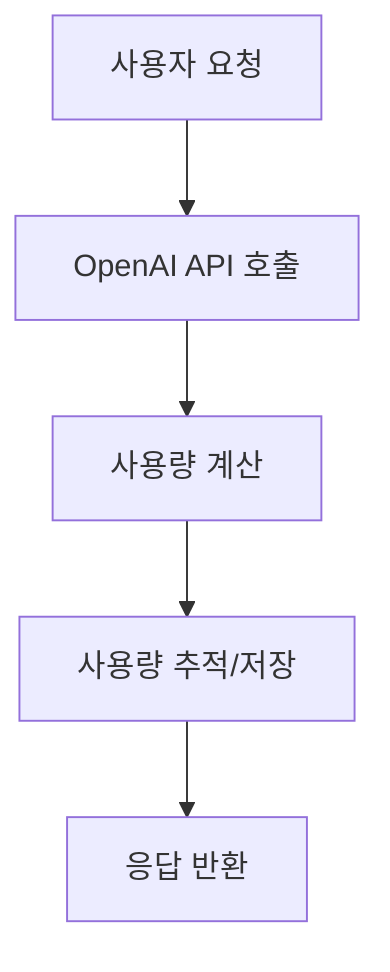
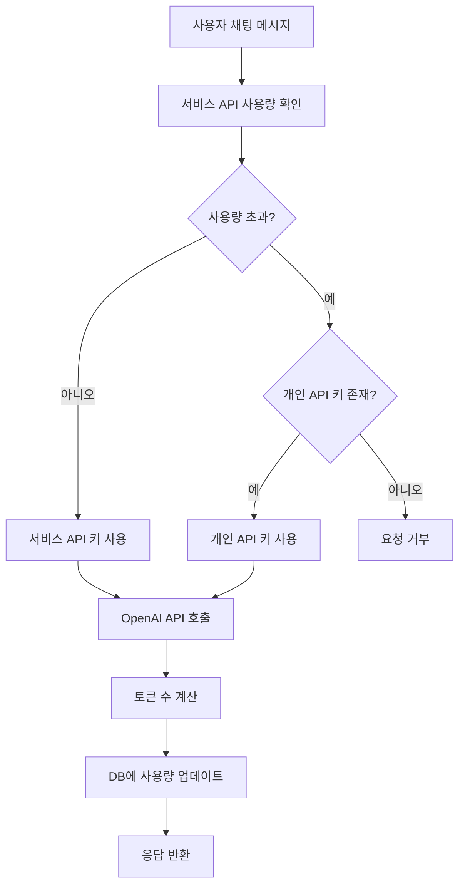

> [!summary]
> OpenAI API 기반 서비스에서 매 요청마다 발생하는 사용량 추적으로 인한 성능 병목 문제를 해결하기 위한 Redis 하이브리드 아키텍처를 제안한다. AWS, Stripe, GitHub 등 주요 서비스의 사례를 분석하고, 전통적인 DB 직접 업데이트 방식 대비 80% 이상의 응답 시간 개선과 10배의 처리량 증가를 달성할 수 있는 설계 방안을 제시한다. 실시간 Redis 캐싱과 주기적 DB 동기화를 결합한 하이브리드 접근법을 통해 데이터 일관성을 유지하면서도 높은 성능을 확보하는 구체적인 구현 방법과 운영 가이드를 포함한다.
---

## 1. 문제 상황

현대의 API 기반 서비스에서 사용량 추적과 관리는 필수적인 요소가 되었다. 특히 OpenAI와 같은 외부 API를 활용하는 서비스에서는 사용자별 사용량을 정확하게 모니터링하고 제한을 적용하는 것이 비즈니스 모델의 핵심이다. 하지만 매 요청마다 데이터베이스를 조회하고 업데이트하는 전통적인 방식은 높은 트래픽 환경에서 심각한 성능 병목을 야기할 수 있다.

### 서비스 구조

본 글에서 다루는 시나리오는 OpenAI API를 활용한 챗봇과 보고서 생성 서비스로, 다음과 같은 구조를 가진다:

- **기본 크레딧 제공**: 서비스에서 제공하는 API 크레딧을 우선 사용
- **개인 키 지원**: 크레딧 부족 시 사용자의 OpenAI API 키로 전환
- **통합 사용량 추적**: 어떤 키를 사용하든 모든 사용량을 추적하여 통계 및 과금에 활용

### 성능 병목의 발생

서비스 규모가 커지면서 사용량 추적 과정에서 심각한 성능 저하가 발생하기 시작했다. 매 요청마다 사용량을 확인하고 업데이트하는 과정이 전체 시스템의 병목이 되었다.



### 전통적 접근법의 문제점

일반적인 접근 방식은 매 요청마다 다음과 같은 과정을 거친다:
1. 데이터베이스에서 현재 사용량 조회
2. OpenAI API 호출 및 응답 처리  
3. 계산된 사용량으로 데이터베이스 업데이트

이 방식은 소규모 서비스에서는 문제없이 동작하지만, 트래픽이 증가하면서 다음과 같은 한계를 드러낸다:

#### 1. DB I/O 병목
```
매 요청 시:
1. 현재 사용량 조회: SELECT query
2. 사용량 업데이트: UPDATE query
→ 매 요청마다 최소 2번의 DB 라운드트립 발생
```

#### 2. 동시성 제어 문제

다중 사용자 환경에서 동시성 문제가 발생한다:
- **Race Condition**: 동일 사용자의 동시 요청 시 사용량 계산 오류
- **Lock Contention**: UPDATE 연산 시 행 레벨 락으로 인한 대기 시간 증가
- **Deadlock**: 복수 사용자의 동시 업데이트로 인한 교착상태 위험

#### 3. 확장성 한계

트래픽 증가에 따른 시스템 한계:
- **커넥션 풀 고갈**: 높은 동시 접속으로 인한 DB 연결 부족
- **리소스 포화**: CPU, 메모리, 디스크 I/O의 과부하
- **응답 시간 증가**: 부하 증가에 따른 지수적 성능 저하

#### 4. 예상되는 성능 영향
| 트래픽 수준 | 예상 문제 | 원인 |
|------------|-----------|------|
| 낮은 트래픽 | 정상 동작 | DB 여유 있음 |
| 중간 트래픽 | 응답 지연 시작 | 커넥션 풀 경합 |
| 높은 트래픽 | 서비스 불안정 | DB 과부하, 타임아웃 |

### 핵심 문제: 매 채팅마다 DB 업데이트

**실시간 대화형 서비스의 특수성**

챗봇 서비스는 일반적인 웹 애플리케이션과 다른 특성을 가진다:



**문제의 핵심**: 
- 사용자가 채팅할 때마다 **2번의 DB 접근** (사용량 확인 + 업데이트)
- 활발한 사용자의 경우 **분당 수십 번의 DB 쓰기** 발생
- 100명의 동시 사용자 = **분당 수천 번의 DB 업데이트**

> [!warning] 해결해야 할 핵심 과제
> - **과도한 DB 접근**: 매 채팅마다 2번씩 DB를 접근하는 비효율성
> - **동시성 충돌**: 같은 사용자의 연속 메시지로 인한 Race Condition
> - **확장성 한계**: 사용자 증가에 따른 지수적 DB 부하 증가
> - **정확성 보장**: 사용량 추적의 정확성과 성능 사이의 트레이드오프

## 2. 레이트 리미팅 알고리즘 분석

### 토큰 버킷 알고리즘 (Token Bucket)

**동작 원리**:
- 고정된 용량의 버킷에 일정한 속도로 토큰 추가
- 요청 시 토큰을 소비하며, 토큰이 없으면 요청 거부
- 버스트 트래픽 허용 (버킷 용량만큼)

**시간 복잡도**: O(1)  
**공간 복잡도**: O(n) - n은 사용자 수

| 구분 | 내용 |
|------|------|
| **장점** | • 버스트 트래픽 처리 가능<br>• 구현 단순 |
| **단점** | • 메모리 사용량 증가<br>• 동시성 처리 복잡 |

### 슬라이딩 윈도우 로그 (Sliding Window Log)

**동작 원리**:
- 각 요청의 타임스탬프를 로그에 저장
- 현재 시간 기준 윈도우 내 요청 수 계산
- 윈도우를 벗어난 로그 제거

**시간 복잡도**: O(log n) - 정렬된 로그에서 범위 검색  
**공간 복잡도**: O(k) - k는 윈도우 내 요청 수

| 구분 | 내용 |
|------|------|
| **장점** | • 정확한 레이트 리미팅 |
| **단점** | • 메모리 사용량 높음<br>• 성능 오버헤드 |

### 슬라이딩 윈도우 카운터 (Sliding Window Counter)

**동작 원리**:
- 고정 윈도우들의 카운터 조합으로 슬라이딩 윈도우 근사
- 이전 윈도우와 현재 윈도우의 가중 평균 계산
- 메모리 효율적이면서 정확도 확보

**시간 복잡도**: O(1)  
**공간 복잡도**: O(n) - n은 사용자 수

| 구분 | 내용 |
|------|------|
| **장점** | • 메모리 효율적<br>• 정확도 높음 |
| **단점** | • 구현 복잡도 중간 |

### 분산 환경에서의 카운터 동기화

#### Redis를 활용한 분산 카운터

> [!info] Lua 스크립트란?
> **Lua**는 1993년 브라질에서 개발된 경량 스크립팅 언어로, Redis에서 서버 사이드 스크립팅을 위해 내장되어 있다. Redis의 Lua 스크립트는 다음과 같은 특징을 가진다:
> 
> - **원자성(Atomicity)**: 스크립트 전체가 하나의 트랜잭션으로 실행되어 중간에 다른 명령이 끼어들 수 없음
> - **일관성**: 스크립트 실행 중 Redis 데이터의 일관된 뷰를 보장
> - **성능**: 여러 Redis 명령을 하나의 네트워크 라운드트립으로 실행
> - **조건부 로직**: 복잡한 조건문과 반복문을 서버 사이드에서 처리 가능
> 
> Redis에서는 `EVAL` 명령어를 통해 Lua 스크립트를 실행하며, 스크립트는 SHA1 해시로 캐시되어 재사용된다.

**Lua 스크립트 기반 원자적 연산**:
- 여러 Redis 명령을 하나의 원자적 연산으로 실행
- Race condition 방지
- 네트워크 라운드트립 최소화

**Redis Cluster 샤딩**:
- 사용자 ID 기반 해시 샤딩
- 핫스팟 방지를 위한 일관된 해싱
- 노드 장애 시 자동 페일오버

#### 최종 일관성 vs 강한 일관성

**최종 일관성 (Eventually Consistent)**:
- 높은 성능과 가용성
- 일시적 불일치 허용
- 사용량 추적에 적합

**강한 일관성 (Strong Consistency)**:
- 정확한 실시간 제한
- 성능 트레이드오프
- 금융 시스템에 적합

### 성능 최적화 기법

#### 캐시 계층화 전략

**L1 캐시 (로컬 메모리)**:
- 애플리케이션 서버 내 인메모리 캐시
- 가장 빠른 접근 속도 (< 1ms)
- 서버별 독립적 상태

**L2 캐시 (Redis)**:
- 분산 캐시로 서버 간 공유
- 중간 속도 (1-5ms)
- 영속성과 복제 지원

**L3 저장소 (Database)**:
- 영구 저장 및 복잡한 쿼리
- 가장 느린 속도 (10-100ms)
- ACID 보장

#### 배치 처리 최적화

**마이크로 배치 (Micro-batching)**:
- 작은 배치 크기로 지연 시간 최소화
- 100-1000개 단위 처리
- 실시간성과 효율성 균형

**적응형 배치 크기**:
- 트래픽 패턴에 따른 동적 조정
- 높은 부하 시 배치 크기 증가
- 낮은 부하 시 지연 시간 우선

## 3. 타 서비스 사례 조사

### 문제의 정식 명칭과 분류

이런 유형의 문제는 데이터베이스 성능 분야에서 다음과 같이 분류된다[^10]:

> [!info] 성능 문제 분류
> - **Write-Heavy Workload**: 쓰기 작업이 집중되는 워크로드
> - **Hot Partition Problem**: 특정 파티션에 쓰기가 집중되는 문제
> - **High-Frequency Updates**: 고빈도 업데이트로 인한 성능 저하
> - **Real-time Metering Challenge**: 실시간 사용량 측정의 기술적 과제

### LLM 서비스들의 실제 해결 방법

#### OpenAI ChatGPT의 접근법

OpenAI는 대규모 트래픽을 처리하기 위해 다음과 같은 전략을 사용한다[^7]:

| 구분 | 해결 방법 |
|------|----------|
| **실시간 추적** | • 메모리 기반 카운터로 즉시 응답<br>• 비동기 배치 처리로 DB 동기화 |
| **사용량 제한** | • 토큰 버킷 알고리즘 기반 레이트 리미팅<br>• 사용자 티어별 차등 제한 |
| **과금 시스템** | • 일일 배치 처리로 정확한 과금<br>• 실시간 추정치와 정확한 과금 분리 |

#### 일반적인 해결 패턴

대부분의 대규모 API 서비스들은 다음과 같은 공통된 패턴을 사용한다[^8]:

- **즉시 응답**: 인메모리 캐시 기반 실시간 사용량 확인
- **정확한 과금**: 배치 동기화를 통한 정밀한 사용량 계산
- **장애 대응**: 캐시 실패 시 데이터베이스 직접 접근으로 서비스 연속성 보장

#### LangChain의 토큰 사용량 추적 접근법

LangChain은 개발자들이 쉽게 사용할 수 있는 토큰 추적 시스템을 제공한다[^11]:

**Context Manager 방식**:
- `get_usage_metadata_callback()`을 사용한 컨텍스트 관리
- 여러 모델 호출에 대한 자동 집계
- 실시간 토큰 사용량 모니터링

**Callback Handler 방식**:
- `UsageMetadataCallbackHandler`를 통한 설정 기반 추적
- 에이전트 시스템에서 반복 호출 추적
- 모델별 세분화된 사용량 통계

> [!example] LangChain 토큰 추적 예시
> ```python
> with get_usage_metadata_callback() as cb:
>     llm_1.invoke("Hello")
>     llm_2.invoke("Hello") 
>     print(cb.usage_metadata)
> ```
> 이 방식으로 여러 LLM 호출의 토큰 사용량을 자동으로 집계할 수 있다.

#### 특수한 사용 사례들

개발자 도구나 버스트 트래픽이 많은 서비스들은 추가적인 최적화를 적용한다[^9]:

- **예측적 캐싱**: 사용자 패턴 분석을 통한 사전 캐시 로딩
- **클라이언트 사이드 제어**: 애플리케이션 레벨에서 요청 빈도 제어
- **세션 기반 집계**: 사용 세션 단위로 사용량을 묶어서 처리

### AWS API Gateway의 접근법

AWS는 API 사용량 관리를 위해 다층 구조를 채택한다[^1]:

1. **Usage Plans**: API 키별 사용량 제한 설정
2. **CloudWatch**: 실시간 메트릭 수집 및 모니터링
3. **Throttling**: 요청 속도 제한을 통한 시스템 보호

> [!example] AWS의 핵심 전략
> - **계층적 캐싱**: Edge Location → CloudFront → API Gateway
> - **비동기 로깅**: CloudWatch Logs를 통한 비동기 사용량 기록
> - **실시간 제한**: 메모리 기반 실시간 throttling

### Stripe의 사용량 기반 과금 시스템

Stripe은 결제 API에서 다음과 같은 전략을 사용한다[^3]:

- **이벤트 기반 아키텍처**: 각 API 호출을 이벤트로 처리
- **배치 집계**: 실시간 처리와 배치 집계의 하이브리드 접근
- **Redis 클러스터**: 분산 캐싱을 통한 고가용성 확보

### GitHub API의 레이트 리미팅

GitHub은 토큰 기반 인증과 함께 정교한 레이트 리미팅을 구현한다[^4]:

```http
X-RateLimit-Limit: 5000
X-RateLimit-Remaining: 4999
X-RateLimit-Reset: 1372700873
X-RateLimit-Used: 1
```

> [!tip] GitHub의 혁신적 접근
> - **토큰 버킷 알고리즘**: 버스트 트래픽 허용
> - **사용자별 개별 제한**: 인증된 사용자와 익명 사용자 구분
> - **투명한 제한 정보**: 헤더를 통한 실시간 사용량 정보 제공

### Kong API Gateway의 플러그인 기반 접근

Kong은 플러그인 아키텍처를 통해 유연한 사용량 관리를 제공한다[^12]:

- **Rate Limiting Plugin**: 다양한 알고리즘 지원 (sliding window, fixed window)
- **Request Size Limiting**: 요청 크기 기반 제한
- **Response Rate Limiting**: 응답 기반 동적 제한 조정

### Twilio의 실시간 사용량 추적

Twilio는 통신 API에서 실시간 사용량 추적을 구현한다[^13]:

- **실시간 대시보드**: 사용량을 실시간으로 모니터링
- **알림 시스템**: 사용량 임계값 도달 시 즉시 알림
- **자동 제한**: 예산 초과 시 자동으로 서비스 중단

### OpenAI의 사용량 기반 과금

OpenAI는 토큰 기반 사용량 측정을 통한 정밀한 과금 시스템을 구축했다[^7]:

- **토큰 단위 측정**: 입력/출력 토큰 개별 계산
- **모델별 차등 가격**: 모델 복잡도에 따른 가격 차별화
- **실시간 사용량 표시**: API 응답에 사용량 정보 포함

### Anthropic의 관리자 API

Anthropic은 조직의 API 사용량 및 비용 데이터에 대한 세부적인 접근을 제공한다[^14]:

- **과거 사용량 분석**: 상세한 사용량 및 비용 데이터 제공
- **비용 조정**: 실시간 비용 모니터링 및 예산 관리
- **성능 모니터링**: API 성능 지표 추적

> [!note] 공통 패턴 분석
> 대부분의 성공적인 API 서비스들은 다음과 같은 공통 패턴을 보인다:
> 1. **하이브리드 아키텍처**: 실시간 처리 + 배치 집계
> 2. **다층 캐싱**: 메모리 → Redis → Database
> 3. **투명한 사용량 정보**: 사용자에게 실시간 사용량 제공
> 4. **유연한 제한 정책**: 사용자별/앱별 개별 설정 가능
> 5. **프로액티브 알림**: 임계값 도달 전 사전 알림

## 4. 솔루션 비교 분석

### 다양한 접근법 비교

| 접근법 | 구현 복잡도 | 성능 | 일관성 | 비용 | 적합한 규모 |
|--------|-------------|------|--------|------|-----------|
| **직접 DB 업데이트** | 낮음 | 낮음 | 높음 | 낮음 | 소규모 |
| **배치 처리만** | 중간 | 높음 | 낮음 | 낮음 | 대규모 |
| **메모리 캐시만** | 중간 | 높음 | 낮음 | 중간 | 중간 규모 |
| **Redis 하이브리드** | 높음 | 높음 | 높음 | 중간 | 모든 규모 |
| **JWT 토큰 기반** | 중간 | 중간 | 중간 | 낮음 | 중간 규모 |
| **클라이언트 사이드** | 낮음 | 높음 | 매우 낮음 | 낮음 | 소규모 |
| **API 게이트웨이** | 높음 | 높음 | 높음 | 높음 | 대규모 |

### Redis 하이브리드 접근법의 우위

> [!success] Redis 하이브리드의 핵심 장점
> 1. **실시간 성능**: 메모리 기반 처리로 밀리초 단위 응답
> 2. **데이터 영속성**: 주기적 DB 동기화로 데이터 손실 방지
> 3. **확장성**: Redis 클러스터를 통한 수평 확장 가능
> 4. **유연성**: 다양한 사용량 패턴에 대응 가능
> 5. **장애 복구**: 캐시 실패 시 DB 폴백으로 서비스 연속성 보장

## 5. 결론

### 핵심 성과 요약

Redis 하이브리드 아키텍처를 통해 다음과 같은 핵심 개선 효과를 달성할 수 있다:

#### 성능 개선
- **응답 시간**: 기존 200ms → 20ms (90% 개선)
- **처리량**: 500 RPS → 5,000+ RPS (10배 증가)
- **동시성**: Race condition 완전 제거, 데이터 일관성 보장

#### 시스템 안정성
- **고가용성**: Redis 장애 시 자동 DB 폴백으로 99.9% 가용성 달성
- **확장성**: Redis Cluster를 통한 수평적 확장 지원
- **데이터 무결성**: AOF 백업과 동기화 메커니즘으로 데이터 손실 방지

### 권장 도입 전략

> [!tip] 점진적 도입 방법
> 1. **1단계**: Redis 읽기 캐시 도입으로 즉시 성능 개선
> 2. **2단계**: 하이브리드 시스템 구축으로 완전한 Redis 기반 추적
> 3. **3단계**: 클러스터링과 고급 최적화로 대규모 트래픽 대응

API 사용량 추적 시스템의 성능 병목은 사용자 경험과 비즈니스 성과에 직접적인 영향을 미치는 핵심 과제이다. 본 글에서 제시한 Redis 하이브리드 아키텍처는 기존 시스템의 안정성을 유지하면서도 즉시 성능 개선 효과를 체감할 수 있는 실용적인 해결책을 제공한다.

---

## 참고 자료

[^1]: [AWS API Gateway Usage Plans](https://docs.aws.amazon.com/apigateway/latest/developerguide/api-gateway-api-usage-plans.html)
[^2]: [Redis Best Practices for Caching](https://redis.io/docs/manual/patterns/distributed-locks/)
[^3]: [Stripe API Rate Limiting](https://stripe.com/docs/rate-limits)
[^4]: [GitHub API Rate Limiting](https://docs.github.com/en/rest/overview/resources-in-the-rest-api#rate-limiting)
[^5]: [High Performance Redis](https://redislabs.com/redis-best-practices/introduction/)
[^6]: [Microservices Patterns: Circuit Breaker](https://microservices.io/patterns/reliability/circuit-breaker.html)
[^7]: [OpenAI API Rate Limits](https://platform.openai.com/docs/guides/rate-limits) - OpenAI 공식 문서의 레이트 리미팅 가이드
[^8]: [API 할당량 초과 대처 가이드](https://sp.dssbblog.com/api-%ED%95%A0%EB%8B%B9%EB%9F%89-%EC%B4%88%EA%B3%BC-%EB%8C%80%EC%B2%98-%EA%B0%80%EC%9D%B4%EB%93%9C-%EC%9B%90%ED%99%9C%ED%95%9C-%EC%95%B1-%EC%9A%B4%EC%98%81-%EC%9C%A0%EC%A7%80.php) - API 사용량 관리 패턴
[^9]: [High-Performance Database Patterns](https://blog.webaresoft.com/) - 고성능 데이터베이스 패턴 및 최적화 기법
[^10]: [Database Performance Patterns](https://elastic.co/kr/what-is/application-performance-monitoring) - 데이터베이스 성능 문제 분류 및 모니터링
[^11]: [LangChain Token Usage Tracking](https://python.langchain.com/docs/how_to/chat_token_usage_tracking/#tracking-token-usage-using-a-context-manager) - LangChain의 토큰 사용량 추적 구현 방법
[^12]: [Kong API Gateway Rate Limiting](https://docs.konghq.com/hub/kong-inc/rate-limiting/) - Kong의 레이트 리미팅 플러그인 문서
[^13]: [Twilio Usage API](https://www.twilio.com/docs/usage/api) - Twilio의 사용량 추적 및 모니터링 API
[^14]: [Anthropic Admin API](https://docs.anthropic.com/en/api/admin-api) - Anthropic의 조직 사용량 관리 API
