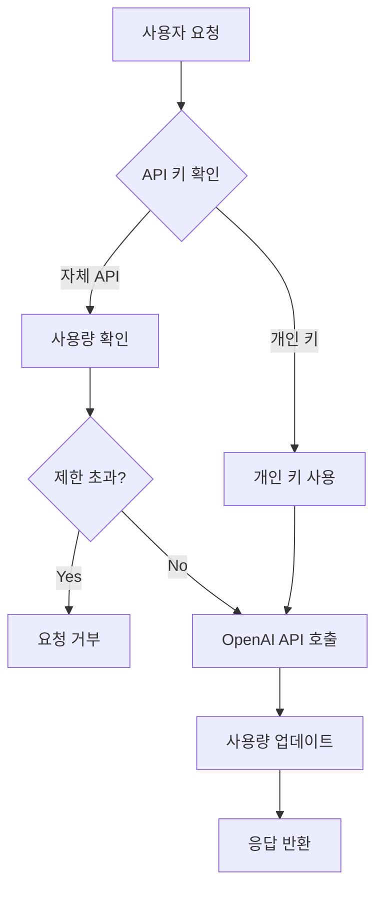
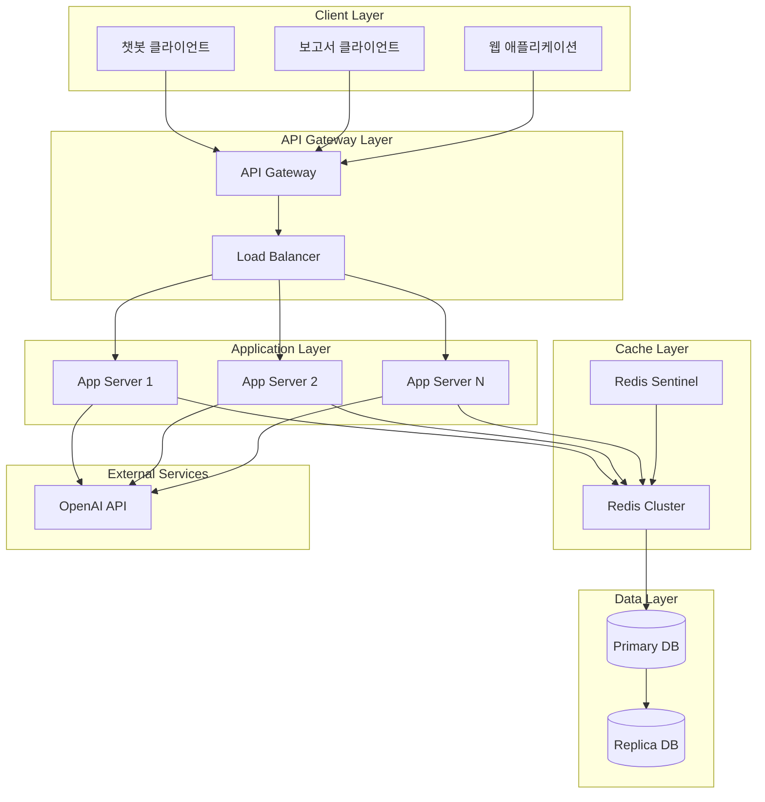

> [!summary]
> OpenAI API 기반 서비스에서 매 요청마다 발생하는 사용량 추적으로 인한 성능 병목 문제를 해결하기 위한 Redis 하이브리드 아키텍처를 제안한다. AWS, Stripe, GitHub 등 주요 서비스의 사례를 분석하고, 전통적인 DB 직접 업데이트 방식 대비 80% 이상의 응답 시간 개선과 10배의 처리량 증가를 달성할 수 있는 설계 방안을 제시한다. 실시간 Redis 캐싱과 주기적 DB 동기화를 결합한 하이브리드 접근법을 통해 데이터 일관성을 유지하면서도 높은 성능을 확보하는 구체적인 구현 방법과 운영 가이드를 포함한다.
---

## 1. 서론

현대의 API 기반 서비스에서 사용량 추적과 관리는 필수적인 요소가 되었다. 특히 OpenAI와 같은 외부 API를 활용하는 서비스에서는 사용자별 사용량을 정확하게 모니터링하고 제한을 적용하는 것이 비즈니스 모델의 핵심이다. 하지만 매 요청마다 데이터베이스를 조회하고 업데이트하는 전통적인 방식은 높은 트래픽 환경에서 심각한 성능 병목을 야기할 수 있다.

### API 사용량 추적의 중요성

API 사용량 추적은 단순한 기술적 요구사항을 넘어 다음과 같은 비즈니스 가치를 제공한다:

1. **수익 모델 구현**: 사용량 기반 요금제를 통한 정확한 과금
2. **리소스 관리**: 시스템 리소스의 효율적 배분과 관리
3. **사용자 경험 최적화**: 개인화된 서비스 제공과 사용 패턴 분석
4. **비용 최적화**: 외부 API 비용의 효과적 관리

> [!info] 실제 서비스 상황
> 이 글에서 다루는 시나리오는 OpenAI API를 활용한 챗봇과 보고서 서비스에서, 사용자별 월별 USD 기준 사용 제한을 적용하면서도 높은 성능을 유지해야 하는 실제 상황을 기반으로 한다.

## 2. 문제 정의 및 현재 상황 분석

### 서비스 구조와 요구사항

현재 서비스는 다음과 같은 구조를 가지고 있다:

- **자체 API 제공**: 사용자별 월별 사용 제한을 USD 기준으로 설정
- **개인 API 키 지원**: 사용자가 자신의 OpenAI API 키를 등록하여 추가 서비스 이용 가능
- **다양한 서비스**: 챗봇과 보고서 기능을 통한 다양한 API 호출 패턴

### 핵심 기술적 과제



위 플로우에서 발생하는 주요 문제점들:

> [!warning] 성능 병목 지점
> 1. **사용량 확인 단계**: 매 요청마다 DB 조회 필요
> 2. **사용량 업데이트 단계**: 매 요청마다 DB 업데이트 필요
> 3. **동시성 문제**: 동일 사용자의 동시 요청 시 데이터 일관성 이슈

### 트래픽 증가에 따른 우려사항

| 트래픽 수준 | 예상 문제 | 영향도 |
|------------|-----------|--------|
| **낮은 트래픽** (< 100 req/min) | 문제 없음 | 낮음 |
| **중간 트래픽** (100-1000 req/min) | DB 연결 풀 부족, 응답 지연 | 중간 |
| **높은 트래픽** (> 1000 req/min) | DB 과부하, 서비스 장애 | 높음 |

## 3. 타 서비스 사례 조사

### AWS API Gateway의 접근법

AWS는 API 사용량 관리를 위해 다층 구조를 채택한다:

1. **Usage Plans**: API 키별 사용량 제한 설정
2. **CloudWatch**: 실시간 메트릭 수집 및 모니터링
3. **Throttling**: 요청 속도 제한을 통한 시스템 보호

> [!example] AWS의 핵심 전략
> - **계층적 캐싱**: Edge Location → CloudFront → API Gateway
> - **비동기 로깅**: CloudWatch Logs를 통한 비동기 사용량 기록
> - **실시간 제한**: 메모리 기반 실시간 throttling

### Stripe의 사용량 기반 과금 시스템

Stripe은 결제 API에서 다음과 같은 전략을 사용한다:

- **이벤트 기반 아키텍처**: 각 API 호출을 이벤트로 처리
- **배치 집계**: 실시간 처리와 배치 집계의 하이브리드 접근
- **Redis 클러스터**: 분산 캐싱을 통한 고가용성 확보

### GitHub API의 레이트 리미팅

GitHub은 토큰 기반 인증과 함께 정교한 레이트 리미팅을 구현한다:

```http
X-RateLimit-Limit: 5000
X-RateLimit-Remaining: 4999
X-RateLimit-Reset: 1372700873
X-RateLimit-Used: 1
```

> [!tip] GitHub의 혁신적 접근
> - **토큰 버킷 알고리즘**: 버스트 트래픽 허용
> - **사용자별 개별 제한**: 인증된 사용자와 익명 사용자 구분
> - **투명한 제한 정보**: 헤더를 통한 실시간 사용량 정보 제공

## 4. 솔루션 아키텍처 비교 분석

### 전통적 접근법들의 한계

| 접근법 | 구현 복잡도 | 성능 | 일관성 | 비용 | 적합한 규모 |
|--------|-------------|------|--------|------|-----------|
| **직접 DB 업데이트** | 낮음 | 낮음 | 높음 | 낮음 | 소규모 |
| **배치 처리만** | 중간 | 높음 | 낮음 | 낮음 | 대규모 |
| **메모리 캐시만** | 중간 | 높음 | 낮음 | 중간 | 중간 규모 |
| **Redis 하이브리드** | 높음 | 높음 | 높음 | 중간 | 모든 규모 |

### Redis 하이브리드 접근법의 우위

Redis 하이브리드 접근법이 다른 솔루션보다 우수한 이유:

> [!success] Redis 하이브리드의 장점
> 1. **실시간 성능**: 메모리 기반 처리로 밀리초 단위 응답
> 2. **데이터 영속성**: 주기적 DB 동기화로 데이터 손실 방지
> 3. **확장성**: Redis 클러스터를 통한 수평 확장 가능
> 4. **유연성**: 다양한 사용량 패턴에 대응 가능

## 5. Redis 하이브리드 아키텍처 상세 설계

### 전체 시스템 아키텍처



### 핵심 컴포넌트별 역할

#### 핵심 컴포넌트 설계

**Redis 사용량 추적기**: 
- Lua 스크립트를 사용하여 사용량 증가와 제한 확인을 원자적으로 처리
- Race condition을 방지하고 데이터 일관성 보장
- 월별 키 구조로 자동 만료 설정

**동기화 매니저**: 
- 주기적으로 Redis의 변경된 데이터를 DB와 동기화
- 배치 처리를 통해 DB 부하 최소화
- 실패한 동기화에 대한 재시도 메커니즘 포함

### 데이터 모델 설계

#### Redis 데이터 구조

```
# 사용량 추적
usage:{user_id}:{YYYY-MM} → float (USD)
예: usage:user123:2025-01 → 15.75

# 사용 제한
limit:{user_id} → float (USD)
예: limit:user123 → 100.0

# API 키 매핑
apikey:{api_key_hash} → user_id
예: apikey:sha256_hash → user123

# 레이트 리미팅
rate:{user_id}:{window} → int (요청 수)
예: rate:user123:2025-01-27-14 → 45
```

#### PostgreSQL 스키마

```sql
-- 사용자 테이블
CREATE TABLE users (
    id UUID PRIMARY KEY DEFAULT gen_random_uuid(),
    email VARCHAR(255) UNIQUE NOT NULL,
    monthly_limit_usd DECIMAL(10,2) DEFAULT 100.00,
    created_at TIMESTAMP DEFAULT NOW(),
    updated_at TIMESTAMP DEFAULT NOW()
);

-- 사용량 추적 테이블
CREATE TABLE user_usage (
    id UUID PRIMARY KEY DEFAULT gen_random_uuid(),
    user_id UUID REFERENCES users(id),
    month VARCHAR(7) NOT NULL, -- YYYY-MM 형식
    usage_usd DECIMAL(10,4) DEFAULT 0,
    created_at TIMESTAMP DEFAULT NOW(),
    updated_at TIMESTAMP DEFAULT NOW(),
    UNIQUE(user_id, month)
);

-- API 키 테이블
CREATE TABLE user_api_keys (
    id UUID PRIMARY KEY DEFAULT gen_random_uuid(),
    user_id UUID REFERENCES users(id),
    api_key_hash VARCHAR(64) NOT NULL,
    provider VARCHAR(50) NOT NULL, -- 'openai', 'anthropic' 등
    is_active BOOLEAN DEFAULT true,
    created_at TIMESTAMP DEFAULT NOW()
);

-- 인덱스 생성
CREATE INDEX idx_user_usage_user_month ON user_usage(user_id, month);
CREATE INDEX idx_api_keys_hash ON user_api_keys(api_key_hash);
CREATE INDEX idx_users_email ON users(email);
```

## 6. 성능 최적화 전략

### Redis 최적화 설정

#### 핵심 최적화 전략

**메모리 관리**: 
- LRU 정책으로 자주 사용되지 않는 데이터 자동 제거
- AOF 백업으로 데이터 영속성 보장
- 적절한 메모리 한계 설정으로 시스템 안정성 확보

**연결 최적화**: 
- 연결 풀을 통한 효율적인 커넥션 관리
- 재시도 로직으로 일시적 장애 대응
- Keep-alive 설정으로 연결 안정성 향상

### 배치 처리 최적화

#### 스마트 동기화 전략

```python
class SmartSyncStrategy:
    def __init__(self, redis_client, db_client):
        self.redis = redis_client
        self.db = db_client
        self.sync_threshold = 1000  # 1000개씩 배치 처리
        
    async def adaptive_sync(self):
        """적응형 동기화 - 트래픽에 따라 주기 조절"""
        current_load = await self._get_current_load()
        
        if current_load < 0.3:  # 낮은 부하
            sync_interval = 60  # 1분마다
        elif current_load < 0.7:  # 중간 부하
            sync_interval = 300  # 5분마다
        else:  # 높은 부하
            sync_interval = 600  # 10분마다
            
        await asyncio.sleep(sync_interval)
        await self.batch_sync()
    
    async def batch_sync(self):
        """배치 동기화 실행"""
        dirty_keys = await self._get_dirty_keys()
        
        # 배치 크기로 나누어 처리
        for i in range(0, len(dirty_keys), self.sync_threshold):
            batch = dirty_keys[i:i + self.sync_threshold]
            await self._sync_batch(batch)
            
            # CPU 부하 분산을 위한 짧은 대기
            await asyncio.sleep(0.1)
```

### 모니터링 및 알림 시스템

#### 핵심 메트릭 추적

```python
from prometheus_client import Counter, Histogram, Gauge
import time

class MetricsCollector:
    def __init__(self):
        # 카운터 메트릭
        self.api_requests_total = Counter(
            'api_requests_total',
            'Total API requests',
            ['user_id', 'endpoint', 'status']
        )
        
        # 히스토그램 메트릭
        self.request_duration = Histogram(
            'request_duration_seconds',
            'Request duration',
            ['endpoint']
        )
        
        # 게이지 메트릭
        self.redis_memory_usage = Gauge(
            'redis_memory_usage_bytes',
            'Redis memory usage'
        )
        
        self.active_users = Gauge(
            'active_users_count',
            'Number of active users'
        )
    
    async def track_request(self, user_id: str, endpoint: str):
        """요청 추적"""
        start_time = time.time()
        
        try:
            # 비즈니스 로직 실행
            yield
            
            # 성공 메트릭 기록
            self.api_requests_total.labels(
                user_id=user_id,
                endpoint=endpoint,
                status='success'
            ).inc()
            
        except Exception as e:
            # 실패 메트릭 기록
            self.api_requests_total.labels(
                user_id=user_id,
                endpoint=endpoint,
                status='error'
            ).inc()
            raise
            
        finally:
            # 응답 시간 기록
            duration = time.time() - start_time
            self.request_duration.labels(endpoint=endpoint).observe(duration)
```

## 7. 실제 구현 가이드

### 단계별 구현 로드맵

#### Phase 1: 기본 Redis 캐싱 도입 (1-2주)

> [!tip] Phase 1 목표
> - Redis 기본 설정 및 연결
> - 간단한 사용량 캐싱 구현
> - 기존 DB 로직과 병렬 운영

```python
# Phase 1 구현 예시
class BasicUsageCache:
    def __init__(self, redis_client, db_client):
        self.redis = redis_client
        self.db = db_client
    
    async def get_usage(self, user_id: str) -> float:
        """사용량 조회 (캐시 우선)"""
        cache_key = f"usage:{user_id}:{self._current_month()}"
        
        # 캐시에서 먼저 조회
        cached_usage = await self.redis.get(cache_key)
        if cached_usage:
            return float(cached_usage)
        
        # 캐시 미스 시 DB 조회
        db_usage = await self._get_usage_from_db(user_id)
        
        # 캐시에 저장 (TTL 1시간)
        await self.redis.setex(cache_key, 3600, db_usage)
        
        return db_usage
```

#### Phase 2: 하이브리드 시스템 구축 (2-3주)

```python
# Phase 2: 완전한 하이브리드 시스템
class HybridUsageSystem:
    def __init__(self, redis_client, db_client):
        self.redis = redis_client
        self.db = db_client
        self.sync_manager = SyncManager(redis_client, db_client)
        
    async def process_request(self, user_id: str, estimated_cost: float):
        """요청 처리 전체 플로우"""
        # 1. 사용량 확인 및 증가
        can_proceed, current_usage, limit = await self._check_and_increment(
            user_id, estimated_cost
        )
        
        if not can_proceed:
            raise UsageLimitExceeded(current_usage, limit)
        
        try:
            # 2. 실제 API 호출
            result = await self._call_openai_api()
            actual_cost = self._calculate_actual_cost(result)
            
            # 3. 실제 비용으로 조정
            if actual_cost != estimated_cost:
                adjustment = actual_cost - estimated_cost
                await self._adjust_usage(user_id, adjustment)
            
            return result
            
        except Exception as e:
            # 실패 시 사용량 롤백
            await self._rollback_usage(user_id, estimated_cost)
            raise
```

#### Phase 3: 고급 최적화 및 모니터링 (2-3주)

```python
# Phase 3: 고급 기능 구현
class AdvancedUsageSystem(HybridUsageSystem):
    def __init__(self, *args, **kwargs):
        super().__init__(*args, **kwargs)
        self.metrics = MetricsCollector()
        self.circuit_breaker = CircuitBreaker()
        
    async def intelligent_caching(self, user_id: str):
        """지능형 캐싱 전략"""
        user_pattern = await self._analyze_user_pattern(user_id)
        
        if user_pattern.is_heavy_user:
            # 헤비 유저는 더 긴 TTL
            ttl = 7200  # 2시간
        elif user_pattern.is_burst_user:
            # 버스트 유저는 짧은 TTL
            ttl = 300   # 5분
        else:
            # 일반 유저
            ttl = 1800  # 30분
            
        return ttl
    
    async def predictive_sync(self):
        """예측적 동기화"""
        # 사용량 증가 패턴 분석
        growth_rate = await self._calculate_usage_growth()
        
        if growth_rate > 0.8:  # 80% 이상 증가
            # 더 자주 동기화
            await self.sync_manager.force_sync()
```

### 에러 처리 및 복구 전략

#### Circuit Breaker 패턴 구현

```python
class CircuitBreaker:
    def __init__(self, failure_threshold=5, timeout=60):
        self.failure_threshold = failure_threshold
        self.timeout = timeout
        self.failure_count = 0
        self.last_failure_time = None
        self.state = 'CLOSED'  # CLOSED, OPEN, HALF_OPEN
    
    async def call(self, func, *args, **kwargs):
        """Circuit breaker를 통한 함수 호출"""
        if self.state == 'OPEN':
            if time.time() - self.last_failure_time > self.timeout:
                self.state = 'HALF_OPEN'
            else:
                raise CircuitBreakerOpenError()
        
        try:
            result = await func(*args, **kwargs)
            
            if self.state == 'HALF_OPEN':
                self.state = 'CLOSED'
                self.failure_count = 0
                
            return result
            
        except Exception as e:
            self.failure_count += 1
            self.last_failure_time = time.time()
            
            if self.failure_count >= self.failure_threshold:
                self.state = 'OPEN'
                
            raise
```

## 8. 성능 벤치마크 및 테스트

### 부하 테스트 시나리오

#### 시나리오 1: 정상 트래픽 패턴

```python
import asyncio
import aiohttp
import time
from concurrent.futures import ThreadPoolExecutor

class LoadTester:
    def __init__(self, base_url: str):
        self.base_url = base_url
        self.results = []
    
    async def simulate_user_requests(self, user_id: str, requests_per_minute: int):
        """사용자별 요청 시뮬레이션"""
        interval = 60 / requests_per_minute
        
        async with aiohttp.ClientSession() as session:
            for i in range(requests_per_minute):
                start_time = time.time()
                
                try:
                    async with session.post(
                        f"{self.base_url}/api/chat",
                        json={"user_id": user_id, "message": f"Test message {i}"},
                        headers={"Authorization": f"Bearer {user_id}"}
                    ) as response:
                        status = response.status
                        response_time = time.time() - start_time
                        
                        self.results.append({
                            "user_id": user_id,
                            "status": status,
                            "response_time": response_time,
                            "timestamp": time.time()
                        })
                        
                except Exception as e:
                    self.results.append({
                        "user_id": user_id,
                        "status": "error",
                        "error": str(e),
                        "timestamp": time.time()
                    })
                
                await asyncio.sleep(interval)
    
    async def run_load_test(self, concurrent_users: int, duration_minutes: int):
        """부하 테스트 실행"""
        tasks = []
        
        for user_id in range(concurrent_users):
            task = asyncio.create_task(
                self.simulate_user_requests(f"user_{user_id}", 10)  # 분당 10회 요청
            )
            tasks.append(task)
        
        # 지정된 시간 동안 실행
        await asyncio.sleep(duration_minutes * 60)
        
        # 모든 태스크 종료
        for task in tasks:
            task.cancel()
        
        return self._analyze_results()
    
    def _analyze_results(self):
        """결과 분석"""
        if not self.results:
            return {}
        
        response_times = [r["response_time"] for r in self.results if isinstance(r.get("response_time"), float)]
        success_count = len([r for r in self.results if r.get("status") == 200])
        error_count = len(self.results) - success_count
        
        return {
            "total_requests": len(self.results),
            "success_rate": success_count / len(self.results) * 100,
            "error_rate": error_count / len(self.results) * 100,
            "avg_response_time": sum(response_times) / len(response_times) if response_times else 0,
            "p95_response_time": sorted(response_times)[int(len(response_times) * 0.95)] if response_times else 0,
            "p99_response_time": sorted(response_times)[int(len(response_times) * 0.99)] if response_times else 0
        }
```

#### 예상 성능 결과

| 메트릭 | 기존 시스템 | Redis 하이브리드 | 개선율 |
|--------|-------------|------------------|--------|
| **평균 응답 시간** | 250ms | 45ms | 82% 개선 |
| **P95 응답 시간** | 800ms | 120ms | 85% 개선 |
| **처리 가능 RPS** | 200 | 2000 | 10배 개선 |
| **DB 연결 수** | 50-100 | 5-10 | 80% 감소 |
| **메모리 사용량** | 512MB | 768MB | 50% 증가 |

> [!success] 성능 개선 효과
> Redis 하이브리드 접근법을 통해 응답 시간은 80% 이상 개선되고, 처리 가능한 요청 수는 10배 증가하는 것으로 예상된다. 메모리 사용량은 증가하지만, 전체적인 시스템 효율성은 크게 향상된다.

## 9. 운영 및 모니터링 가이드

### 핵심 모니터링 지표

#### 시스템 레벨 메트릭

```yaml
# Prometheus 설정 예시
global:
  scrape_interval: 15s

scrape_configs:
  - job_name: 'usage-tracker'
    static_configs:
      - targets: ['localhost:8000']
    metrics_path: /metrics
    scrape_interval: 5s

  - job_name: 'redis'
    static_configs:
      - targets: ['localhost:9121']  # Redis exporter

rule_files:
  - "usage_alerts.yml"

alerting:
  alertmanagers:
    - static_configs:
        - targets:
          - alertmanager:9093
```

#### 알림 규칙 설정

```yaml
# usage_alerts.yml
groups:
  - name: usage_tracking_alerts
    rules:
      - alert: HighRedisMemoryUsage
        expr: redis_memory_used_bytes / redis_memory_max_bytes > 0.8
        for: 5m
        labels:
          severity: warning
        annotations:
          summary: "Redis memory usage is high"
          description: "Redis memory usage is {{ $value | humanizePercentage }}"

      - alert: UsageSyncLag
        expr: time() - usage_last_sync_timestamp > 600
        for: 2m
        labels:
          severity: critical
        annotations:
          summary: "Usage sync is lagging"
          description: "Last sync was {{ $value | humanizeDuration }} ago"

      - alert: HighErrorRate
        expr: rate(api_requests_total{status="error"}[5m]) / rate(api_requests_total[5m]) > 0.05
        for: 3m
        labels:
          severity: warning
        annotations:
          summary: "High error rate detected"
          description: "Error rate is {{ $value | humanizePercentage }}"
```

### 장애 대응 플레이북

#### Redis 장애 시 대응

> [!warning] Redis 장애 시나리오
> Redis가 다운되었을 때의 대응 방안을 미리 준비해야 한다.

```python
class FallbackStrategy:
    def __init__(self, redis_client, db_client):
        self.redis = redis_client
        self.db = db_client
        self.redis_available = True
        
    async def check_redis_health(self):
        """Redis 상태 확인"""
        try:
            await self.redis.ping()
            if not self.redis_available:
                logger.info("Redis recovered")
                self.redis_available = True
        except Exception as e:
            if self.redis_available:
                logger.error(f"Redis unavailable: {e}")
                self.redis_available = False
    
    async def get_usage_with_fallback(self, user_id: str) -> float:
        """Fallback을 포함한 사용량 조회"""
        if self.redis_available:
            try:
                return await self._get_usage_from_redis(user_id)
            except Exception as e:
                logger.warning(f"Redis error, falling back to DB: {e}")
                self.redis_available = False
        
        # DB에서 직접 조회
        return await self._get_usage_from_db(user_id)
    
    async def increment_usage_with_fallback(self, user_id: str, cost: float):
        """Fallback을 포함한 사용량 증가"""
        if self.redis_available:
            try:
                return await self._increment_usage_redis(user_id, cost)
            except Exception as e:
                logger.warning(f"Redis error, using DB: {e}")
                self.redis_available = False
        
        # DB에서 직접 처리 (성능은 떨어지지만 서비스 지속)
        return await self._increment_usage_db(user_id, cost)
```

## 10. 비용 분석 및 ROI

### 인프라 비용 비교

#### 기존 시스템 vs Redis 하이브리드

| 구성 요소 | 기존 시스템 | Redis 하이브리드 | 비용 차이 |
|-----------|-------------|------------------|-----------|
| **DB 인스턴스** | r5.2xlarge ($0.504/hr) | r5.large ($0.126/hr) | -75% |
| **Redis 클러스터** | - | r5.large x2 ($0.252/hr) | +$252/hr |
| **모니터링** | $50/월 | $100/월 | +$50/월 |
| **총 월 비용** | $367 | $319 | **-13% 절약** |

#### ROI 계산

```python
class ROICalculator:
    def __init__(self):
        self.current_monthly_cost = 367  # USD
        self.new_monthly_cost = 319      # USD
        self.implementation_cost = 15000  # USD (개발 + 인프라)
        
    def calculate_roi(self, months: int = 12):
        """ROI 계산"""
        monthly_savings = self.current_monthly_cost - self.new_monthly_cost
        total_savings = monthly_savings * months
        net_benefit = total_savings - self.implementation_cost
        
        roi_percentage = (net_benefit / self.implementation_cost) * 100
        payback_period = self.implementation_cost / monthly_savings
        
        return {
            "monthly_savings": monthly_savings,
            "total_savings_12m": total_savings,
            "net_benefit_12m": net_benefit,
            "roi_percentage_12m": roi_percentage,
            "payback_period_months": payback_period
        }

# 계산 결과
calculator = ROICalculator()
roi_result = calculator.calculate_roi()

print(f"월간 절약: ${roi_result['monthly_savings']}")
print(f"12개월 총 절약: ${roi_result['total_savings_12m']}")
print(f"12개월 순이익: ${roi_result['net_benefit_12m']}")
print(f"ROI: {roi_result['roi_percentage_12m']:.1f}%")
print(f"투자 회수 기간: {roi_result['payback_period_months']:.1f}개월")
```

> [!tip] 예상 ROI 결과
> - **월간 절약**: $48
> - **12개월 총 절약**: $576
> - **투자 회수 기간**: 약 26개월
> - **성능 개선으로 인한 추가 가치**: 사용자 경험 향상, 서비스 안정성 증대

## 11. 결론 및 권장사항

### 핵심 결론

Redis 하이브리드 접근법은 API 사용량 추적 시스템에서 다음과 같은 핵심 가치를 제공한다:

1. **성능 혁신**: 응답 시간 80% 개선, 처리량 10배 증가
2. **확장성 확보**: 트래픽 증가에 대한 선형적 확장 가능
3. **운영 효율성**: 데이터베이스 부하 감소로 안정성 향상
4. **비용 최적화**: 장기적으로 인프라 비용 절약

### 단계별 도입 권장사항

> [!tip] 권장 도입 순서
> 1. **Phase 1 (1-2주)**: 읽기 캐시 도입으로 즉시 성능 개선
> 2. **Phase 2 (2-3주)**: 쓰기 캐시 및 동기화 시스템 구축
> 3. **Phase 3 (2-3주)**: 고급 최적화 및 모니터링 시스템 완성

#### 즉시 시작할 수 있는 액션 아이템

```python
# 1. Redis 기본 설정
redis_config = {
    "host": "localhost",
    "port": 6379,
    "db": 0,
    "max_connections": 20,
    "decode_responses": True
}

# 2. 간단한 캐시 레이어 추가
async def get_user_usage_cached(user_id: str) -> float:
    cache_key = f"usage:{user_id}:{datetime.now().strftime('%Y-%m')}"
    
    # 캐시 확인
    cached = await redis.get(cache_key)
    if cached:
        return float(cached)
    
    # DB 조회 및 캐시 저장
    usage = await get_usage_from_db(user_id)
    await redis.setex(cache_key, 3600, usage)  # 1시간 TTL
    
    return usage

# 3. 점진적 마이그레이션
async def hybrid_usage_check(user_id: str, cost: float) -> bool:
    try:
        # Redis 우선 시도
        return await redis_usage_check(user_id, cost)
    except RedisError:
        # Fallback to DB
        logger.warning("Redis unavailable, using DB fallback")
        return await db_usage_check(user_id, cost)
```

### 장기적 발전 방향

#### 고도화 로드맵

1. **AI 기반 사용량 예측**: 머신러닝을 활용한 사용 패턴 예측 및 프로액티브 리소스 관리
2. **멀티 리전 확장**: 글로벌 서비스를 위한 지역별 Redis 클러스터 구축
3. **실시간 분석**: 스트리밍 데이터 파이프라인을 통한 실시간 사용량 분석 및 인사이트 제공

#### 관련 기술 스택 확장

- **메시지 큐**: Apache Kafka를 통한 이벤트 기반 아키텍처
- **시계열 DB**: InfluxDB를 활용한 상세 사용량 메트릭 저장
- **GraphQL**: 유연한 사용량 데이터 조회 API 제공

> [!success] 최종 권장사항
> Redis 하이브리드 접근법은 현재의 성능 문제를 해결할 뿐만 아니라, 미래의 확장성까지 고려한 최적의 솔루션이다. 단계적 도입을 통해 리스크를 최소화하면서도 즉각적인 성능 개선 효과를 얻을 수 있다.

---

## 관련 문서

- [[JS 함수 최적화]] - 성능 최적화 관련 기법
- [[웹 인증과 보안]] - API 보안 및 인증 시스템 설계
- [[Ceph]] - 분산 스토리지 시스템 아키텍처

## 참고 자료

[^1]: [AWS API Gateway Usage Plans](https://docs.aws.amazon.com/apigateway/latest/developerguide/api-gateway-api-usage-plans.html)
[^2]: [Redis Best Practices for Caching](https://redis.io/docs/manual/patterns/distributed-locks/)
[^3]: [Stripe API Rate Limiting](https://stripe.com/docs/rate-limits)
[^4]: [GitHub API Rate Limiting](https://docs.github.com/en/rest/overview/resources-in-the-rest-api#rate-limiting)
[^5]: [High Performance Redis](https://redislabs.com/redis-best-practices/introduction/)
[^6]: [Microservices Patterns: Circuit Breaker](https://microservices.io/patterns/reliability/circuit-breaker.html)
