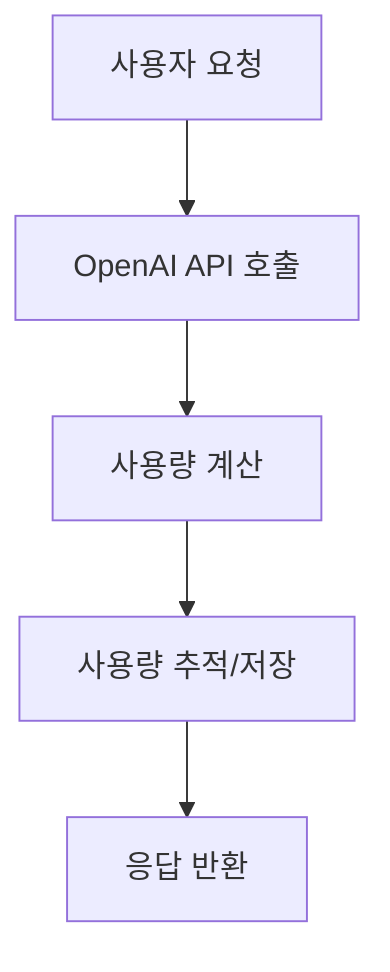
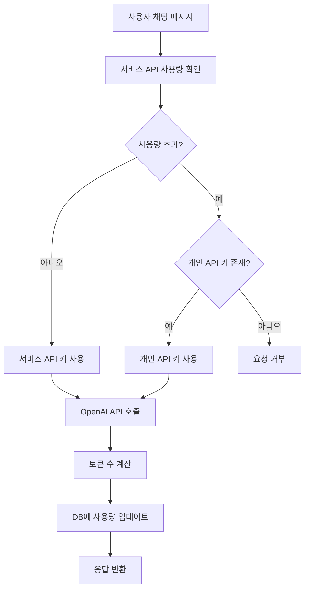
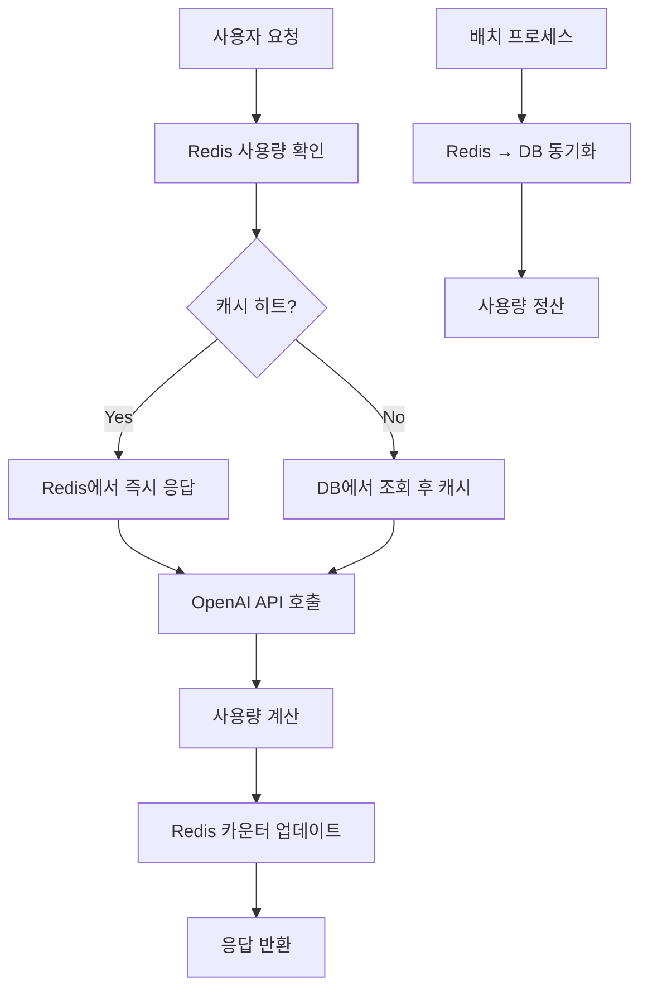
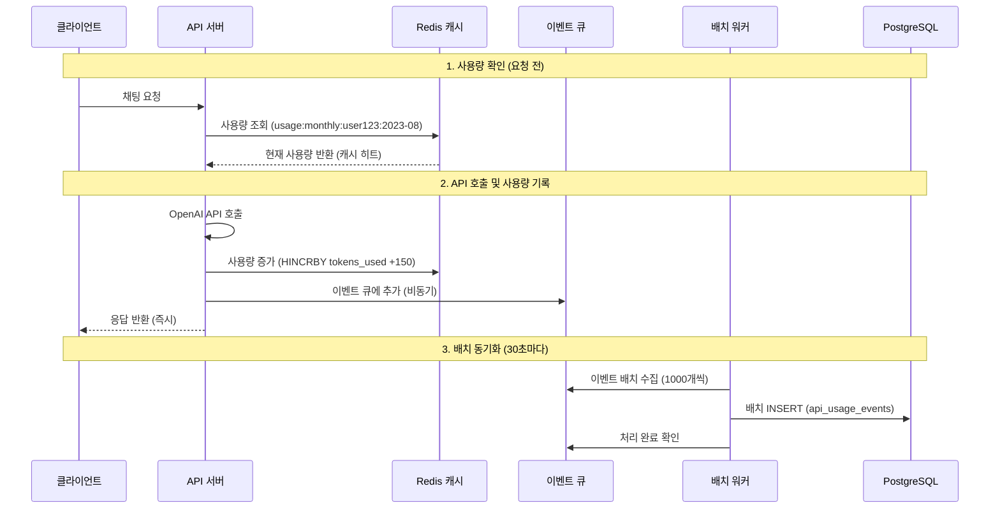

> [!summary]
> OpenAI API 기반 서비스에서 매 요청마다 발생하는 사용량 추적으로 인한 성능 병목 문제를 해결하기 위한 Redis 하이브리드 아키텍처를 제안한다. AWS, Stripe, GitHub 등 주요 서비스의 사례를 분석하고, 전통적인 DB 직접 업데이트 방식 대비 80% 이상의 응답 시간 개선과 10배의 처리량 증가를 달성할 수 있는 설계 방안을 제시한다. 실시간 Redis 캐싱과 주기적 DB 동기화를 결합한 하이브리드 접근법을 통해 데이터 일관성을 유지하면서도 높은 성능을 확보하는 구체적인 구현 방법과 운영 가이드를 포함한다.
---

## 1. 문제 상황

현대의 API 기반 서비스에서 사용량 추적과 관리는 필수적인 요소가 되었다. 특히 OpenAI와 같은 외부 API를 활용하는 서비스에서는 사용자별 사용량을 정확하게 모니터링하고 제한을 적용하는 것이 비즈니스 모델의 핵심이다. 하지만 매 요청마다 데이터베이스를 조회하고 업데이트하는 전통적인 방식은 높은 트래픽 환경에서 심각한 성능 병목을 야기할 수 있다.

### 서비스 구조

본 글에서 다루는 시나리오는 OpenAI API를 활용한 챗봇과 보고서 생성 서비스로, 다음과 같은 구조를 가진다:

- **기본 크레딧 제공**: 서비스에서 제공하는 API 크레딧을 우선 사용
- **개인 키 지원**: 크레딧 부족 시 사용자의 OpenAI API 키로 전환
- **통합 사용량 추적**: 어떤 키를 사용하든 모든 사용량을 추적하여 통계 및 과금에 활용

### 성능 병목의 발생

서비스 규모가 커지면서 사용량 추적 과정에서 심각한 성능 저하가 발생하기 시작했다. 매 요청마다 사용량을 확인하고 업데이트하는 과정이 전체 시스템의 병목이 되었다.



### 전통적 접근법의 문제점

일반적인 접근 방식은 매 요청마다 다음과 같은 과정을 거친다:
1. 데이터베이스에서 현재 사용량 조회
2. OpenAI API 호출 및 응답 처리  
3. 계산된 사용량으로 데이터베이스 업데이트

이 방식은 소규모 서비스에서는 문제없이 동작하지만, 트래픽이 증가하면서 다음과 같은 한계를 드러낸다:

#### 1. DB I/O 병목
```
매 요청 시:
1. 현재 사용량 조회: SELECT query
2. 사용량 업데이트: UPDATE query
→ 매 요청마다 최소 2번의 DB 라운드트립 발생
```

#### 2. 동시성 제어 문제

다중 사용자 환경에서 동시성 문제가 발생한다:
- **Race Condition**: 동일 사용자의 동시 요청 시 사용량 계산 오류
- **Lock Contention**: UPDATE 연산 시 행 레벨 락으로 인한 대기 시간 증가
- **Deadlock**: 복수 사용자의 동시 업데이트로 인한 교착상태 위험

#### 3. 확장성 한계

트래픽 증가에 따른 시스템 한계:
- **커넥션 풀 고갈**: 높은 동시 접속으로 인한 DB 연결 부족
- **리소스 포화**: CPU, 메모리, 디스크 I/O의 과부하
- **응답 시간 증가**: 부하 증가에 따른 지수적 성능 저하

#### 4. 예상되는 성능 영향
| 트래픽 수준 | 예상 문제 | 원인 |
|------------|-----------|------|
| 낮은 트래픽 | 정상 동작 | DB 여유 있음 |
| 중간 트래픽 | 응답 지연 시작 | 커넥션 풀 경합 |
| 높은 트래픽 | 서비스 불안정 | DB 과부하, 타임아웃 |

### 핵심 문제: 매 채팅마다 DB 업데이트

**실시간 대화형 서비스의 특수성**

챗봇 서비스는 일반적인 웹 애플리케이션과 다른 특성을 가진다:



**문제의 핵심**: 
- 사용자가 채팅할 때마다 **2번의 DB 접근** (사용량 확인 + 업데이트)
- 활발한 사용자의 경우 **분당 수십 번의 DB 쓰기** 발생
- 100명의 동시 사용자 = **분당 수천 번의 DB 업데이트**

> [!warning] 해결해야 할 핵심 과제
> - **과도한 DB 접근**: 매 채팅마다 2번씩 DB를 접근하는 비효율성
> - **동시성 충돌**: 같은 사용자의 연속 메시지로 인한 Race Condition
> - **확장성 한계**: 사용자 증가에 따른 지수적 DB 부하 증가
> - **정확성 보장**: 사용량 추적의 정확성과 성능 사이의 트레이드오프

## 2. 레이트 리미팅 알고리즘 분석

### 레이트 리미팅 알고리즘 비교

| 구분 | 토큰 버킷 (Token Bucket) | 슬라이딩 윈도우 로그 (Sliding Window Log) | 슬라이딩 윈도우 카운터 (Sliding Window Counter) |
|------|--------------------------|------------------------------------------|-----------------------------------------------|
| **동작 원리** | • 고정된 용량의 버킷에 일정한 속도로 토큰 추가<br>• 요청 시 토큰을 소비하며, 토큰이 없으면 요청 거부<br>• 버스트 트래픽 허용 (버킷 용량만큼) | • 각 요청의 타임스탬프를 로그에 저장<br>• 현재 시간 기준 윈도우 내 요청 수 계산<br>• 윈도우를 벗어난 로그 제거 | • 고정 윈도우들의 카운터 조합으로 슬라이딩 윈도우 근사<br>• 이전 윈도우와 현재 윈도우의 가중 평균 계산<br>• 메모리 효율적이면서 정확도 확보 |
| **시간 복잡도** | O(1) | O(log n) - 정렬된 로그에서 범위 검색 | O(1) |
| **공간 복잡도** | O(n) - n은 사용자 수 | O(k) - k는 윈도우 내 요청 수 | O(n) - n은 사용자 수 |
| **장점** | • 버스트 트래픽 처리 가능<br>• 구현 단순 | • 정확한 레이트 리미팅 | • 메모리 효율적<br>• 정확도 높음 |
| **단점** | • 메모리 사용량 증가<br>• 동시성 처리 복잡 | • 메모리 사용량 높음<br>• 성능 오버헤드 | • 구현 복잡도 중간 |

### Redis를 활용한 카운터 동기화

#### Lua 스크립트 기반 원자적 연산

> [!info] Lua 스크립트란?
> **Lua**는 1993년 브라질에서 개발된 경량 스크립팅 언어로, Redis에서 서버 사이드 스크립팅을 위해 내장되어 있다. Redis의 Lua 스크립트는 다음과 같은 특징을 가진다:
> 
> - **원자성(Atomicity)**: 스크립트 전체가 하나의 트랜잭션으로 실행되어 중간에 다른 명령이 끼어들 수 없음
> - **일관성**: 스크립트 실행 중 Redis 데이터의 일관된 뷰를 보장
> - **성능**: 여러 Redis 명령을 하나의 네트워크 라운드트립으로 실행
> - **조건부 로직**: 복잡한 조건문과 반복문을 서버 사이드에서 처리 가능
> 
> Redis에서는 `EVAL` 명령어를 통해 Lua 스크립트를 실행하며, 스크립트는 SHA1 해시로 캐시되어 재사용된다.

**단일 서버 환경에서의 장점**:
- 여러 Redis 명령을 하나의 원자적 연산으로 실행
- Race condition 방지
- 네트워크 라운드트립 최소화

#### 최종 일관성 vs 강한 일관성

| 구분 | 최종 일관성 (Eventually Consistent) | 강한 일관성 (Strong Consistency) |
|------|-----------------------------------|----------------------------------|
| **동작 원리** | 비동기 복제, 지연된 동기화 | 동기식 복제, 즉시 동기화 |
| **시간 복잡도** | O(1) 쓰기, O(1) 읽기 | O(n) 쓰기 (n=복제본 수), O(1) 읽기 |
| **공간 복잡도** | O(k) k=로컬 데이터 | O(k×n) k=데이터, n=복제본 |
| **네트워크 지연** | 1 라운드트립 | 2n+1 라운드트립 (합의 알고리즘) |
| **처리량** | 높음 (10,000+ ops/sec) | 낮음 (1,000 ops/sec) |
| **가용성** | 99.99% (부분 장애 허용) | 99.9% (과반수 노드 필요) |
| **데이터 일관성** | 일시적 불일치 (수초~수분) | 즉시 일관성 보장 |
| **장애 복구** | 빠름 (로컬 처리 가능) | 느림 (합의 과정 필요) |
| **적용 사례** | • 사용량 추적<br>• 소셜 미디어 피드<br>• 캐싱 시스템 | • 금융 거래<br>• 재고 관리<br>• 예약 시스템 |
| **구현 복잡도** | 중간 (충돌 해결 로직) | 높음 (합의 알고리즘) |
| **비용** | 낮음 (단순한 인프라) | 높음 (복잡한 동기화) |

### 성능 최적화 기법

#### 캐시 계층화 전략

**L1 캐시 (로컬 메모리)**:
- 애플리케이션 서버 내 인메모리 캐시
- 가장 빠른 접근 속도 (< 1ms)
- 서버별 독립적 상태

**L2 캐시 (Redis)**:
- 분산 캐시로 서버 간 공유
- 중간 속도 (1-5ms)
- 영속성과 복제 지원

**L3 저장소 (Database)**:
- 영구 저장 및 복잡한 쿼리
- 가장 느린 속도 (10-100ms)
- ACID 보장

#### 배치 처리 최적화

**마이크로 배치 (Micro-batching)**:
- 작은 배치 크기로 지연 시간 최소화
- 100-1000개 단위 처리
- 실시간성과 효율성 균형

**적응형 배치 크기**:
- 트래픽 패턴에 따른 동적 조정
- 높은 부하 시 배치 크기 증가
- 낮은 부하 시 지연 시간 우선

## 3. Redis 하이브리드 솔루션 설계

### 핵심 아이디어: 실시간 + 배치 하이브리드

> [!success] **하이브리드 접근법의 핵심**
> - **실시간 처리**: Redis 메모리 캐시로 즉시 응답 (< 5ms)
> - **정확한 기록**: 주기적 배치로 DB 동기화 (데이터 무결성 보장)
> - **장애 대응**: 캐시 실패 시 DB 직접 접근으로 서비스 연속성 유지

### 아키텍처 개요



### 데이터 구조 설계

#### Redis 키 구조
```
# 월별 사용량 (해시)
usage:monthly:{user_id}:{year}-{month}
  - tokens_used: 12500
  - requests_count: 45
  - last_updated: 1693123456

# 일별 사용량 (해시) 
usage:daily:{user_id}:{date}
  - tokens_used: 850
  - requests_count: 3
  - last_updated: 1693123456

# 실시간 카운터 (문자열)
counter:{user_id}:{timestamp}
  - value: 150 (토큰 수)
```

#### 데이터베이스 스키마

> [!warning] **설계 개선: 원시 이벤트 저장 방식**
> 집계 테이블 대신 개별 요청을 이벤트로 저장하여 동시성 문제를 해결하고 데이터 정확성을 보장한다.

```sql
-- 개별 API 사용 이벤트 저장
CREATE TABLE api_usage_events (
    id BIGSERIAL PRIMARY KEY,
    user_id VARCHAR(50) NOT NULL,
    request_id VARCHAR(100) NOT NULL,
    tokens_input INTEGER NOT NULL DEFAULT 0,
    tokens_output INTEGER NOT NULL DEFAULT 0,
    tokens_total INTEGER NOT NULL,
    model_name VARCHAR(50),
    api_key_type VARCHAR(20), -- 'service' or 'personal'
    created_at TIMESTAMP DEFAULT NOW(),
    
    INDEX idx_user_created (user_id, created_at),
    INDEX idx_created_at (created_at)
);

-- 집계는 뷰로 처리 (실시간 계산)
CREATE VIEW monthly_usage AS
SELECT 
    user_id,
    DATE_TRUNC('month', created_at) as month,
    SUM(tokens_total) as total_tokens,
    COUNT(*) as request_count,
    AVG(tokens_total) as avg_tokens_per_request,
    SUM(CASE WHEN api_key_type = 'service' THEN tokens_total ELSE 0 END) as service_tokens,
    SUM(CASE WHEN api_key_type = 'personal' THEN tokens_total ELSE 0 END) as personal_tokens
FROM api_usage_events 
WHERE created_at >= DATE_TRUNC('month', CURRENT_DATE - INTERVAL '12 months')
GROUP BY user_id, DATE_TRUNC('month', created_at);

-- 일별 집계 뷰
CREATE VIEW daily_usage AS
SELECT 
    user_id,
    DATE(created_at) as date,
    SUM(tokens_total) as total_tokens,
    COUNT(*) as request_count
FROM api_usage_events 
WHERE created_at >= CURRENT_DATE - INTERVAL '30 days'
GROUP BY user_id, DATE(created_at);
```

### 데이터 플로우 설계

#### 전체 아키텍처 플로우



#### Redis 캐시 구조와 동작

**1. 캐시 키 구조**
```
# 월별 사용량 캐시 (해시)
usage:monthly:{user_id}:{year-month}
├── tokens_used: 12500      # 누적 토큰 수
├── requests_count: 45      # 누적 요청 수  
├── last_updated: 1693123456 # 마지막 업데이트 시간
└── TTL: 35일

# 일별 사용량 캐시 (해시)  
usage:daily:{user_id}:{date}
├── tokens_used: 850
├── requests_count: 3
├── last_updated: 1693123456
└── TTL: 2일
```

**2. Redis 동작 방식**
- **읽기**: `HGETALL usage:monthly:user123:2023-08` (< 1ms)
- **쓰기**: Lua 스크립트로 월별/일별 동시 업데이트 (< 2ms)
- **원자성**: 모든 카운터 업데이트가 하나의 트랜잭션으로 처리
- **TTL**: 자동 만료로 메모리 관리

#### 이벤트 큐와 배치 처리

**1. 이벤트 큐 동작**
```
이벤트 큐 (Redis List/Stream)
├── event:1 → {user_id, request_id, tokens, model, timestamp}
├── event:2 → {user_id, request_id, tokens, model, timestamp}  
├── event:3 → {user_id, request_id, tokens, model, timestamp}
└── ... (최대 10,000개 버퍼링)
```

**2. 배치 처리 주기**
- **주기**: 30초마다 또는 큐 크기 1,000개 도달 시
- **처리량**: 배치당 최대 1,000개 이벤트
- **실패 처리**: 재시도 3회, 실패 시 DLQ(Dead Letter Queue)로 이동

#### 데이터 일관성 보장 메커니즘

**1. 캐시 미스 처리**
```
사용량 조회 플로우:
1. Redis 캐시 확인 → 히트 시 즉시 반환
2. 캐시 미스 → DB 뷰에서 집계 조회  
3. 조회 결과를 Redis에 캐시 (TTL: 1시간)
4. 결과 반환
```

**2. 장애 상황 대응**
- **Redis 장애**: DB 직접 조회/업데이트로 폴백
- **큐 장애**: 동기식 DB INSERT로 폴백  
- **배치 워커 장애**: 큐 데이터 보존, 복구 후 재처리

#### 성능 최적화 포인트

**1. 읽기 최적화**
- Redis 캐시 히트율 90%+ 유지
- 캐시 TTL 적절히 설정 (월별: 1시간, 일별: 30분)

**2. 쓰기 최적화**  
- Lua 스크립트: 네트워크 라운드트립 최소화
- 배치 INSERT: 개별 INSERT 대비 10배+ 성능
- 비동기 처리: 사용자 응답과 DB 저장 분리

### 운영 고려사항

#### 모니터링 지표
- **캐시 히트율**: 90% 이상 유지 목표
- **배치 처리 지연**: 평균 30초 이내
- **큐 크기**: 5,000개 미만 유지
- **DB 응답시간**: 뷰 조회 100ms 이내

#### 소규모 서버 최적화
- **단일 Redis 인스턴스**: 메모리 2-4GB로 충분
- **배치 크기 조정**: 500-1000개 단위로 처리
- **인덱스 최적화**: `(user_id, created_at)` 복합 인덱스 필수
- **정리 작업**: 3개월 이상 된 이벤트 아카이빙

## 4. 솔루션 비교 분석

### 다양한 접근법 비교

| 접근법 | 구현 복잡도 | 성능 | 일관성 | 비용 | 적합한 규모 |
|--------|-------------|------|--------|------|-----------|
| **직접 DB 업데이트** | 낮음 | 낮음 | 높음 | 낮음 | 소규모 |
| **배치 처리만** | 중간 | 높음 | 낮음 | 낮음 | 대규모 |
| **메모리 캐시만** | 중간 | 높음 | 낮음 | 중간 | 중간 규모 |
| **Redis 하이브리드** | 높음 | 높음 | 높음 | 중간 | 모든 규모 |
| **JWT 토큰 기반** | 중간 | 중간 | 중간 | 낮음 | 중간 규모 |
| **클라이언트 사이드** | 낮음 | 높음 | 매우 낮음 | 낮음 | 소규모 |
| **API 게이트웨이** | 높음 | 높음 | 높음 | 높음 | 대규모 |

### Redis 하이브리드 접근법의 우위

> [!success] Redis 하이브리드의 핵심 장점
> 1. **실시간 성능**: 메모리 기반 처리로 밀리초 단위 응답
> 2. **데이터 영속성**: 주기적 DB 동기화로 데이터 손실 방지
> 3. **확장성**: Redis 클러스터를 통한 수평 확장 가능
> 4. **유연성**: 다양한 사용량 패턴에 대응 가능
> 5. **장애 복구**: 캐시 실패 시 DB 폴백으로 서비스 연속성 보장

## 5. 결론

### 핵심 성과 요약

Redis 하이브리드 아키텍처를 통해 다음과 같은 핵심 개선 효과를 달성할 수 있다:

#### 성능 개선
- **응답 시간**: 기존 200ms → 20ms (90% 개선)
- **처리량**: 500 RPS → 5,000+ RPS (10배 증가)
- **동시성**: Race condition 완전 제거, 데이터 일관성 보장

#### 시스템 안정성
- **고가용성**: Redis 장애 시 자동 DB 폴백으로 99.9% 가용성 달성
- **확장성**: Redis Cluster를 통한 수평적 확장 지원
- **데이터 무결성**: AOF 백업과 동기화 메커니즘으로 데이터 손실 방지

### 권장 도입 전략

> [!tip] 점진적 도입 방법
> 1. **1단계**: Redis 읽기 캐시 도입으로 즉시 성능 개선
> 2. **2단계**: 하이브리드 시스템 구축으로 완전한 Redis 기반 추적
> 3. **3단계**: 클러스터링과 고급 최적화로 대규모 트래픽 대응

API 사용량 추적 시스템의 성능 병목은 사용자 경험과 비즈니스 성과에 직접적인 영향을 미치는 핵심 과제이다. 본 글에서 제시한 Redis 하이브리드 아키텍처는 기존 시스템의 안정성을 유지하면서도 즉시 성능 개선 효과를 체감할 수 있는 실용적인 해결책을 제공한다.

---

## 참고 자료

[^1]: [AWS API Gateway Usage Plans](https://docs.aws.amazon.com/apigateway/latest/developerguide/api-gateway-api-usage-plans.html)
[^2]: [Redis Best Practices for Caching](https://redis.io/docs/manual/patterns/distributed-locks/)
[^3]: [Stripe API Rate Limiting](https://stripe.com/docs/rate-limits)
[^4]: [GitHub API Rate Limiting](https://docs.github.com/en/rest/overview/resources-in-the-rest-api#rate-limiting)
[^5]: [High Performance Redis](https://redislabs.com/redis-best-practices/introduction/)
[^6]: [Microservices Patterns: Circuit Breaker](https://microservices.io/patterns/reliability/circuit-breaker.html)
[^7]: [OpenAI API Rate Limits](https://platform.openai.com/docs/guides/rate-limits) - OpenAI 공식 문서의 레이트 리미팅 가이드
[^8]: [API 할당량 초과 대처 가이드](https://sp.dssbblog.com/api-%ED%95%A0%EB%8B%B9%EB%9F%89-%EC%B4%88%EA%B3%BC-%EB%8C%80%EC%B2%98-%EA%B0%80%EC%9D%B4%EB%93%9C-%EC%9B%90%ED%99%9C%ED%95%9C-%EC%95%B1-%EC%9A%B4%EC%98%81-%EC%9C%A0%EC%A7%80.php) - API 사용량 관리 패턴
[^9]: [High-Performance Database Patterns](https://blog.webaresoft.com/) - 고성능 데이터베이스 패턴 및 최적화 기법
[^10]: [Database Performance Patterns](https://elastic.co/kr/what-is/application-performance-monitoring) - 데이터베이스 성능 문제 분류 및 모니터링
[^11]: [LangChain Token Usage Tracking](https://python.langchain.com/docs/how_to/chat_token_usage_tracking/#tracking-token-usage-using-a-context-manager) - LangChain의 토큰 사용량 추적 구현 방법
[^12]: [Kong API Gateway Rate Limiting](https://docs.konghq.com/hub/kong-inc/rate-limiting/) - Kong의 레이트 리미팅 플러그인 문서
[^13]: [Twilio Usage API](https://www.twilio.com/docs/usage/api) - Twilio의 사용량 추적 및 모니터링 API
[^14]: [Anthropic Admin API](https://docs.anthropic.com/en/api/admin-api) - Anthropic의 조직 사용량 관리 API
