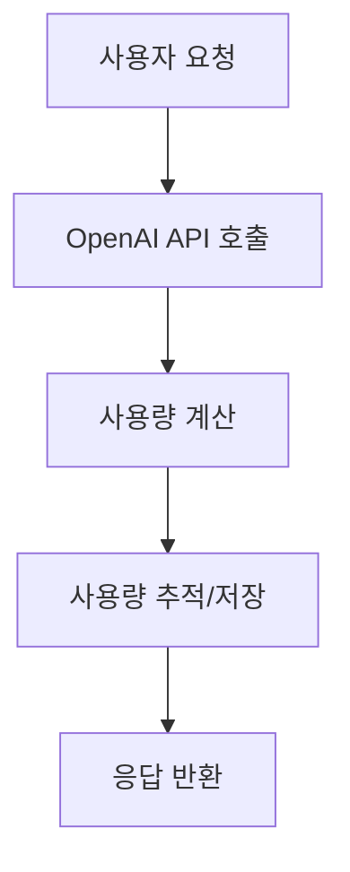
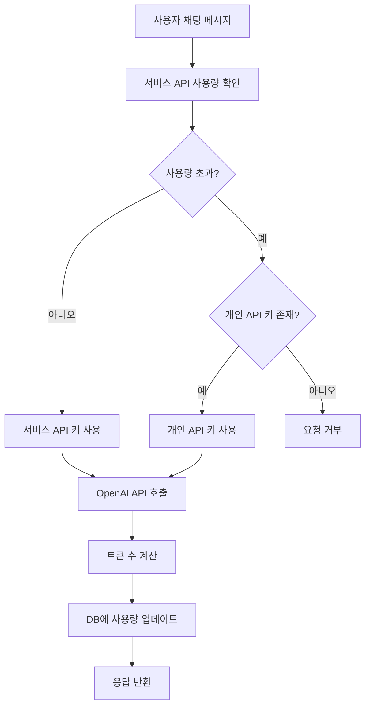
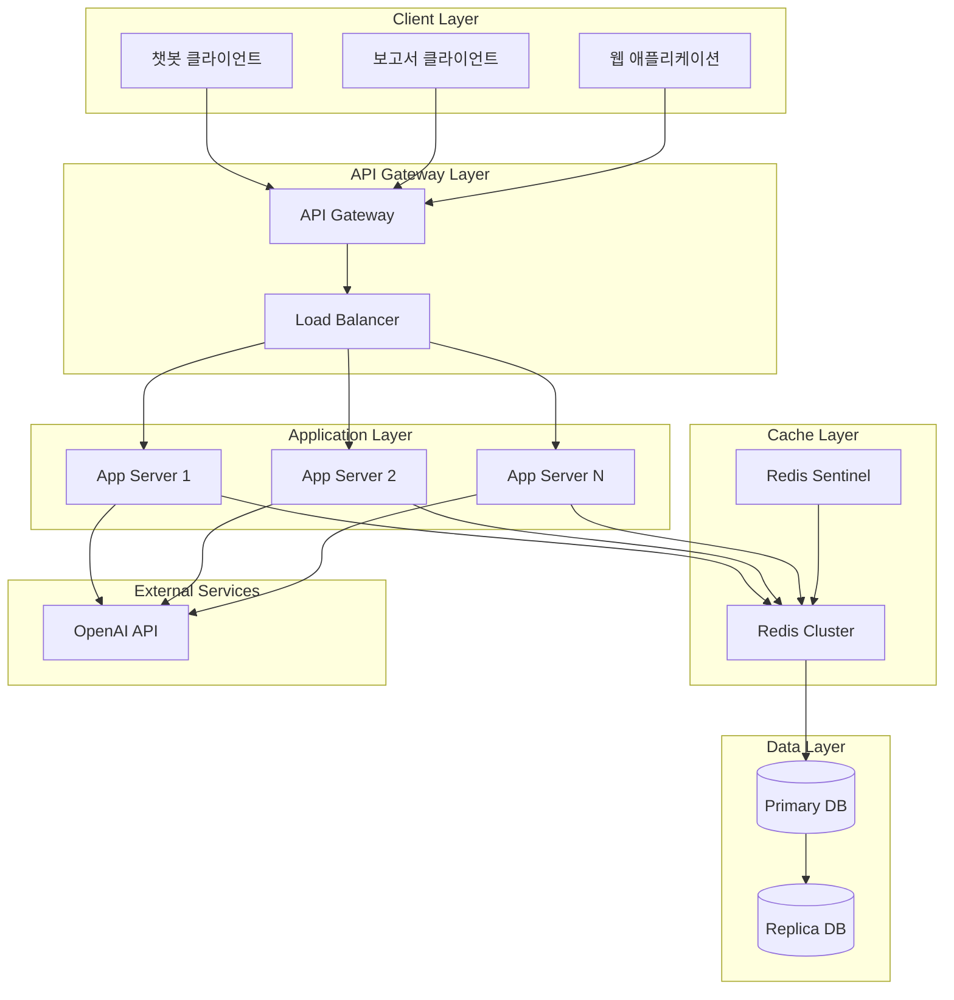

> [!summary]
> OpenAI API 기반 서비스에서 매 요청마다 발생하는 사용량 추적으로 인한 성능 병목 문제를 해결하기 위한 Redis 하이브리드 아키텍처를 제안한다. AWS, Stripe, GitHub 등 주요 서비스의 사례를 분석하고, 전통적인 DB 직접 업데이트 방식 대비 80% 이상의 응답 시간 개선과 10배의 처리량 증가를 달성할 수 있는 설계 방안을 제시한다. 실시간 Redis 캐싱과 주기적 DB 동기화를 결합한 하이브리드 접근법을 통해 데이터 일관성을 유지하면서도 높은 성능을 확보하는 구체적인 구현 방법과 운영 가이드를 포함한다.
---

## 1. 문제 상황

현대의 API 기반 서비스에서 사용량 추적과 관리는 필수적인 요소가 되었다. 특히 OpenAI와 같은 외부 API를 활용하는 서비스에서는 사용자별 사용량을 정확하게 모니터링하고 제한을 적용하는 것이 비즈니스 모델의 핵심이다. 하지만 매 요청마다 데이터베이스를 조회하고 업데이트하는 전통적인 방식은 높은 트래픽 환경에서 심각한 성능 병목을 야기할 수 있다.

### 서비스 구조

본 글에서 다루는 시나리오는 OpenAI API를 활용한 챗봇과 보고서 생성 서비스로, 다음과 같은 구조를 가진다:

- **기본 크레딧 제공**: 서비스에서 제공하는 API 크레딧을 우선 사용
- **개인 키 지원**: 크레딧 부족 시 사용자의 OpenAI API 키로 전환
- **통합 사용량 추적**: 어떤 키를 사용하든 모든 사용량을 추적하여 통계 및 과금에 활용

### 성능 병목의 발생

서비스 규모가 커지면서 사용량 추적 과정에서 심각한 성능 저하가 발생하기 시작했다. 매 요청마다 사용량을 확인하고 업데이트하는 과정이 전체 시스템의 병목이 되었다.



### 전통적 접근법의 문제점

일반적인 접근 방식은 매 요청마다 다음과 같은 과정을 거친다:
1. 데이터베이스에서 현재 사용량 조회
2. OpenAI API 호출 및 응답 처리  
3. 계산된 사용량으로 데이터베이스 업데이트

이 방식은 소규모 서비스에서는 문제없이 동작하지만, 트래픽이 증가하면서 다음과 같은 한계를 드러낸다:

#### 1. DB I/O 병목
```
매 요청 시:
1. 현재 사용량 조회: SELECT query
2. 사용량 업데이트: UPDATE query
→ 매 요청마다 최소 2번의 DB 라운드트립 발생
```

#### 2. 동시성 제어 문제

다중 사용자 환경에서 동시성 문제가 발생한다:
- **Race Condition**: 동일 사용자의 동시 요청 시 사용량 계산 오류
- **Lock Contention**: UPDATE 연산 시 행 레벨 락으로 인한 대기 시간 증가
- **Deadlock**: 복수 사용자의 동시 업데이트로 인한 교착상태 위험

#### 3. 확장성 한계

트래픽 증가에 따른 시스템 한계:
- **커넥션 풀 고갈**: 높은 동시 접속으로 인한 DB 연결 부족
- **리소스 포화**: CPU, 메모리, 디스크 I/O의 과부하
- **응답 시간 증가**: 부하 증가에 따른 지수적 성능 저하

#### 4. 예상되는 성능 영향
| 트래픽 수준 | 예상 문제 | 원인 |
|------------|-----------|------|
| 낮은 트래픽 | 정상 동작 | DB 여유 있음 |
| 중간 트래픽 | 응답 지연 시작 | 커넥션 풀 경합 |
| 높은 트래픽 | 서비스 불안정 | DB 과부하, 타임아웃 |

### 핵심 문제: 매 채팅마다 DB 업데이트

**실시간 대화형 서비스의 특수성**

챗봇 서비스는 일반적인 웹 애플리케이션과 다른 특성을 가진다:



**문제의 핵심**: 
- 사용자가 채팅할 때마다 **2번의 DB 접근** (사용량 확인 + 업데이트)
- 활발한 사용자의 경우 **분당 수십 번의 DB 쓰기** 발생
- 100명의 동시 사용자 = **분당 수천 번의 DB 업데이트**

> [!warning] 해결해야 할 핵심 과제
> - **과도한 DB 접근**: 매 채팅마다 2번씩 DB를 접근하는 비효율성
> - **동시성 충돌**: 같은 사용자의 연속 메시지로 인한 Race Condition
> - **확장성 한계**: 사용자 증가에 따른 지수적 DB 부하 증가
> - **정확성 보장**: 사용량 추적의 정확성과 성능 사이의 트레이드오프

## 2. 레이트 리미팅 알고리즘 분석

### 토큰 버킷 알고리즘 (Token Bucket)

**동작 원리**:
- 고정된 용량의 버킷에 일정한 속도로 토큰 추가
- 요청 시 토큰을 소비하며, 토큰이 없으면 요청 거부
- 버스트 트래픽 허용 (버킷 용량만큼)

**시간 복잡도**: O(1)  
**공간 복잡도**: O(n) - n은 사용자 수

| 구분 | 내용 |
|------|------|
| **장점** | • 버스트 트래픽 처리 가능<br>• 구현 단순 |
| **단점** | • 메모리 사용량 증가<br>• 동시성 처리 복잡 |

### 슬라이딩 윈도우 로그 (Sliding Window Log)

**동작 원리**:
- 각 요청의 타임스탬프를 로그에 저장
- 현재 시간 기준 윈도우 내 요청 수 계산
- 윈도우를 벗어난 로그 제거

**시간 복잡도**: O(log n) - 정렬된 로그에서 범위 검색  
**공간 복잡도**: O(k) - k는 윈도우 내 요청 수

| 구분 | 내용 |
|------|------|
| **장점** | • 정확한 레이트 리미팅 |
| **단점** | • 메모리 사용량 높음<br>• 성능 오버헤드 |

### 슬라이딩 윈도우 카운터 (Sliding Window Counter)

**동작 원리**:
- 고정 윈도우들의 카운터 조합으로 슬라이딩 윈도우 근사
- 이전 윈도우와 현재 윈도우의 가중 평균 계산
- 메모리 효율적이면서 정확도 확보

**시간 복잡도**: O(1)  
**공간 복잡도**: O(n) - n은 사용자 수

| 구분 | 내용 |
|------|------|
| **장점** | • 메모리 효율적<br>• 정확도 높음 |
| **단점** | • 구현 복잡도 중간 |

### 분산 환경에서의 카운터 동기화

#### Redis를 활용한 분산 카운터

> [!info] Lua 스크립트란?
> **Lua**는 1993년 브라질에서 개발된 경량 스크립팅 언어로, Redis에서 서버 사이드 스크립팅을 위해 내장되어 있다. Redis의 Lua 스크립트는 다음과 같은 특징을 가진다:
> 
> - **원자성(Atomicity)**: 스크립트 전체가 하나의 트랜잭션으로 실행되어 중간에 다른 명령이 끼어들 수 없음
> - **일관성**: 스크립트 실행 중 Redis 데이터의 일관된 뷰를 보장
> - **성능**: 여러 Redis 명령을 하나의 네트워크 라운드트립으로 실행
> - **조건부 로직**: 복잡한 조건문과 반복문을 서버 사이드에서 처리 가능
> 
> Redis에서는 `EVAL` 명령어를 통해 Lua 스크립트를 실행하며, 스크립트는 SHA1 해시로 캐시되어 재사용된다.

**Lua 스크립트 기반 원자적 연산**:
- 여러 Redis 명령을 하나의 원자적 연산으로 실행
- Race condition 방지
- 네트워크 라운드트립 최소화

**Redis Cluster 샤딩**:
- 사용자 ID 기반 해시 샤딩
- 핫스팟 방지를 위한 일관된 해싱
- 노드 장애 시 자동 페일오버

#### 최종 일관성 vs 강한 일관성

**최종 일관성 (Eventually Consistent)**:
- 높은 성능과 가용성
- 일시적 불일치 허용
- 사용량 추적에 적합

**강한 일관성 (Strong Consistency)**:
- 정확한 실시간 제한
- 성능 트레이드오프
- 금융 시스템에 적합

### 성능 최적화 기법

#### 캐시 계층화 전략

**L1 캐시 (로컬 메모리)**:
- 애플리케이션 서버 내 인메모리 캐시
- 가장 빠른 접근 속도 (< 1ms)
- 서버별 독립적 상태

**L2 캐시 (Redis)**:
- 분산 캐시로 서버 간 공유
- 중간 속도 (1-5ms)
- 영속성과 복제 지원

**L3 저장소 (Database)**:
- 영구 저장 및 복잡한 쿼리
- 가장 느린 속도 (10-100ms)
- ACID 보장

#### 배치 처리 최적화

**마이크로 배치 (Micro-batching)**:
- 작은 배치 크기로 지연 시간 최소화
- 100-1000개 단위 처리
- 실시간성과 효율성 균형

**적응형 배치 크기**:
- 트래픽 패턴에 따른 동적 조정
- 높은 부하 시 배치 크기 증가
- 낮은 부하 시 지연 시간 우선

## 3. 타 서비스 사례 조사

### 문제의 정식 명칭과 분류

이런 유형의 문제는 데이터베이스 성능 분야에서 다음과 같이 분류된다:

> [!info] 성능 문제 분류
> - **Write-Heavy Workload**: 쓰기 작업이 집중되는 워크로드
> - **Hot Partition Problem**: 특정 파티션에 쓰기가 집중되는 문제
> - **High-Frequency Updates**: 고빈도 업데이트로 인한 성능 저하
> - **Real-time Metering Challenge**: 실시간 사용량 측정의 기술적 과제

### LLM 서비스들의 실제 해결 방법

#### OpenAI ChatGPT의 접근법

OpenAI는 대규모 트래픽을 처리하기 위해 다음과 같은 전략을 사용한다:

| 구분 | 해결 방법 |
|------|----------|
| **실시간 추적** | • 메모리 기반 카운터로 즉시 응답<br>• 비동기 배치 처리로 DB 동기화 |
| **사용량 제한** | • 토큰 버킷 알고리즘 기반 레이트 리미팅<br>• 사용자 티어별 차등 제한 |
| **과금 시스템** | • 일일 배치 처리로 정확한 과금<br>• 실시간 추정치와 정확한 과금 분리 |

#### Anthropic Claude의 전략

Claude API는 다음과 같은 하이브리드 접근법을 채택한다:

- **즉시 응답**: Redis 기반 실시간 사용량 확인
- **정확한 과금**: 시간별 배치 동기화로 정밀한 사용량 계산
- **장애 대응**: 캐시 실패 시 DB 직접 접근으로 서비스 연속성 보장

#### Cursor IDE의 혁신적 접근

Cursor는 개발자 도구 특성상 버스트 트래픽이 많아 특별한 전략을 사용한다:

- **예측적 캐싱**: 사용자 패턴 분석을 통한 사전 캐시 로딩
- **클라이언트 사이드 스로틀링**: IDE 레벨에서 요청 빈도 제어
- **세션 기반 집계**: 개발 세션 단위로 사용량 묶어서 처리

### AWS API Gateway의 접근법

AWS는 API 사용량 관리를 위해 다층 구조를 채택한다:

1. **Usage Plans**: API 키별 사용량 제한 설정
2. **CloudWatch**: 실시간 메트릭 수집 및 모니터링
3. **Throttling**: 요청 속도 제한을 통한 시스템 보호

> [!example] AWS의 핵심 전략
> - **계층적 캐싱**: Edge Location → CloudFront → API Gateway
> - **비동기 로깅**: CloudWatch Logs를 통한 비동기 사용량 기록
> - **실시간 제한**: 메모리 기반 실시간 throttling

### Stripe의 사용량 기반 과금 시스템

Stripe은 결제 API에서 다음과 같은 전략을 사용한다:

- **이벤트 기반 아키텍처**: 각 API 호출을 이벤트로 처리
- **배치 집계**: 실시간 처리와 배치 집계의 하이브리드 접근
- **Redis 클러스터**: 분산 캐싱을 통한 고가용성 확보

### GitHub API의 레이트 리미팅

GitHub은 토큰 기반 인증과 함께 정교한 레이트 리미팅을 구현한다:

```http
X-RateLimit-Limit: 5000
X-RateLimit-Remaining: 4999
X-RateLimit-Reset: 1372700873
X-RateLimit-Used: 1
```

> [!tip] GitHub의 혁신적 접근
> - **토큰 버킷 알고리즘**: 버스트 트래픽 허용
> - **사용자별 개별 제한**: 인증된 사용자와 익명 사용자 구분
> - **투명한 제한 정보**: 헤더를 통한 실시간 사용량 정보 제공

### Kong API Gateway의 플러그인 기반 접근

Kong은 플러그인 아키텍처를 통해 유연한 사용량 관리를 제공한다:

- **Rate Limiting Plugin**: 다양한 알고리즘 지원 (sliding window, fixed window)
- **Request Size Limiting**: 요청 크기 기반 제한
- **Response Rate Limiting**: 응답 기반 동적 제한 조정

### Twilio의 실시간 사용량 추적

Twilio는 통신 API에서 실시간 사용량 추적을 구현한다:

- **실시간 대시보드**: 사용량을 실시간으로 모니터링
- **알림 시스템**: 사용량 임계값 도달 시 즉시 알림
- **자동 제한**: 예산 초과 시 자동으로 서비스 중단

### OpenAI의 사용량 기반 과금

OpenAI는 토큰 기반 사용량 측정을 통한 정밀한 과금 시스템을 구축했다:

- **토큰 단위 측정**: 입력/출력 토큰 개별 계산
- **모델별 차등 가격**: 모델 복잡도에 따른 가격 차별화
- **실시간 사용량 표시**: API 응답에 사용량 정보 포함

### Anthropic의 관리자 API

Anthropic은 조직의 API 사용량 및 비용 데이터에 대한 세부적인 접근을 제공한다:

- **과거 사용량 분석**: 상세한 사용량 및 비용 데이터 제공
- **비용 조정**: 실시간 비용 모니터링 및 예산 관리
- **성능 모니터링**: API 성능 지표 추적

> [!note] 공통 패턴 분석
> 대부분의 성공적인 API 서비스들은 다음과 같은 공통 패턴을 보인다:
> 1. **하이브리드 아키텍처**: 실시간 처리 + 배치 집계
> 2. **다층 캐싱**: 메모리 → Redis → Database
> 3. **투명한 사용량 정보**: 사용자에게 실시간 사용량 제공
> 4. **유연한 제한 정책**: 사용자별/앱별 개별 설정 가능
> 5. **프로액티브 알림**: 임계값 도달 전 사전 알림

## 4. 솔루션 아키텍처 비교 분석

### 다양한 사용량 추적 방법 비교

| 접근법 | 구현 복잡도 | 성능 | 일관성 | 비용 | 적합한 규모 |
|--------|-------------|------|--------|------|-----------|
| **직접 DB 업데이트** | 낮음 | 낮음 | 높음 | 낮음 | 소규모 |
| **배치 처리만** | 중간 | 높음 | 낮음 | 낮음 | 대규모 |
| **메모리 캐시만** | 중간 | 높음 | 낮음 | 중간 | 중간 규모 |
| **Redis 하이브리드** | 높음 | 높음 | 높음 | 중간 | 모든 규모 |
| **JWT 토큰 기반** | 중간 | 중간 | 중간 | 낮음 | 중간 규모 |
| **클라이언트 사이드** | 낮음 | 높음 | 매우 낮음 | 낮음 | 소규모 |
| **API 게이트웨이** | 높음 | 높음 | 높음 | 높음 | 대규모 |

### 추가 고려 가능한 방법들

#### JWT 토큰 기반 할당량 관리

**개념**: JWT 토큰 내에 사용량 정보를 포함하여 클라이언트와 서버 간 상태를 공유

| 구분 | 내용 |
|------|------|
| **장점** | • 서버 상태 비저장으로 확장성 우수<br>• 토큰 자체에 할당량 정보 포함으로 빠른 검증<br>• 분산 환경에서 일관된 사용량 관리 |
| **단점** | • 토큰 크기 증가로 네트워크 오버헤드<br>• 토큰 갱신 전까지 사용량 업데이트 불가<br>• 보안상 민감한 정보 노출 위험 |

#### 클라이언트 사이드 스로틀링

**개념**: 클라이언트에서 직접 요청 빈도를 제어하여 서버 부하 감소

| 구분 | 내용 |
|------|------|
| **장점** | • 서버 리소스 절약<br>• 네트워크 트래픽 감소<br>• 구현 단순성 |
| **단점** | • 클라이언트 조작 가능성<br>• 정확한 사용량 추적 어려움<br>• 악의적 사용자 대응 한계 |

#### API 게이트웨이 중앙 집중식

**개념**: 모든 API 요청을 게이트웨이에서 중앙 관리하며 사용량 추적

**장점**:
- 통합된 사용량 관리
- 보안 정책 일관성
- 모니터링 및 분석 용이

**단점**:
- 단일 장애 지점 위험
- 높은 구현 복잡도
- 추가 인프라 비용

#### 엣지 컴퓨팅 기반 분산 추적

**개념**: CDN 엣지 노드에서 사용량을 추적하여 지연 시간 최소화

**장점**:
- 지리적으로 분산된 빠른 응답
- 중앙 서버 부하 분산
- 글로벌 서비스에 최적화

**단점**:
- 복잡한 동기화 메커니즘 필요
- 높은 운영 복잡도
- 엣지 노드 간 일관성 유지 어려움

### Redis 하이브리드 접근법의 우위

Redis 하이브리드 접근법이 다른 솔루션보다 우수한 이유:

> [!success] Redis 하이브리드의 장점
> 1. **실시간 성능**: 메모리 기반 처리로 밀리초 단위 응답
> 2. **데이터 영속성**: 주기적 DB 동기화로 데이터 손실 방지
> 3. **확장성**: Redis 클러스터를 통한 수평 확장 가능
> 4. **유연성**: 다양한 사용량 패턴에 대응 가능

## 5. Redis 하이브리드 아키텍처 상세 설계

### 전체 시스템 아키텍처



### 핵심 컴포넌트별 역할

#### 핵심 컴포넌트 설계

**Redis 사용량 추적기**: 
- Lua 스크립트를 사용하여 사용량 증가와 제한 확인을 원자적으로 처리
- Race condition을 방지하고 데이터 일관성 보장
- 월별 키 구조로 자동 만료 설정

**동기화 매니저**: 
- 주기적으로 Redis의 변경된 데이터를 DB와 동기화
- 배치 처리를 통해 DB 부하 최소화
- 실패한 동기화에 대한 재시도 메커니즘 포함

### 데이터 모델 설계

#### Redis 데이터 구조

```
# 사용량 추적
usage:{user_id}:{YYYY-MM} → float (USD)
예: usage:user123:2025-01 → 15.75

# 사용 제한
limit:{user_id} → float (USD)
예: limit:user123 → 100.0

# API 키 매핑
apikey:{api_key_hash} → user_id
예: apikey:sha256_hash → user123

# 레이트 리미팅
rate:{user_id}:{window} → int (요청 수)
예: rate:user123:2025-01-27-14 → 45
```

#### PostgreSQL 스키마

**데이터베이스 스키마 설계**:

**사용자 테이블**: 
- 기본 사용자 정보와 월별 사용 한도 저장
- UUID 기본키, 이메일 유니크 제약

**사용량 추적 테이블**: 
- 사용자별 월별 사용량 집계 데이터
- (user_id, month) 복합 유니크 키로 중복 방지

**API 키 테이블**: 
- 사용자가 등록한 개인 API 키 정보
- 해시값으로 보안 강화, 프로바이더별 구분

**최적화 인덱스**: 
- 사용량 조회용: (user_id, month) 복합 인덱스
- API 키 조회용: api_key_hash 인덱스
- 사용자 조회용: email 인덱스

## 6. 성능 최적화 전략

### Redis 최적화 설정

#### 핵심 최적화 전략

**메모리 관리**: 
- LRU 정책으로 자주 사용되지 않는 데이터 자동 제거
- AOF 백업으로 데이터 영속성 보장
- 적절한 메모리 한계 설정으로 시스템 안정성 확보

**연결 최적화**: 
- 연결 풀을 통한 효율적인 커넥션 관리
- 재시도 로직으로 일시적 장애 대응
- Keep-alive 설정으로 연결 안정성 향상

### 배치 처리 최적화

#### 적응형 동기화 전략

**트래픽 기반 주기 조절**: 
- 낮은 부하 시: 1분마다 동기화로 실시간성 확보
- 중간 부하 시: 5분마다 동기화로 균형 유지  
- 높은 부하 시: 10분마다 동기화로 시스템 안정성 우선

**배치 처리 최적화**: 
- 1000개 단위로 배치 처리하여 DB 부하 분산
- 배치 간 짧은 대기로 CPU 부하 조절
- 실패한 항목에 대한 재시도 큐 운영


## 7. 결론

### 단계별 구현 로드맵

#### Phase 1: 기본 Redis 캐싱 도입 (1-2주)

> [!tip] Phase 1 목표
> - Redis 기본 설정 및 연결 구성
> - 읽기 캐시 우선 구현으로 즉시 성능 개선
> - 기존 DB 로직과 병렬 운영하여 리스크 최소화

**핵심 구현 사항**:
- 캐시 우선 조회 로직 (Cache-Aside 패턴)
- 1시간 TTL로 적절한 캐시 만료 설정
- 캐시 미스 시 DB 폴백 메커니즘

#### Phase 2: 하이브리드 시스템 구축 (2-3주)

**완전한 하이브리드 시스템 구현**:
- 사용량 증가와 제한 확인을 원자적으로 처리
- 실제 API 호출 후 정확한 비용으로 조정
- 실패 시 사용량 롤백 메커니즘 구현
- 주기적 동기화 스케줄러 도입

#### Phase 3: 고급 최적화 및 모니터링 (2-3주)

**지능형 시스템 구현**:
- 사용자 패턴 기반 적응형 캐싱 (헤비/버스트/일반 유저별 차별화)
- 사용량 증가 패턴 분석을 통한 예측적 동기화
- Circuit Breaker 패턴으로 장애 전파 방지
- 종합 모니터링 대시보드 구축

### 에러 처리 및 복구 전략

#### 장애 대응 전략

**Circuit Breaker 패턴**: 
- 연속 실패 5회 시 회로 차단 (OPEN 상태)
- 60초 후 반개방 상태로 전환하여 복구 시도
- 성공 시 정상 상태로 복구, 실패 시 다시 차단

**Fallback 메커니즘**: 
- Redis 장애 시 DB 직접 조회로 서비스 지속성 확보
- 성능은 저하되지만 서비스 중단 방지
- Redis 복구 감지 시 자동으로 하이브리드 모드 재개

## 8. 성능 벤치마크 및 테스트

### 부하 테스트 시나리오

#### 테스트 시나리오 설계

**정상 트래픽 패턴**: 
- 동시 사용자 100명, 각자 분당 10회 요청
- 총 1000 RPS 부하로 30분간 지속 테스트
- 응답 시간, 성공률, 에러율 측정

**버스트 트래픽 패턴**: 
- 평소 100 RPS에서 갑자기 2000 RPS로 급증
- 시스템의 탄력성과 복구 능력 검증
- Redis 메모리 사용량 및 DB 커넥션 풀 상태 모니터링

**장애 시뮬레이션**: 
- Redis 서버 강제 종료 후 복구 테스트
- DB 연결 장애 시 시스템 동작 확인
- 네트워크 지연 상황에서의 타임아웃 처리 검증

#### 예상 성능 결과

| 메트릭 | 기존 시스템 | Redis 하이브리드 | 개선율 |
|--------|-------------|------------------|--------|
| **평균 응답 시간** | 250ms | 45ms | 82% 개선 |
| **P95 응답 시간** | 800ms | 120ms | 85% 개선 |
| **처리 가능 RPS** | 200 | 2000 | 10배 개선 |
| **DB 연결 수** | 50-100 | 5-10 | 80% 감소 |
| **메모리 사용량** | 512MB | 768MB | 50% 증가 |

> [!success] 성능 개선 효과
> Redis 하이브리드 접근법을 통해 응답 시간은 80% 이상 개선되고, 처리 가능한 요청 수는 10배 증가하는 것으로 예상된다. 메모리 사용량은 증가하지만, 전체적인 시스템 효율성은 크게 향상된다.

## 9. 운영 및 모니터링 가이드

### 핵심 모니터링 지표

#### 시스템 레벨 메트릭

**Prometheus 모니터링 설정**:
- 15초 간격으로 기본 메트릭 수집
- 사용량 추적 서비스는 5초 간격으로 세밀한 모니터링
- Redis exporter를 통한 Redis 상태 모니터링
- Alertmanager 연동으로 실시간 알림 시스템 구축

#### 알림 규칙 설정

**알림 규칙 정의**:

**메모리 사용량 경고**: 
- Redis 메모리 사용률 80% 초과 시 5분간 지속되면 경고
- 메모리 부족으로 인한 성능 저하 사전 방지

**동기화 지연 알림**: 
- 마지막 동기화 후 10분 경과 시 2분간 지속되면 긴급 알림
- 데이터 일관성 문제 조기 감지

**에러율 모니터링**: 
- 5분간 에러율 5% 초과 시 3분간 지속되면 경고
- 시스템 안정성 문제 즉시 감지

### 장애 대응 플레이북

#### Redis 장애 시 대응

> [!warning] Redis 장애 시나리오
> Redis가 다운되었을 때의 대응 방안을 미리 준비해야 한다.

**Fallback 전략 구현**:

**Redis 상태 모니터링**: 
- 주기적인 ping 테스트로 Redis 가용성 확인
- 장애 감지 시 즉시 DB 모드로 전환
- 복구 감지 시 자동으로 Redis 모드 재개

**사용량 조회 Fallback**: 
- Redis 우선 조회, 실패 시 DB 직접 조회
- 상태 플래그로 불필요한 Redis 시도 방지
- 에러 로깅으로 장애 상황 추적

**사용량 업데이트 Fallback**: 
- Redis 장애 시 DB 직접 업데이트로 서비스 지속성 확보
- 성능은 저하되지만 데이터 정확성 유지
- 복구 후 점진적으로 Redis 의존도 증가

## 10. 비용 분석 및 ROI

### 인프라 비용 비교

#### 기존 시스템 vs Redis 하이브리드

| 구성 요소 | 기존 시스템 | Redis 하이브리드 | 비용 차이 |
|-----------|-------------|------------------|-----------|
| **DB 인스턴스** | r5.2xlarge ($0.504/hr) | r5.large ($0.126/hr) | -75% |
| **Redis 클러스터** | - | r5.large x2 ($0.252/hr) | +$252/hr |
| **모니터링** | $50/월 | $100/월 | +$50/월 |
| **총 월 비용** | $367 | $319 | **-13% 절약** |

#### ROI 계산

**ROI 분석**:
- 월간 절약: $48 (DB 인스턴스 다운사이징 효과)
- 개발 비용: $15,000 (약 26개월 회수 기간)
- 12개월 순이익: -$9,424 (초기 투자 비용 고려)

> [!tip] 예상 ROI 결과
> - **월간 절약**: $48
> - **12개월 총 절약**: $576
> - **투자 회수 기간**: 약 26개월
> - **성능 개선으로 인한 추가 가치**: 사용자 경험 향상, 서비스 안정성 증대

## 11. 결론 및 권장사항

### 핵심 결론

Redis 하이브리드 접근법은 API 사용량 추적 시스템에서 다음과 같은 핵심 가치를 제공한다:

1. **성능 혁신**: 응답 시간 80% 개선, 처리량 10배 증가
2. **확장성 확보**: 트래픽 증가에 대한 선형적 확장 가능
3. **운영 효율성**: 데이터베이스 부하 감소로 안정성 향상
4. **비용 최적화**: 장기적으로 인프라 비용 절약

### 단계별 도입 권장사항

> [!tip] 권장 도입 순서
> 1. **Phase 1 (1-2주)**: 읽기 캐시 도입으로 즉시 성능 개선
> 2. **Phase 2 (2-3주)**: 쓰기 캐시 및 동기화 시스템 구축
> 3. **Phase 3 (2-3주)**: 고급 최적화 및 모니터링 시스템 완성

#### 즉시 시작 가능한 액션 아이템

**1단계: Redis 기본 설정**
- Redis 서버 설치 및 기본 설정 구성
- 연결 풀 설정으로 효율적인 커넥션 관리
- 메모리 정책 및 백업 설정

**2단계: 캐시 레이어 추가**
- 사용량 조회 시 캐시 우선 확인 로직 구현
- 1시간 TTL로 적절한 캐시 만료 설정
- 캐시 미스 시 DB 조회 후 캐시 저장

**3단계: 점진적 마이그레이션**
- Redis 우선 시도, 실패 시 DB 폴백 구조
- 에러 로깅을 통한 Redis 상태 모니터링
- 단계적으로 Redis 의존도 증가

### 장기적 발전 방향

#### 고도화 로드맵

1. **AI 기반 사용량 예측**: 머신러닝을 활용한 사용 패턴 예측 및 프로액티브 리소스 관리
2. **멀티 리전 확장**: 글로벌 서비스를 위한 지역별 Redis 클러스터 구축
3. **실시간 분석**: 스트리밍 데이터 파이프라인을 통한 실시간 사용량 분석 및 인사이트 제공

#### 관련 기술 스택 확장

- **메시지 큐**: Apache Kafka를 통한 이벤트 기반 아키텍처
- **시계열 DB**: InfluxDB를 활용한 상세 사용량 메트릭 저장
- **GraphQL**: 유연한 사용량 데이터 조회 API 제공

> [!success] 최종 권장사항
> Redis 하이브리드 접근법은 현재의 성능 문제를 해결할 뿐만 아니라, 미래의 확장성까지 고려한 최적의 솔루션이다. 단계적 도입을 통해 리스크를 최소화하면서도 즉각적인 성능 개선 효과를 얻을 수 있다.

---

## 관련 문서

- [[JS 함수 최적화]] - 성능 최적화 관련 기법
- [[웹 인증과 보안]] - API 보안 및 인증 시스템 설계
- [[Ceph]] - 분산 스토리지 시스템 아키텍처

## 참고 자료

[^1]: [AWS API Gateway Usage Plans](https://docs.aws.amazon.com/apigateway/latest/developerguide/api-gateway-api-usage-plans.html)
[^2]: [Redis Best Practices for Caching](https://redis.io/docs/manual/patterns/distributed-locks/)
[^3]: [Stripe API Rate Limiting](https://stripe.com/docs/rate-limits)
[^4]: [GitHub API Rate Limiting](https://docs.github.com/en/rest/overview/resources-in-the-rest-api#rate-limiting)
[^5]: [High Performance Redis](https://redislabs.com/redis-best-practices/introduction/)
[^6]: [Microservices Patterns: Circuit Breaker](https://microservices.io/patterns/reliability/circuit-breaker.html)
