> [!summary]
> 사이드 프로젝트를 시작할 때마다 완성하지 못하는 문제를 해결하기 위한 1인 개발자 생산성 스택을 소개한다. Linear, GitHub, Cursor, Vercel, Supabase, GCP 6가지 도구를 통합하여 개발부터 배포까지 자동화하고, AI 코드 어시스턴트를 활용해 생산성을 극대화한다. GitHub Actions 같은 복잡한 설정 없이 Repository 연결만으로 PR 생성 시 자동 배포되며, Linear에서 이슈 생성부터 Vercel 배포 확인까지 원클릭으로 가능하다. 핵심은 빠른 피드백 루프로 재미를 유지하며, 월 $20(Cursor만)로 MVP를 하루 만에 완성하는 것이다.

## 들어가며

사이드 프로젝트를 시작할 때마다 겪는 고질적인 문제가 있다. 처음엔 열정이 넘치지만, 시간이 지날수록 흥미를 잃고 결국 완성하지 못한 채 방치되는 프로젝트들. 이런 문제를 해결하기 위해 나는 최신 AI 툴들을 활용해 생산성을 극대화하는 나만의 워크플로우를 만들었다.

핵심은 간단하다: **빠르게 만들어서 재미를 유지하자.**

> [!tip] 이 글에서 다루는 내용
> - 6가지 도구를 통합한 자동화 워크플로우
> - GitHub Actions 없이 PR별 자동 배포 구현
> - AI 코드 어시스턴트로 개발 속도 2-3배 향상
> - 월 $20로 MVP 하루 만에 완성하는 비결

---

## 워크플로우 핵심 원칙

### 1. 빠른 피드백 루프
아이디어에서 실제 동작하는 프로토타입까지의 시간을 최소화한다. 매일 조금씩이라도 눈에 보이는 진전이 있어야 동기부여가 유지된다.

### 2. 자동화 우선
반복적인 작업은 무조건 자동화한다. 배포, 테스트, 린팅 등은 생각할 필요 없이 자동으로 처리되어야 한다.

### 3. 인프라 걱정 최소화
서버 관리, 스케일링 등에 시간을 쓰지 않는다. Managed 서비스를 적극 활용하여 개발에만 집중한다.

### 4. 개발에만 집중할 수 있는 환경
보일러플레이트 코드는 AI에게 맡기고, 중요한 비즈니스 로직에 집중한다.

---

## 사전 준비: 통합이 전부다

이 워크플로우의 핵심은 도구들 간의 **완벽한 통합**이다. 한 번만 연결해두면 이후엔 자동으로 모든 게 돌아간다.

> [!important] 중요한 점
> **이 모든 게 무료로 가능하다.** (Cursor 제외)

### 필수 연결 (전부 클릭 몇 번으로 끝)

| 연결 | 효과 |
|------|------|
| **GitHub ↔ Vercel** | PR 생성 시 자동 프리뷰 배포 |
| **GitHub ↔ GCP** | main 브랜치 머지 시 프로덕션 배포 |
| **Linear ↔ GitHub** | 이슈와 PR 자동 연동 |
| **Linear ↔ Cursor** | 이슈 할당 시 Cursor에서 바로 작업 시작 |

> [!check] GitHub Actions 필요 없음
> 각 서비스의 GitHub 연동 기능을 쓰면 끝. 복잡한 YAML 설정 불필요.

### 자동화 흐름

```mermaid
graph LR
    A[Linear 이슈 생성] --> B[Cursor Assign]
    B --> C[자동 상태 변경: In Progress]
    C --> D[Cursor가 코드 작성]
    D --> E[GitHub PR 생성]
    E --> F[Vercel 자동 배포]
    F --> G[Linear에서 원클릭 확인]
    G --> H[PR Merge]
    H --> I[프로덕션 배포]
    I --> J[Linear 자동 완료]
```



**내가 할 일**: Linear에서 이슈 생성 → Cursor 작업 완료 → Vercel 배포 확인 → 필요시 추가 요청 or 머지

끝.

---

## 기술 스택과 역할

### 기술 스택 한눈에 보기

| 도구 | 역할 | 비용 | 핵심 기능 |
|------|------|------|----------|
| **GitHub** | 형상 관리 허브 | 무료 | PR 기반 개발, 자동 트리거 |
| **Cursor** | AI 페어 프로그래밍 | $20/월 | 코드 자동 생성, Linear 연동 |
| **Vercel** | 프론트엔드 배포 | 무료 | PR별 자동 배포, Zero-config |
| **GCP** | AI/백엔드 배포 | 3개월 무료 | Cloud Run, Python 로직 |
| **Supabase** | 백엔드 인프라 | 무료 | PostgreSQL, 인증, 스토리지 |
| **Linear** | 프로젝트 관리 | 무료 | 이슈 추적, 통합 허브 |

---

### 1. GitHub - 형상 관리의 중심

> [!info] 왜 GitHub가 중심인가?
> 모든 서비스가 GitHub Repository를 감시하며 자동으로 배포한다. 코드 푸시 한 번으로 전체 파이프라인이 작동한다.

#### 실제 사용법
- **브랜치 전략**: `main` (프로덕션), `feature/*` (기능별)
- **PR 기반 개발**: 1인이라도 PR을 만들어 히스토리 관리
- **자동화 트리거**: Vercel, GCP가 Repository를 감시하다가 자동 배포

#### 핵심 포인트
GitHub Actions 설정 필요 없이, 각 플랫폼이 제공하는 GitHub App 연동만으로 모든 자동화가 완성된다.

---

### 2. Cursor - AI 페어 프로그래밍

> [!quote] Cursor를 선택한 이유
> Claude Code를 더 선호하지만, Cursor의 Linear/GitHub 통합성이 훨씬 우월하다. MCP 기반의 Claude Code도 좋지만 실무 편의성에서 차이가 난다.

#### 실제 사용법
- Linear 이슈가 assign되면 Cursor에서 알림
- AI에게 요구사항 전달하면 코드 생성
- 보일러플레이트, CRUD, 타입 정의 등은 전부 AI가 작성
- 로컬 테스트까지 AI와 함께

#### 핵심 포인트
"AI가 코드 수정/만들고 → 그 코드베이스로 가서 실행시키고 확인하는 과정"을 생략. **이게 정말 큰 생산성 향상이다.**

---

### 3. Vercel - 웹 배포의 끝판왕

> [!check] Vercel의 강점
> PR마다 별도 배포 URL을 자동 생성해준다. `git checkout`해서 로컬에서 실행하는 번거로움을 완전히 제거한다.

#### 실제 사용법
- **무료 플랜**으로 충분한 성능 (Hobby 플랜)
- **GitHub Repository 연결**: 클릭 몇 번이면 끝
- **PR마다 자동 배포**: GitHub Actions 없이도 작동
- **원클릭 확인**: Linear에서 바로 Vercel 배포 링크 클릭 가능

#### 핵심 포인트
AI가 코드 만들고 → 실행 → 확인 과정의 마지막 단계를 **실제 배포된 환경**에서 할 수 있다. 로컬에서 `npm run dev` 돌릴 필요 없음.

---

### 4. GCP - AI 로직 배포

> [!tip] GCP 무료 크레딧 활용
> 3개월 $300 무료 크레딧을 적극 활용. 다 쓰면 AWS, Azure로 로테이션 가능.

#### 실제 사용법
- **3개월 $300 무료 크레딧** 적극 활용
- **Cloud Run**으로 컨테이너 배포
- **GitHub Repository 연결**로 자동 배포 (Cloud Build 사용)
- Vercel로 커버 안 되는 무거운 로직 처리

#### 핵심 포인트
프론트엔드는 Vercel, AI/백엔드 로직은 GCP로 분리해서 각 플랫폼의 강점을 최대한 활용한다.

---

### 5. Supabase - 백엔드를 5분 안에

> [!success] Supabase의 장점
> Firebase처럼 쓰되, 실제 PostgreSQL이라 나중에 스케일업도 쉽다.

#### 실제 사용법
- **무료 플랜**으로 충분 (500MB DB, 1GB 파일 저장소, 50,000 MAU)
- **빠른 회원 관리 구현**: 소셜 로그인 5분 컷
- **PostgreSQL**: 복잡한 쿼리도 가능한 완전한 DB
- **Row Level Security**: 보안도 간단하게

#### 핵심 포인트
"백엔드 인프라 세팅에 하루 걸리던 게 5분으로 단축". **이게 MVP 빠르게 만드는 핵심이다.**

---

### 6. Linear - 프로젝트 관리의 새로운 기준

> [!note] Notion vs Linear
> 원래 Notion(공유용) + Obsidian(개인용)을 썼지만, Linear를 써보고 프로젝트 관리는 완전히 넘어왔다.

#### 실제 사용법
- **무료 플랜 충분** (개인 프로젝트는 Free로 가능)
- **다른 서비스 연결이 장난 아님**: GitHub, Cursor, Vercel 등 모든 걸 한 곳에서
- **키보드 중심 워크플로우**: `C`로 이슈 생성, `Cmd+K`로 모든 작업
- **상태 자동 업데이트**: PR 생성되면 자동으로 "In Progress", 머지되면 "Done"
- **원클릭 네비게이션**: 이슈 → PR → Vercel 배포까지 클릭 한 번씩

#### 핵심 포인트
Linear에서 모든 걸 컨트롤하고 확인할 수 있다. **브라우저 탭 10개 열 필요 없음.**

---

## 실제 프로젝트 워크플로우

이제 실제로 어떻게 작업하는지 단계별로 보자.

### 1단계: Linear에서 이슈 생성

```
아이디어 떠오름 → Linear 열고 `C` → 이슈 생성
```


> [!tip]
> 3초면 충분. 상세 내용은 나중에 추가해도 됨.

---

### 2단계: Cursor에서 작업 시작

```
Linear에서 이슈 생성, Cursor Assign
→ Cursor가 자동으로 감지 → 작업 시작 → PR 생성, Vercel 배포
```


조금 지나면 커서가 백그라운드로 실행되며 이슈 상태가 **Todo → In Progress**로 변경됨


> [!success] 놀라운 속도
> 이런식으로 계속 이슈 만들다 보면 하나씩 완료 메세지가 뜬다. **사실상 이슈 만드는 시간보다 작업 시간이 더 빠른 경우가 많다.**


이슈에 들어가 확인하면 커서가 작동중인걸 확인할 수 있고 원할 시 커서 화면에서 세부 작업 내용도 확인 가능하다


작업이 종료되면 아래 화면처럼 이슈 목록 페이지에 **PR과 배포된 Vercel 링크**가 표시된다


---

### 3단계: Linear에서 원클릭 확인

```
→ "View Deployment" 버튼 클릭 (Vercel 프리뷰로 이동)
	→ 반영 내용 확인
→ "View PR" 버튼 클릭 (GitHub PR로 이동)
	→ Merge
```

> [!important] Vercel Preview의 의미
> 이 배포는 방금 작업한 PR에 대한 배포다. Vercel에서 제공하는 기능으로, 구현된 코드를 실행하기 위해 `git checkout`해서 실행시켜서 확인하는 번거로움을 없애준다.


---

### 4단계: 확인 & 머지

#### 4-1. 추가 수정 필요한 경우
Vercel 프리뷰에서 테스트 → 문제 발견 → Cursor에서 수정 → 다시 push → Vercel 자동 재배포

#### 4-2. 완성된 경우
GitHub PR에서 Merge → main 브랜치로 자동 배포 → 프로덕션 반영 완료

Linear 이슈도 자동으로 "Done" 상태로 변경됨.

---

### 전체 사이클 소요 시간

| 작업 규모 | 소요 시간 |
|----------|----------|
| 간단한 기능 추가 | 10-20분 |
| 중간 규모 기능 | 1-2시간 |
| 복잡한 기능 | 반나절 |

> [!quote] 핵심은 속도가 아니다
> **마찰이 없다는 것.** 배포 걱정, 인프라 걱정 없이 오직 기능 구현에만 집중할 수 있다.

---

## 💰 비용 정리

| 서비스 | 플랜 | 월 비용 | 비고 |
|--------|------|---------|------|
| **GitHub** | Public repo | 무료 | 형상 관리 |
| **Vercel** | Hobby | 무료 | 프론트엔드 배포 |
| **Supabase** | Free tier | 무료 | 백엔드 인프라 |
| **GCP** | 신규 가입 | 3개월 무료 | $300 크레딧 |
| **Linear** | Free | 무료 | 개인 프로젝트 |
| **Cursor** | Pro | $20 | 유일한 고정 비용 (현재 무료 계정 사용중) |

> [!success] 월 총 비용: **약 $20** (Cursor만)
> MVP 단계에서 인프라 비용 걱정 없이 개발에만 집중할 수 있다.

---

## 성과와 교훈

### 얼마나 빨리 MVP를 만들 수 있었나?

| 구분 | 소요 시간 |
|------|----------|
| **이 워크플로우** | 하루 |
| **기존 방식** (수작업 배포, 인프라 설정) | 1-2개월 |
| **시간 절약** | **약 95%** |

---

### 포기하지 않고 완성한 비결

1. **매일 보이는 성과**: Vercel Preview로 바로바로 확인
2. **낮은 마찰**: 배포, 인프라 걱정 없이 코딩만 하면 됨
3. **재미 유지**: 빠른 개발 속도로 지루할 틈 없음

---

### 개선점 & 다음 단계

> [!todo] 향후 개선 계획
> - [ ] 프로젝트 설계 에이전트 도입
> - [ ] 이슈 생성 자동화 에이전트
> - [ ] PR Review 자동화 에이전트

---

## 실제 프로젝트 사례

이 워크플로우로 실제 완성한 프로젝트를 소개한다.

> [!example] Portfolio Web 프로젝트
> - **GitHub**: [https://github.com/syshin0116/portfolio-web](https://github.com/syshin0116/portfolio-web)
> - **배포 사이트**: [https://syshin0116.vercel.app/](https://syshin0116.vercel.app/)
> - **기술 스택**: Next.js, Supabase, Vercel
> - **개발 기간**: 하루 (이 워크플로우 적용)

### 프로젝트에서 활용한 기능들

| 기능 | 사용 도구 | 효과 |
|------|----------|------|
| 자동 배포 | Vercel | PR마다 프리뷰 URL 생성 |
| 이슈 관리 | Linear | 키보드로 빠른 이슈 생성 |
| 코드 작성 | Cursor | AI로 보일러플레이트 자동 생성 |
| 버전 관리 | GitHub | PR 기반 체계적 관리 |

실제로 동작하는 사이트를 확인하고, GitHub에서 코드를 살펴보면 이 워크플로우가 어떻게 적용되었는지 더 명확히 이해할 수 있다.

---

## 마치며

도구는 수단일 뿐이다. 핵심은 **지속 가능한 재미**를 만드는 것.

완벽한 아키텍처, 완벽한 코드보다 중요한 건 **일단 만들어서 세상에 내놓는 것**이다. 이 스택은 그 과정을 최대한 빠르고 즐겁게 만들어준다.

혼자서도 충분히 멋진 프로덕트를 만들 수 있다. 필요한 건 올바른 도구와 워크플로우, 그리고 지속적인 실행.

> [!quote] 1인 개발자의 무기
> "빠른 피드백 루프로 재미를 유지하라. 그것이 완성의 비결이다."

---

## 참고 링크

- **실제 프로젝트**: [Portfolio Web GitHub](https://github.com/syshin0116/portfolio-web)
- **배포 사이트**: [https://syshin0116.vercel.app/](https://syshin0116.vercel.app/)
- [Linear 공식 사이트](https://linear.app/)
- [Cursor 공식 사이트](https://cursor.sh/)
- [Vercel 공식 사이트](https://vercel.com/)
- [Supabase 공식 사이트](https://supabase.com/)
